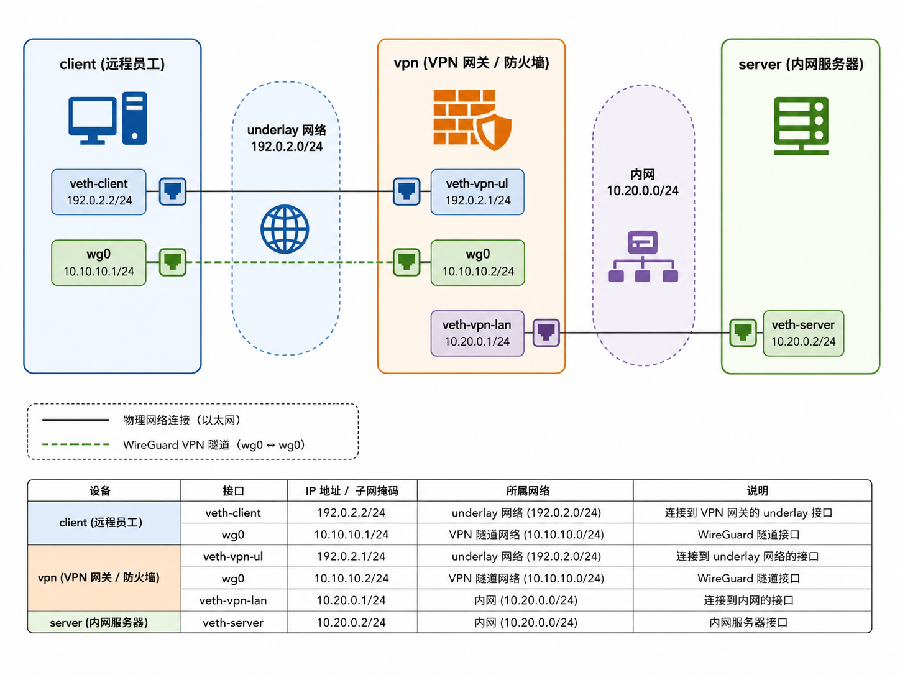
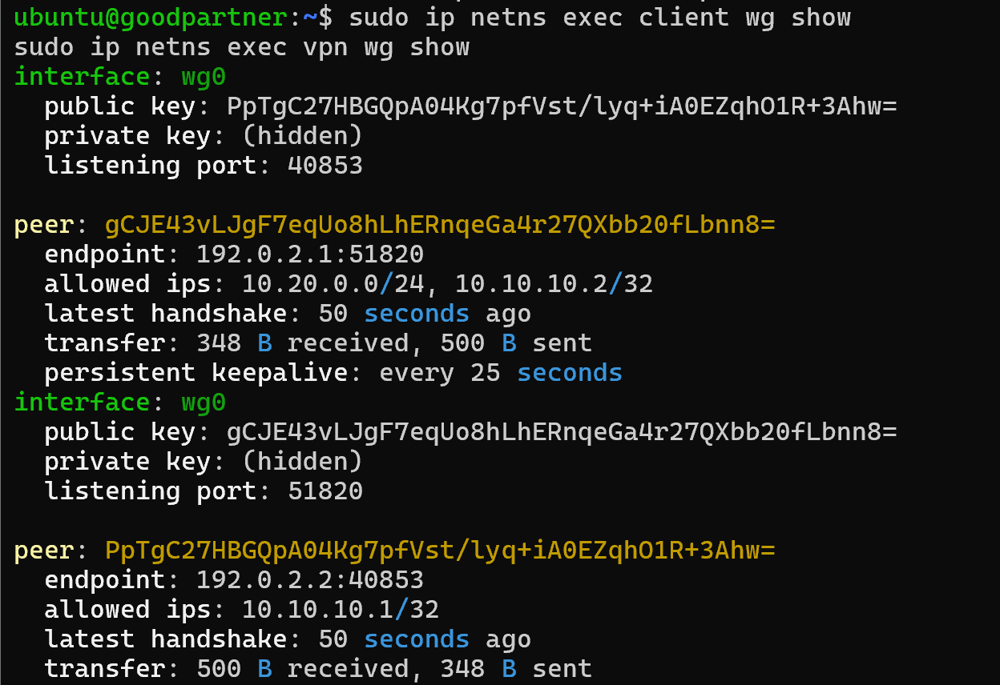
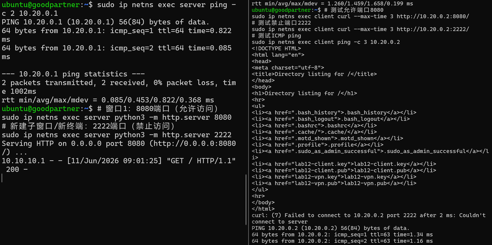
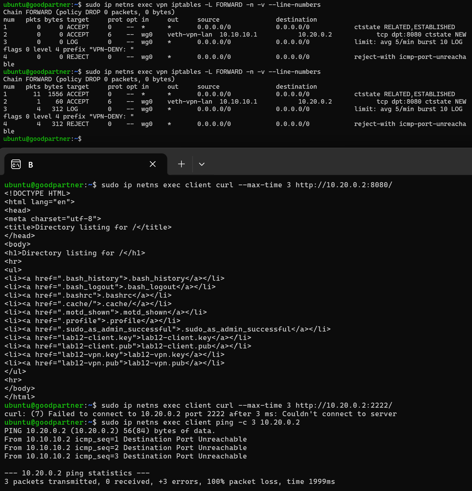
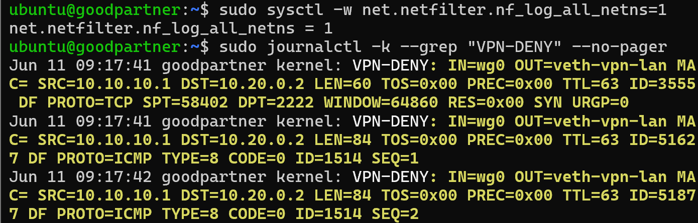
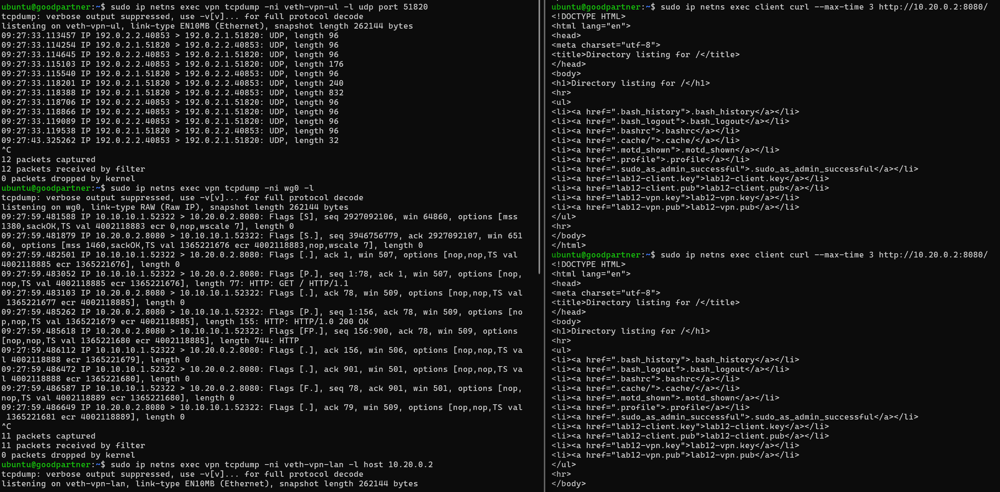

# Lab12：WireGuard 远程接入安全策略

## 从 Lab11 到 Lab12

Lab11 解决的是“VPN 隧道怎么建起来”：

- `client` 和 `vpn` 两端创建 `wg0` 虚拟接口
- WireGuard 用 underlay 网络发送 UDP 51820 加密包
- `AllowedIPs` 决定哪些目标地址交给隧道
- 抓包时，underlay 只能看到外层 UDP 包，`wg0` 能看到解密后的内层流量

但真实部署中，只把 VPN 建起来远远不够。一个远程用户连进来以后，不应该自动拥有整个内网的访问权限。VPN 只是入口，入口后面仍然需要防火墙规则、最小权限策略和日志审计。

本实验重点回答：

> VPN 用户进来以后，能访问什么、不能访问什么，由谁决定，怎么留下证据？

本实验不依赖 Lab11 的残留环境。即使 Lab11 的 namespace、密钥、配置文件都已经清理，也可以从头完成。

---

## 实验目标

完成本实验后，你应该能够：

1. 从零搭建一个 `client - vpn - server` 的远程接入 VPN 实验环境。
2. 配置 WireGuard 隧道，让远程客户端访问内网服务器。
3. 观察“只建隧道、不写防火墙规则”时，VPN 用户访问权限过大的问题。
4. 在 VPN 网关上使用 `FORWARD` 链限制 VPN 用户只能访问指定服务。
5. 使用 `LOG + REJECT` 记录被拒绝的 VPN 流量。
6. 用 tcpdump 对比 underlay、`wg0`、内网接口三处看到的不同流量。
7. 理解 `AllowedIPs` 和 iptables 访问控制的区别。

---

## 实验拓扑



---

## 准备工作

### 安装工具

本实验需要 Linux 环境，推荐 Ubuntu 虚拟机或云主机。需要以下工具：

```bash
sudo apt update
sudo apt install -y wireguard-tools iproute2 iptables tcpdump curl python3 conntrack
```

检查 WireGuard 工具是否可用：

```bash
wg --version
command -v wg-quick
```

### 建议终端布局

建议同时打开 4 个终端：

| 终端 | 用途 |
| :--- | :--- |
| 终端 A | 在 `server` 中运行 HTTP 服务 |
| 终端 B | 在 `client` 中执行访问测试 |
| 终端 C | 在 `vpn` 中配置 iptables、查看 WireGuard 状态 |
| 终端 D | 运行 tcpdump 或查看日志 |

---

## 任务一：清理残留环境

如果你之前做过 Lab11 或本实验，先清理旧环境，避免同名 namespace、接口或 `wg0` 残留。

```bash
sudo ip netns exec client wg-quick down /etc/wireguard/lab12-client/wg0.conf 2>/dev/null
sudo ip netns exec vpn    wg-quick down /etc/wireguard/lab12-vpn/wg0.conf 2>/dev/null

sudo ip netns exec client ip link del wg0 2>/dev/null
sudo ip netns exec vpn    ip link del wg0 2>/dev/null

sudo ip netns del client 2>/dev/null
sudo ip netns del vpn 2>/dev/null
sudo ip netns del server 2>/dev/null

sudo ip link del veth-client 2>/dev/null
sudo ip link del veth-vpn-ul 2>/dev/null
sudo ip link del veth-server 2>/dev/null
sudo ip link del veth-vpn-lan 2>/dev/null
```

说明：

| 写法 | 含义 |
| :--- | :--- |
| `2>/dev/null` | 忽略“不存在”的错误，便于重复执行 |
| `wg-quick down` | 关闭 WireGuard 接口并删除自动添加的路由 |
| `ip netns del` | 删除 namespace，其中的接口、路由、防火墙规则会随之消失 |

确认清理结果：

```bash
sudo ip netns list
```

如果没有 `client`、`vpn`、`server`，说明清理完成。

---

## 任务二：创建网络拓扑

### 第一步：创建三个 namespace

```bash
sudo ip netns add client
sudo ip netns add vpn
sudo ip netns add server
```

查看：

```bash
sudo ip netns list
```

### 第二步：创建两对 veth

```bash
sudo ip link add veth-client type veth peer name veth-vpn-ul
sudo ip link add veth-server type veth peer name veth-vpn-lan
```

含义：

| veth 对 | 连接关系 |
| :--- | :--- |
| `veth-client <-> veth-vpn-ul` | 远程客户端到 VPN 网关外侧 |
| `veth-server <-> veth-vpn-lan` | VPN 网关内侧到内网服务器 |

### 第三步：把接口放入 namespace

```bash
sudo ip link set veth-client netns client
sudo ip link set veth-vpn-ul netns vpn
sudo ip link set veth-server netns server
sudo ip link set veth-vpn-lan netns vpn
```

### 第四步：配置 IP 地址并启用接口

```bash
# client
sudo ip netns exec client ip addr add 192.0.2.2/24 dev veth-client
sudo ip netns exec client ip link set veth-client up
sudo ip netns exec client ip link set lo up

# vpn
sudo ip netns exec vpn ip addr add 192.0.2.1/24 dev veth-vpn-ul
sudo ip netns exec vpn ip link set veth-vpn-ul up
sudo ip netns exec vpn ip addr add 10.20.0.1/24 dev veth-vpn-lan
sudo ip netns exec vpn ip link set veth-vpn-lan up
sudo ip netns exec vpn ip link set lo up

# server
sudo ip netns exec server ip addr add 10.20.0.2/24 dev veth-server
sudo ip netns exec server ip link set veth-server up
sudo ip netns exec server ip link set lo up
```

### 第五步：配置路由和 IP 转发

`server` 的默认网关指向 `vpn` 的内网侧地址：

```bash
sudo ip netns exec server ip route add default via 10.20.0.1
```

`vpn` 开启 IP 转发：

```bash
sudo ip netns exec vpn sysctl -w net.ipv4.ip_forward=1
```

说明：

| 配置 | 作用 |
| :--- | :--- |
| `server default via 10.20.0.1` | 让 server 回复 VPN 客户端时知道交给 vpn 网关 |
| `net.ipv4.ip_forward=1` | 允许 vpn 在 `wg0` 和内网接口之间转发数据 |

### 第六步：验证基础连通

从 `client` 测试 underlay：

```bash
sudo ip netns exec client ping -c 2 192.0.2.1
```

从 `server` 测试内网网关：

```bash
sudo ip netns exec server ping -c 2 10.20.0.1
```

此时 `client` 不应该直接访问 `server`：

```bash
sudo ip netns exec client ping -c 2 10.20.0.2
```

如果提示 `Network is unreachable` 或无响应，这是正常现象。因为 VPN 隧道还没有建立，`client` 没有到 `10.20.0.0/24` 的路由。

填写：

| 测试项 | 预期结果 | 你的结果 |
| :--- | :--- | :--- |
| `client -> 192.0.2.1` | 成功 | 成功 |
| `server -> 10.20.0.1` | 成功 | 成功|
| `client -> 10.20.0.2` | 失败 | 失败|

---

## 任务三：配置 WireGuard 隧道

### 第一步：生成密钥

在宿主机当前目录执行：

```bash
umask 077
wg genkey | tee lab12-client.key | wg pubkey > lab12-client.pub
wg genkey | tee lab12-vpn.key    | wg pubkey > lab12-vpn.pub
```

查看文件：

```bash
ls -l lab12-client.key lab12-client.pub lab12-vpn.key lab12-vpn.pub
```

说明：

| 文件 | 作用 |
| :--- | :--- |
| `lab12-client.key` | client 私钥，只写入 client 配置 |
| `lab12-client.pub` | client 公钥，写入 vpn 的 Peer |
| `lab12-vpn.key` | vpn 私钥，只写入 vpn 配置 |
| `lab12-vpn.pub` | vpn 公钥，写入 client 的 Peer |

### 第二步：创建配置目录

```bash
sudo mkdir -p /etc/wireguard/lab12-client
sudo mkdir -p /etc/wireguard/lab12-vpn
```

读取密钥到变量：

```bash
CLIENT_PRIVATE_KEY=$(cat lab12-client.key)
CLIENT_PUBLIC_KEY=$(cat lab12-client.pub)
VPN_PRIVATE_KEY=$(cat lab12-vpn.key)
VPN_PUBLIC_KEY=$(cat lab12-vpn.pub)
```

### 第三步：写 client 配置

```bash
sudo tee /etc/wireguard/lab12-client/wg0.conf > /dev/null <<EOF
[Interface]
Address = 10.10.10.1/24
PrivateKey = ${CLIENT_PRIVATE_KEY}

[Peer]
PublicKey = ${VPN_PUBLIC_KEY}
Endpoint = 192.0.2.1:51820
AllowedIPs = 10.20.0.0/24, 10.10.10.2/32
PersistentKeepalive = 25
EOF
```

### 第四步：写 vpn 配置

```bash
sudo tee /etc/wireguard/lab12-vpn/wg0.conf > /dev/null <<EOF
[Interface]
Address = 10.10.10.2/24
PrivateKey = ${VPN_PRIVATE_KEY}
ListenPort = 51820

[Peer]
PublicKey = ${CLIENT_PUBLIC_KEY}
AllowedIPs = 10.10.10.1/32
EOF
```

设置权限：

```bash
sudo chmod 600 /etc/wireguard/lab12-client/wg0.conf
sudo chmod 600 /etc/wireguard/lab12-vpn/wg0.conf
```

配置含义：

| 位置 | 字段 | 含义 |
| :--- | :--- | :--- |
| client `[Interface]` | `Address = 10.10.10.1/24` | client 的隧道地址 |
| client `[Peer]` | `Endpoint = 192.0.2.1:51820` | 主动连接 vpn 的 underlay 地址 |
| client `[Peer]` | `AllowedIPs = 10.20.0.0/24, 10.10.10.2/32` | 访问 server 内网和 vpn 的 wg0 地址时走 VPN |
| vpn `[Interface]` | `ListenPort = 51820` | vpn 在 UDP 51820 等待连接 |
| vpn `[Peer]` | `AllowedIPs = 10.10.10.1/32` | vpn 只接受 client 隧道地址发来的内层包 |

### 第五步：启动隧道

先启动 vpn 监听端：

```bash
sudo ip netns exec vpn wg-quick up /etc/wireguard/lab12-vpn/wg0.conf
```

再启动 client：

```bash
sudo ip netns exec client wg-quick up /etc/wireguard/lab12-client/wg0.conf
```

查看接口：

```bash
sudo ip netns exec client ip addr show wg0
sudo ip netns exec vpn ip addr show wg0
```

查看路由：

```bash
sudo ip netns exec client ip route
```

应能看到类似：

```text
10.20.0.0/24 dev wg0 scope link
```

这条路由来自 client 端的 `AllowedIPs = 10.20.0.0/24`。同时，client 端 peer 的 `AllowedIPs` 还包含 `10.10.10.2/32`，这是为了后续能够通过隧道访问 VPN 网关自己的 `wg0` 地址。

### 第六步：触发握手并查看状态

先从 client ping server：

```bash
sudo ip netns exec client ping -c 2 10.20.0.2
```

然后查看：

```bash
sudo ip netns exec client wg show
sudo ip netns exec vpn wg show
```

关注：

| 字段 | 含义 |
| :--- | :--- |
| `latest handshake` | 最近一次握手时间 |
| `transfer` | 隧道收发字节数 |
| `allowed ips` | 当前 peer 的 AllowedIPs |

填写：

| 项目 | 你的填写 |
| :--- | :--- |
| client `wg0` 地址 |10.10.10.1/24 |
| vpn `wg0` 地址 |10.10.10.2/24|
| client 端 `AllowedIPs` |10.20.0.0/24, 10.10.10.2/32 |
| client 路由表中的 `wg0` 路由 |10.20.0.0/24 dev wg0 scope link |
| 是否看到 `latest handshake` |是 |

截图：



---

## 任务四：基线测试——只建 VPN 时权限过大

### 第一步：在 server 上启动两个服务

终端 A：

```bash
sudo ip netns exec server python3 -m http.server 8080
```

另一个终端：

```bash
sudo ip netns exec server python3 -m http.server 2222
```

说明：

| 端口 | 用途 |
| :--- | :--- |
| `8080` | 允许 VPN 用户访问的 Web 服务 |
| `2222` | 模拟不应暴露给 VPN 用户的内部服务 |

### 第二步：在没有防火墙限制时测试

此时新建 namespace 内的 `FORWARD` 默认通常是 ACCEPT。先观察“只建隧道”的效果：

```bash
sudo ip netns exec client curl --max-time 3 http://10.20.0.2:8080/
sudo ip netns exec client curl --max-time 3 http://10.20.0.2:2222/
sudo ip netns exec client ping -c 3 10.20.0.2
```

预期：三个测试都可能成功。

这说明：

> `AllowedIPs = 10.20.0.0/24, 10.10.10.2/32` 只是让 client 到 server 内网和 vpn 的 wg0 地址的流量进入隧道，并没有限制 client 到底能访问 server 的哪些端口。

填写：

| 测试 | 预期 | 你的结果 |
| :--- | :--- | :--- |
| `client -> server:8080` | 成功 |成功 |
| `client -> server:2222` | 成功 |成功 |
| `client -> server ping` | 成功 |成功 |

截图：



---

## 任务五：配置 VPN 访问控制

现在把 `vpn` 网关变成真正的访问控制点。

### 第一步：清空 FORWARD 并设置默认 DROP

```bash
sudo ip netns exec vpn iptables -F FORWARD
sudo ip netns exec vpn iptables -P FORWARD DROP
```

说明：

| 命令 | 含义 |
| :--- | :--- |
| `-F FORWARD` | 清空转发链规则 |
| `-P FORWARD DROP` | 默认拒绝所有转发流量 |

### 第二步：放行已建立连接

```bash
sudo ip netns exec vpn iptables -A FORWARD \
  -m conntrack --ctstate ESTABLISHED,RELATED \
  -j ACCEPT
```

这条规则必须放在前面。否则即使 client 的请求被允许，server 返回的响应也可能被默认 DROP。

### 第三步：只允许 VPN 用户访问 server:8080

```bash
sudo ip netns exec vpn iptables -A FORWARD \
  -i wg0 -o veth-vpn-lan \
  -s 10.10.10.1 -d 10.20.0.2 \
  -p tcp --dport 8080 \
  -m conntrack --ctstate NEW \
  -j ACCEPT
```

规则含义：

| 条件 | 含义 |
| :--- | :--- |
| `-i wg0` | 流量从 VPN 隧道进入 |
| `-o veth-vpn-lan` | 流量准备转发到内网侧 |
| `-s 10.10.10.1` | 只允许这个 VPN 客户端 |
| `-d 10.20.0.2` | 只允许访问这台 server |
| `--dport 8080` | 只允许访问 Web 服务端口 |
| `--ctstate NEW` | 只匹配新连接，后续包由 ESTABLISHED 规则处理 |

### 第四步：记录其他 VPN 访问

```bash
sudo ip netns exec vpn iptables -A FORWARD \
  -i wg0 \
  -m limit --limit 5/min --limit-burst 10 \
  -j LOG --log-prefix "VPN-DENY: " --log-level 4
```

说明：

| 参数 | 含义 |
| :--- | :--- |
| `-i wg0` | 只记录来自 VPN 的转发流量 |
| `--limit 5/min` | 稳定状态每分钟最多记录 5 条 |
| `--limit-burst 10` | 允许初始突发最多 10 条 |
| `--log-prefix "VPN-DENY: "` | 给日志打标签，便于过滤 |

### 第五步：拒绝其他 VPN 访问

```bash
sudo ip netns exec vpn iptables -A FORWARD \
  -i wg0 \
  -j REJECT
```

注意：LOG 不会终止匹配，所以必须在 LOG 后面放一条真正的拒绝规则。

### 第六步：查看规则

```bash
sudo ip netns exec vpn iptables -L FORWARD -n -v --line-numbers
```

填写：

| 行号 | target | 匹配条件 | 作用 |
| :--- | :--- | :--- | :--- |
| 1 |ACCEPT |--ctstate ESTABLISHED,RELATED |放行已建立 / 关联连接，保证回包正常 |
| 2 |ACCEPT |-i wg0 -o veth-vpn-lan -s 10.10.10.1 -d 10.20.0.2 -p tcp --dport 8080 --ctstate NEW |仅允许 VPN 客户端访问内网 8080 端口 |
| 3 |LOG |-i wg0 limit 5/min |记录所有被拒绝的 VPN 流量，添加日志前缀 |
| 4 |	REJECT |-i wg0 | 拒绝所有未匹配规则的 VPN 转发流量|

---

## 任务六：验证 VPN 策略

### 第一步：访问允许的服务

```bash
sudo ip netns exec client curl --max-time 3 http://10.20.0.2:8080/
```

预期：成功。

### 第二步：访问禁止的服务

```bash
sudo ip netns exec client curl --max-time 3 http://10.20.0.2:2222/
```

预期：失败，并产生 `VPN-DENY` 日志。

### 第三步：测试 ICMP

```bash
sudo ip netns exec client ping -c 3 10.20.0.2
```

预期：失败，并产生 `VPN-DENY` 日志。

### 第四步：观察规则计数器

```bash
sudo ip netns exec vpn iptables -L FORWARD -n -v --line-numbers
```

重点观察：

- 访问 `8080` 时，ACCEPT 规则计数增加。
- 访问 `2222` 或 ping 时，LOG/REJECT 规则计数增加。

填写：

| 测试 | 成功/失败 | 命中的规则 | 计数器是否增加 |
| :--- | :--- | :--- | :--- |
| `client -> server:8080` |成功 | 	行 2 ACCEPT 规则| 是|
| `client -> server:2222` |失败 |	行 3 LOG + 行 4 REJECT | 是|
| `client -> server ping` |失败 |	行 3 LOG + 行 4 REJECT |是 |

截图：



---

## 任务七：查看日志

### 第一步：处理 namespace 日志常见问题

如果你确认 LOG 规则计数增加，但 `journalctl` 或 `dmesg` 看不到日志，先在宿主机执行：

```bash
sudo sysctl -w net.netfilter.nf_log_all_netns=1
```

然后重新触发一次禁止访问。

### 第二步：查看 VPN-DENY 日志

```bash
sudo journalctl -k --grep "VPN-DENY" --no-pager
```

或：

```bash
sudo dmesg | grep "VPN-DENY"
```

一条典型日志类似：

```text
VPN-DENY: IN=wg0 OUT=veth-vpn-lan SRC=10.10.10.1 DST=10.20.0.2 PROTO=TCP SPT=54321 DPT=2222 SYN
```

字段解释：

| 字段 | 含义 |
| :--- | :--- |
| `IN=wg0` | 包从 VPN 隧道进入 |
| `OUT=veth-vpn-lan` | 包准备转发到内网接口 |
| `SRC=10.10.10.1` | VPN 客户端隧道地址 |
| `DST=10.20.0.2` | 内网服务器地址 |
| `PROTO=TCP` | 协议 |
| `DPT=2222` | 目标端口 |
| `SYN` | TCP 新连接请求 |

填写：

| 项目 | 你的填写 |
| :--- | :--- |
| 日志前缀 |VPN-DENY |
| `IN=` |wg0 |
| `OUT=` |veth-vpn-lan |
| `SRC=` |10.10.10.1 |
| `DST=` |10.20.0.2 |
| `PROTO=` |ICMP |
| `DPT=` |无 |

截图：



---

## 任务八：保护 VPN 网关自身管理面

前面的规则都写在 `FORWARD` 链，因为它们控制的是：

```text
client -> vpn -> server
```

也就是“经过 VPN 网关转发”的流量。

但 VPN 用户还可能直接访问 VPN 网关自己，例如：

```text
client -> vpn:9090
```

这种流量的目的地是 `vpn` 本机进程，不会走 `FORWARD` 链，而是走 `INPUT` 链。真实环境中，VPN 网关上可能有 SSH、Web 管理页面、监控端口等服务，这些管理面不应该默认暴露给所有 VPN 用户。

本任务用 `9090` 端口模拟 VPN 网关自己的管理服务。

> 注意：client 端配置里必须包含 `AllowedIPs = 10.20.0.0/24, 10.10.10.2/32`。如果只写 `10.20.0.0/24`，client 访问 `10.10.10.2` 时可能找不到对应的 WireGuard peer，表现为 `curl` 立刻失败，而不是被 INPUT 链拦截。

### 第一步：在 vpn 上启动模拟管理服务

在一个新终端执行：

```bash
sudo ip netns exec vpn python3 -m http.server 9090
```

这个服务运行在 `vpn` namespace 内，监听 `0.0.0.0:9090`，因此理论上 `client` 可以通过 `vpn` 的 `wg0` 地址访问它。

### 第二步：从 client 访问 vpn 自身服务

```bash
sudo ip netns exec client curl --max-time 3 http://10.10.10.2:9090/
```

如果此时 `INPUT` 链默认是 ACCEPT，访问通常会成功。

如果这里立刻失败，先检查两项：

```bash
sudo ip netns exec vpn ss -lntp | grep 9090
sudo ip netns exec client wg show
```

确认：

1. `vpn` 上确实有服务监听 `0.0.0.0:9090` 或 `10.10.10.2:9090`。
2. `client wg show` 中 peer 的 `allowed ips` 包含 `10.10.10.2/32`。

这说明：

> `FORWARD` 链只管穿过 VPN 网关的流量，不会阻止 VPN 用户访问 VPN 网关自己的服务。

### 第三步：添加 INPUT 日志规则

在 `vpn` namespace 中执行：

```bash
sudo ip netns exec vpn iptables -I INPUT 1 \
  -i wg0 -p tcp --dport 9090 \
  -m limit --limit 5/min --limit-burst 10 \
  -j LOG --log-prefix "VPN-MGMT-DENY: " --log-level 4
```

说明：

| 条件 | 含义 |
| :--- | :--- |
| `INPUT` | 处理目的地是 vpn 本机进程的包 |
| `-i wg0` | 只匹配来自 VPN 隧道的访问 |
| `--dport 9090` | 只匹配模拟管理端口 |
| `VPN-MGMT-DENY` | 管理面拒绝日志前缀 |

### 第四步：添加 INPUT 拒绝规则

```bash
sudo ip netns exec vpn iptables -I INPUT 2 \
  -i wg0 -p tcp --dport 9090 \
  -j REJECT
```

查看 INPUT 链：

```bash
sudo ip netns exec vpn iptables -L INPUT -n -v --line-numbers
```

### 第五步：再次测试

```bash
sudo ip netns exec client curl --max-time 3 http://10.10.10.2:9090/
```

预期：访问失败，并产生 `VPN-MGMT-DENY` 日志。

查看日志：

```bash
sudo journalctl -k --grep "VPN-MGMT-DENY" --no-pager
```

填写：

| 测试 | 加 INPUT 规则前 | 加 INPUT 规则后 | 是否产生日志 |
| :--- | :--- | :--- | :--- |
| `client -> vpn:9090` |成功 | 失败|是 |

### 第六步：对比 INPUT 与 FORWARD

填写：

| 访问目标 | 经过的链 | 原因 |
| :--- | :--- | :--- |
| `client -> server:8080` | `FORWARD` |流量穿过 VPN 网关，转发到内网其他主机 |
| `client -> server:2222` | `FORWARD` | 流量穿过 VPN 网关，转发到内网其他主机|
| `client -> vpn:9090` | `INPUT` | 流量目标是 VPN 网关本机进程，不转发|

---

## 任务九：用 conntrack 观察 VPN 内层连接

Lab7 和 Lab8 已经用过 conntrack。到了 VPN 场景，需要特别注意：

> WireGuard 的加密隧道状态由 WireGuard 自己维护，`wg show` 负责显示；conntrack 不是 WireGuard 的隧道映射表。

但是，当 WireGuard 解密出内层 IP 包后，这些内层 TCP/ICMP 连接仍然会进入 Linux 网络栈，并被 conntrack 跟踪。iptables 中的 `-m conntrack --ctstate ESTABLISHED,RELATED` 匹配的就是这些连接状态。

简单讲：**WireGuard 负责把加密隧道打通，conntrack 负责跟踪隧道里跑的那些真实连接。** 写 iptables 规则时，你只需要对着内层 IP 思考，当成没有 VPN 的普通转发场景来写就对了。

### 第一步：清空旧 conntrack 记录

```bash
sudo ip netns exec vpn conntrack -F
```

说明：

| 命令 | 含义 |
| :--- | :--- |
| `conntrack -F` | 清空当前 namespace 中的 conntrack 表，便于观察新连接 |

### 第二步：触发一次允许的 VPN 访问

```bash
sudo ip netns exec client curl --max-time 3 http://10.20.0.2:8080/
```

### 第三步：查看内层 TCP 连接

```bash
sudo ip netns exec vpn conntrack -L -p tcp
```

你应该能看到类似记录：

```text
tcp  6  ... ESTABLISHED src=10.10.10.1 dst=10.20.0.2 sport=xxxxx dport=8080 ...
                         src=10.20.0.2 dst=10.10.10.1 sport=8080 dport=xxxxx ...
```

重点字段：

| 字段 | 含义 |
| :--- | :--- |
| `src=10.10.10.1` | VPN 客户端的隧道地址 |
| `dst=10.20.0.2` | 内网服务器地址 |
| `dport=8080` | 被允许访问的服务端口 |
| `ESTABLISHED` | conntrack 认为这条 TCP 连接已经建立 |

### 第四步：对比外层 WireGuard UDP

再查看 UDP 记录：

```bash
sudo ip netns exec vpn conntrack -L -p udp
```

如果能看到 UDP 51820 相关记录，它对应的是 WireGuard 外层 underlay 通信，例如：

```text
src=192.0.2.2 dst=192.0.2.1 dport=51820
```

这和内层 TCP 连接不同：

| 类型 | 地址 | 协议 | 说明 |
| :--- | :--- | :--- | :--- |
| 外层 WireGuard 包 | `192.0.2.2 -> 192.0.2.1` | UDP 51820 | 加密隧道本身 |
| 内层业务连接 | `10.10.10.1 -> 10.20.0.2` | TCP 8080 | 解密后被防火墙处理的连接 |

### 第五步：填写观察表

| 观察项 | 你的填写 |
| :--- | :--- |
| 内层 TCP 连接源地址 |10.10.10.1 |
| 内层 TCP 连接目的地址 |10.20.0.2 |
| 内层 TCP 目标端口 |8080 |
| 外层 UDP 源地址 |192.0.2.2 |
| 外层 UDP 目的地址 |192.0.2.1 |
| 外层 UDP 目标端口 | 51820|

---

## 任务十：抓包观察策略作用位置

本任务要证明：WireGuard 外层包和防火墙处理的内层包不是同一个层次。

### 抓包点一：underlay 接口

在 `vpn` 的外侧接口抓包：

```bash
sudo ip netns exec vpn tcpdump -ni veth-vpn-ul -l udp port 51820
```

从 client 访问 server：

```bash
sudo ip netns exec client curl --max-time 3 http://10.20.0.2:8080/
```

你应该只看到类似：

```text
192.0.2.2.xxxxx > 192.0.2.1.51820: UDP
192.0.2.1.51820 > 192.0.2.2.xxxxx: UDP
```

underlay 看不到 `10.10.10.1`、`10.20.0.2`、`HTTP` 内容。

### 抓包点二：vpn 的 wg0 接口

```bash
sudo ip netns exec vpn tcpdump -ni wg0 -l
```

再次访问：

```bash
sudo ip netns exec client curl --max-time 3 http://10.20.0.2:8080/
```

你应该看到内层流量：

```text
10.10.10.1.xxxxx > 10.20.0.2.8080: Flags [S]
10.20.0.2.8080 > 10.10.10.1.xxxxx: Flags [S.]
```

### 抓包点三：vpn 的内网接口

```bash
sudo ip netns exec vpn tcpdump -ni veth-vpn-lan -l host 10.20.0.2
```

分别测试：

```bash
sudo ip netns exec client curl --max-time 3 http://10.20.0.2:8080/
sudo ip netns exec client curl --max-time 3 http://10.20.0.2:2222/
```

观察：

- 访问 `8080` 时，内网接口能看到转发给 server 的包。
- 访问 `2222` 时，包在 `vpn` 的 FORWARD 链被拒绝，内网接口不应看到完整连接。

填写：

| 抓包位置 | 看到的地址 | 协议/端口 | 说明 |
| :--- | :--- | :--- | :--- |
| `veth-vpn-ul` | 192.0.2.2/192.0.2.1| UDP 51820 | 外层加密包 |
| `wg0` |10.10.10.1/10.20.0.2 | TCP/ICMP | 解密后的内层包 |
| `veth-vpn-lan` |10.10.10.1/10.20.0.2 | TCP 8080 | 被允许转发的内网包 |

截图：



---

## 任务十一：故障排查练习

本任务故意制造三个常见错误。每个错误观察完成后，都要恢复配置，再继续下一个错误。

### 故障一：删除 ESTABLISHED,RELATED 规则

#### 第一步：删除状态放行规则

```bash
sudo ip netns exec vpn iptables -D FORWARD \
  -m conntrack --ctstate ESTABLISHED,RELATED \
  -j ACCEPT
```

#### 第二步：访问允许的服务

```bash
sudo ip netns exec client curl --max-time 3 http://10.20.0.2:8080/
```

预期：访问可能失败或超时。

原因：

- client 发出的新连接请求能命中 `--dport 8080` 的 ACCEPT 规则。
- server 返回的响应方向是 `veth-vpn-lan -> wg0`。
- 如果没有 `ESTABLISHED,RELATED`，响应包不匹配允许规则，会被默认 DROP。

#### 第三步：恢复规则

```bash
sudo ip netns exec vpn iptables -I FORWARD 1 \
  -m conntrack --ctstate ESTABLISHED,RELATED \
  -j ACCEPT
```

再次测试 `server:8080`，确认恢复成功。

### 故障二：把 LOG 放在 REJECT 后面

本故障用临时端口 `3333` 演示错误规则顺序。

#### 第一步：插入错误顺序规则

先查看当前行号：

```bash
sudo ip netns exec vpn iptables -L FORWARD -n --line-numbers
```

在允许规则之后、通用 `VPN-DENY` 之前插入两条临时规则。假设要插入到第 3 行：

```bash
sudo ip netns exec vpn iptables -I FORWARD 3 \
  -i wg0 -p tcp --dport 3333 \
  -j REJECT

sudo ip netns exec vpn iptables -I FORWARD 4 \
  -i wg0 -p tcp --dport 3333 \
  -j LOG --log-prefix "WRONG-ORDER: " --log-level 4
```

这两条规则故意把 `REJECT` 放在 `LOG` 前面。

#### 第二步：触发访问

```bash
sudo ip netns exec client curl --max-time 3 http://10.20.0.2:3333/
```

查看日志：

```bash
sudo journalctl -k --grep "WRONG-ORDER" --no-pager
```

预期：访问被拒绝，但看不到 `WRONG-ORDER` 日志。

原因：

> iptables 规则按顺序匹配。包命中 `REJECT` 后，处理立即结束，后面的 LOG 规则没有机会执行。

#### 第三步：删除临时错误规则

先查看行号：

```bash
sudo ip netns exec vpn iptables -L FORWARD -n --line-numbers
```

然后删除刚才插入的两条临时规则。若它们仍在第 3、4 行，可执行：

```bash
sudo ip netns exec vpn iptables -D FORWARD 3
sudo ip netns exec vpn iptables -D FORWARD 3
```

说明：删除原第 3 行后，原第 4 行会变成新的第 3 行，所以第二次仍删除第 3 行。

### 故障三：把管理面拦截规则错写到 FORWARD 链

这个故障用来验证：访问 `vpn` 自己的 `9090` 管理端口走 `INPUT` 链，不走 `FORWARD` 链。

#### 第一步：临时删除正确的 INPUT 管理面规则

先查看 `INPUT` 链行号：

```bash
sudo ip netns exec vpn iptables -L INPUT -n --line-numbers
```

删除任务八中添加的 `VPN-MGMT-DENY` 和 `REJECT` 规则。按实际行号删除，并且建议从较大的行号开始删。例如如果它们在第 1、2 行：

```bash
sudo ip netns exec vpn iptables -D INPUT 2
sudo ip netns exec vpn iptables -D INPUT 1
```

确认 `client` 又能访问 `vpn:9090`：

```bash
sudo ip netns exec client curl --max-time 3 http://10.10.10.2:9090/
```

#### 第二步：把管理面拦截规则错误地写到 FORWARD 链

故意在 `FORWARD` 链中插入拦截 `9090` 的规则：

```bash
sudo ip netns exec vpn iptables -I FORWARD 3 \
  -i wg0 -p tcp --dport 9090 \
  -j LOG --log-prefix "WRONG-CHAIN: " --log-level 4

sudo ip netns exec vpn iptables -I FORWARD 4 \
  -i wg0 -p tcp --dport 9090 \
  -j REJECT
```

再次访问：

```bash
sudo ip netns exec client curl --max-time 3 http://10.10.10.2:9090/
```

预期：访问仍然成功。

查看 FORWARD 计数器和日志：

```bash
sudo ip netns exec vpn iptables -L FORWARD -n -v --line-numbers
sudo journalctl -k --grep "WRONG-CHAIN" --no-pager
```

预期：

| 项目 | 现象 |
| :--- | :--- |
| `client -> vpn:9090` | 仍然成功 |
| `WRONG-CHAIN` 规则计数器 | 不增加 |
| `WRONG-CHAIN` 日志 | 没有 |

解释：

> 目的地是 `vpn` 本机进程的包走 `INPUT` 链。即使你在 `FORWARD` 链写了拒绝规则，也拦不住 `client -> vpn:9090`。

#### 第三步：清理错误的 FORWARD 规则

查看行号：

```bash
sudo ip netns exec vpn iptables -L FORWARD -n --line-numbers
```

删除刚才的 `WRONG-CHAIN` 临时规则。若它们仍在第 3、4 行：

```bash
sudo ip netns exec vpn iptables -D FORWARD 3
sudo ip netns exec vpn iptables -D FORWARD 3
```

#### 第四步：恢复正确的 INPUT 管理面规则

```bash
sudo ip netns exec vpn iptables -I INPUT 1 \
  -i wg0 -p tcp --dport 9090 \
  -m limit --limit 5/min --limit-burst 10 \
  -j LOG --log-prefix "VPN-MGMT-DENY: " --log-level 4

sudo ip netns exec vpn iptables -I INPUT 2 \
  -i wg0 -p tcp --dport 9090 \
  -j REJECT
```

再次测试：

```bash
sudo ip netns exec client curl --max-time 3 http://10.10.10.2:9090/
```

预期：访问失败，并产生 `VPN-MGMT-DENY` 日志。

填写：

| 故障 | 现象 | 原因 | 修复方法 |
| :--- | :--- | :--- | :--- |
| 删除 `ESTABLISHED,RELATED` |8080访问超时 | 服务端回包无规则放行，被默认 DROP|重新添加ESTABLISHED,RELATED放行规则到 FORWARD 首行 |
| `LOG` 放在 `REJECT` 后面 |流量被拒绝，但无对应日志 |iptables 按顺序匹配，REJECT 终止流程，LOG 无法执行 |调整规则顺序，LOG 必须在 REJECT/DROP 之前 |
| 管理面规则错写到 `FORWARD` |9090 端口仍可访问，规则计数器、日志均无变化 |访问本机流量走 INPUT 链，FORWARD 链规则无法拦截 |将管理面防护规则写入 INPUT 链，删除 FORWARD 中错误规则 |

---

## 任务十二：清理环境

实验结束后关闭隧道并删除 namespace：

```bash
sudo ip netns exec client wg-quick down /etc/wireguard/lab12-client/wg0.conf 2>/dev/null
sudo ip netns exec vpn    wg-quick down /etc/wireguard/lab12-vpn/wg0.conf 2>/dev/null

sudo ip netns del client 2>/dev/null
sudo ip netns del vpn 2>/dev/null
sudo ip netns del server 2>/dev/null

sudo ip netns list
```

---

## 实验结果填写

### A. 拓扑与隧道

| 项目 | 你的填写 |
| :--- | :--- |
| client underlay 地址 |192.0.2.2/24 |
| vpn underlay 地址 |192.0.2.1/24 |
| server 地址 |10.20.0.2/24 |
| client wg0 地址 |10.10.10.1/24 |
| vpn wg0 地址 |10.10.10.2/24 |
| 是否看到 WireGuard 握手 | 是|

### B. 基线测试

| 测试 | 只建 VPN 时是否成功 |
| :--- | :--- |
| `client -> server:8080` |是 |
| `client -> server:2222` |是 |
| `client -> server ping` |是 |

### C. 加防火墙后的测试

| 测试 | 结果 | 原因 |
| :--- | :--- | :--- |
| `client -> server:8080` |成功 |iptables FORWARD 规则放行 8080 端口 |
| `client -> server:2222` |失败 |未匹配放行规则，被 LOG+REJECT 拦截 |
| `client -> server ping` |失败 |ICMP 无放行规则，被 LOG+REJECT 拦截 |

### D. 日志与抓包

| 项目 | 你的填写 |
| :--- | :--- |
| `VPN-DENY` 日志条数 |3 |
| 日志中被拒绝的目标端口 |2222 |
| underlay 抓包看到的协议 |UDP 51820 |
| `wg0` 抓包看到的源地址 |10.10.10.1 |
| 内网接口是否能看到被拒绝的 2222 连接 | 否|

### E. VPN 网关管理面保护

| 项目 | 你的填写 |
| :--- | :--- |
| 模拟管理服务端口 |9090 |
| 加 INPUT 规则前是否能访问 |是 |
| 加 INPUT 规则后是否能访问 |否 |
| 管理面拒绝日志前缀 |VPN-MGMT-DENY |
| `client -> vpn:9090` 经过的链 |INPUT |

### F. conntrack 观察

| 项目 | 你的填写 |
| :--- | :--- |
| 内层 TCP 连接源地址 | 10.10.10.1|
| 内层 TCP 连接目的地址 |10.20.0.2 |
| 内层 TCP 目标端口 |8080 |
| 内层连接状态 |ESTABLISHED |
| 外层 UDP 源地址 |192.0.2.2 |
| 外层 UDP 目的地址 |192.0.2.1 |
| 外层 UDP 目标端口 |51820 |
| WireGuard 隧道状态应看 `conntrack` 还是 `wg show` |wg show |

### G. 故障排查

| 故障 | 现象 | 原因 | 修复方法 |
| :--- | :--- | :--- | :--- |
| 删除 `ESTABLISHED,RELATED` |8080 访问超时失败 |回包无放行规则被 DROP |恢复 ESTABLISHED/RELATED 规则 |
| `LOG` 放在 `REJECT` 后面 |访问拒绝 |REJECT 终止匹配，LOG 不执行 |LOG 前置，REJECT 后置 |
| 管理面规则错写到 `FORWARD` |9090 仍可访问、无日志 |本机流量走 INPUT 链 |规则迁移至 INPUT 链 |

---

## 思考题

1. `AllowedIPs` 和 iptables 访问控制分别解决什么问题？为什么不能只靠 `AllowedIPs` 做权限控制？
   答：AllowedIPs：路由控制，决定哪些流量进入 WireGuard 隧道（基于 IP 段）；iptables：访问控制，限制隧道内流量的端口 / 协议 / 权限。仅靠AllowedIPs只能控制 IP，无法做细粒度端口 / 服务拦截，因此必须配合防火墙。
2. 为什么 VPN 用户访问内网服务器时，规则要写在 `FORWARD` 链，而不是 `INPUT` 链？
   答：客户端流量经过 VPN 网关转发至内网服务器，流量 “穿过” 网关，属于转发流量，因此使用FORWARD链。
3. 本实验中 `ESTABLISHED,RELATED` 规则如果删除，访问 `server:8080` 会出现什么现象？
   答：客户端能发起连接请求，但服务器回包无法转发，请求超时、访问失败。
4. 为什么 LOG 必须放在 REJECT 前面？
   答：iptables 规则顺序匹配，REJECT/DROP会终止数据包匹配流程，后置 LOG 永远不会执行。
5. underlay 抓包只能看到 UDP 51820，这对通信安全意味着什么？它还能暴露哪些信息？
   答：外层流量全加密，攻击者无法窃取内层 IP、端口、业务数据；仅能暴露：两端外网 IP、UDP 51820 端口（WireGuard 特征端口）。
6. 如果一个真实企业允许 VPN 用户访问整个内网 `10.0.0.0/8`，可能带来哪些风险？
   答：VPN 用户可横向渗透内网、访问数据库 / 运维端口 / 管理后台、发起内网攻击，扩大安全边界。
7. `client -> vpn:9090` 和 `client -> server:8080` 分别经过哪条 iptables 链？为什么不同？
  答：client->vpn:9090：目标是网关本机进程 → INPUT；client->server:8080：流量转发至其他主机 → FORWARD。
8. conntrack 能看到 WireGuard 外层 UDP 包和内层 TCP 连接。为什么不能把 WireGuard 隧道本身理解成 conntrack 的 NAT 映射？
   答：WireGuard 是二层 / 三层加密隧道，独立维护隧道握手状态；conntrack 仅跟踪解密后的内层业务连接，不管理加密隧道本身。
9.  如果 VPN 网关上有 SSH 管理端口，应该允许哪些来源访问？应该如何写日志？
    答：仅允许运维固定公网 IP / 内网管理段访问；规则添加LOG记录所有 SSH 访问日志，便于审计溯源。
10. 当 `wg show` 有握手但业务访问失败时，应该按什么顺序检查服务监听、路由表、防火墙规则、日志和计数器？
   答：1、检查wg show确认隧道握手正常；2、检查客户端 / 网关路由表；3、 检查 iptables 规则 + 计数器；4、 查看防火墙拒绝日志；5、 检查服务监听状态。

---

## 截图要求

`topology.png` 已提供，不需要截图或重新绘制；提交时保留在 `Lab12.md` 同一目录下，保证打开实验报告时能直接显示。

实验截图须清晰，终端文字可读。截图文件需与本 `Lab12.md` 放在同一目录下，并保证它们能在上方对应任务位置正常显示。只需提交以下 5 张实验截图：

| 截图内容 | 文件名 |
| :--- | :--- |
| `wg show` 与 client 路由表 | `wg_status.png` |
| 只建 VPN 时 8080、2222、ping 都可访问的基线结果 | `baseline.png` |
| VPN 访问控制规则列表、计数器，以及加规则后 8080 成功、2222/ping 失败 | `policy_test.png` |
| `VPN-DENY` 日志 | `vpn_log.png` |
| underlay、wg0、内网接口抓包对比 | `tcpdump_compare.png` |

具体要求：

1. `wg_status.png`：放在任务三末尾，能看到 `wg show` 中的 `latest handshake` 或 `transfer`，以及 client 路由表中指向 `wg0` 的 `10.20.0.0/24` 路由。
2. `baseline.png`：放在任务四末尾，只建立 VPN、未加访问控制规则时，能看到 `client -> server:8080`、`client -> server:2222`、`client -> server ping` 都可访问。
3. `policy_test.png`：放在任务六末尾，能看到 VPN 网关 `FORWARD` 链规则、计数器，以及加规则后 `8080` 成功、`2222` 和 `ping` 失败。
4. `vpn_log.png`：放在任务七末尾，能看到 `VPN-DENY` 日志，日志中应包含被拒绝流量的关键信息，例如源地址、目的地址、协议或目标端口。
5. `tcpdump_compare.png`：放在任务十末尾，能对比 underlay、`wg0`、内网接口三处抓包结果。可以把多张截图拼成一张图。

---

## 提交要求

```text
学号姓名/
└── Lab12/
    ├── Lab12.md             # 本文件（填写完整，含截图与答案）
    ├── topology.png         # 已提供的实验拓扑图
    ├── wg_status.png        # 隧道状态与路由表
    ├── baseline.png         # 未加访问控制前的基线测试
    ├── policy_test.png      # 防火墙策略与访问测试
    ├── vpn_log.png          # VPN-DENY 日志
    └── tcpdump_compare.png  # 三处抓包对比
```

## 截止时间

###### 2026-06-18，届时关于 `Lab12` 的 PR 将不会被合并。
