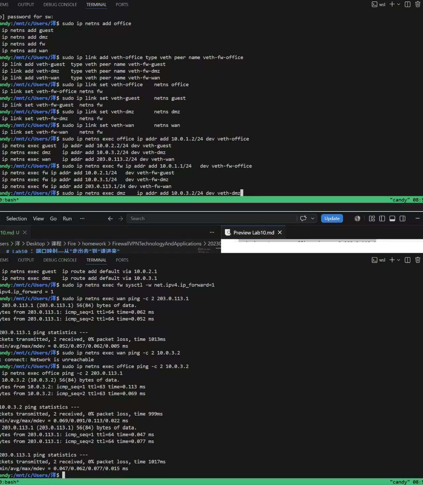
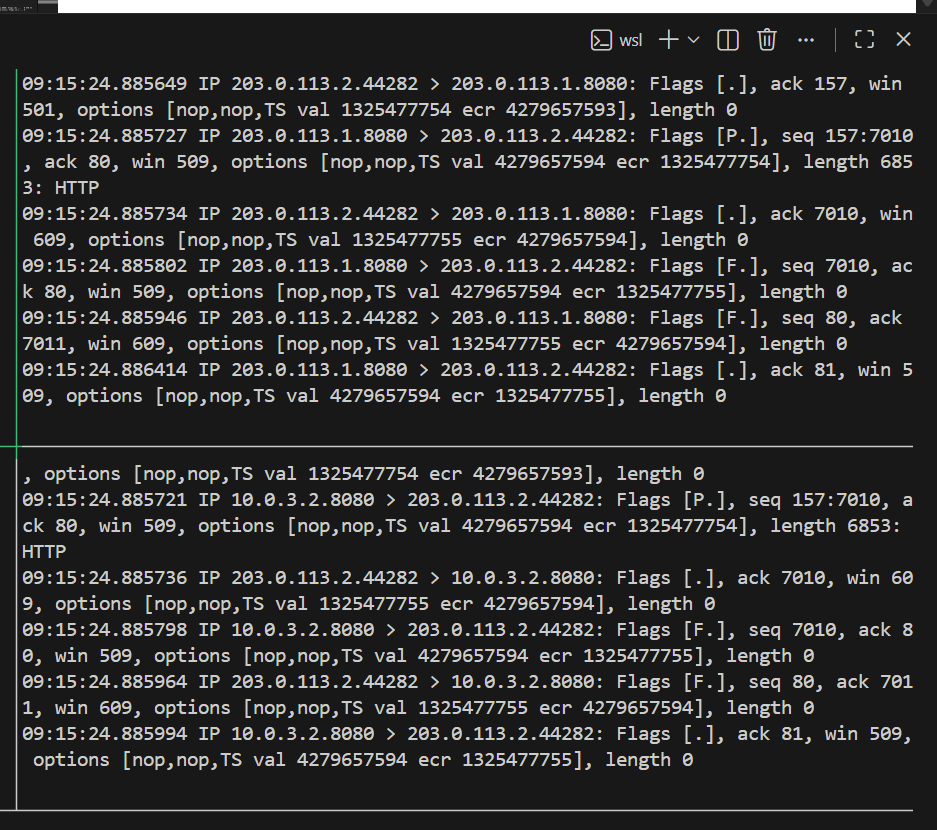
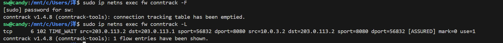
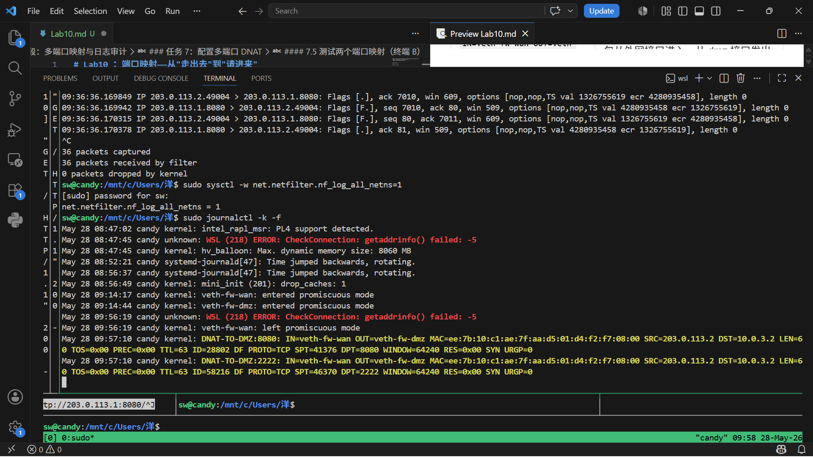

# Lab10 ：端口映射——从"走出去"到"请进来"

## 从 Lab9 到 Lab10——内部服务如何对外开放

Lab9 搭建了一套四区域网络（`office`、`guest`、`dmz`、`fw`），用 iptables 规则实现了分区间访问控制和日志审计。`dmz` 里运行着 Web 服务，`office` 可以正常访问，`guest` 被禁止访问——分区完成，日志也到位了。

但有一个问题 Lab9 没有回答：**如果外部用户需要访问 `dmz` 里的服务怎么办？**

Lab8 用 NAT（SNAT/MASQUERADE）解决了"内网主机访问外网"的问题——把内网地址换成外网地址发出去。但这是**由内向外**的方向。现在需求反了过来：外部用户要主动访问内网的服务，这是**由外向内的方向**。

**端口映射**（Port Mapping，也称端口转发、DNAT）解决的就是这个方向的问题。它的逻辑是：

- 外部用户访问防火墙**公网 IP 的某个端口**
- 防火墙把这个请求**映射到内网某台服务器的对应端口**上
- 服务器返回响应时，防火墙再根据映射关系把包送回给外部用户

操作上，Lab8 在 `nat` 表的 `POSTROUTING` 链上改写源地址（SNAT）；本实验在 `nat` 表的 `PREROUTING` 链上改写目标地址（DNAT）。两者同样依赖 conntrack 记录映射关系——conntrack 是 NAT 的"记忆"。

---

## 端口映射的工作原理

`fw` 上有一条 DNAT 规则：凡是目的地址是 `203.0.113.1:8080` 的包，把目标地址改写为 `10.0.3.2:8080`：

```
wan 发出的包（改写前）：  src=203.0.113.2  dst=203.0.113.1  dport=8080
fw PREROUTING 改写后：    src=203.0.113.2  dst=10.0.3.2      dport=8080
```

`fw` 的路由表知道 `10.0.3.2` 在内网，走 FORWARD 链转发给 `dmz`。`dmz` 收到后回复：

```
dmz 回复的包：            src=10.0.3.2      dst=203.0.113.2
```

这个包源地址是 `10.0.3.2`——是内网地址。`wan` 不认识它。但 conntrack 记录了"之前做过一次 DNAT"，于是 **conntrack 自动执行逆向地址还原**：把回复包的源地址从 `10.0.3.2` 改回 `203.0.113.1`：

```
fw conntrack 还原后：     src=203.0.113.1   dst=203.0.113.2
```

`wan` 收到的回复看起来就是 `fw` 的 `203.0.113.1` 回的——它完全不知道背后是 `10.0.3.2` 这台内网机器。

> **SNAT 和 DNAT 的区别**：
>
> | | 改写方向 | 作用的链 | 典型用途 |
> | :--- | :--- | :--- | :--- |
> | **SNAT**（Lab8） | 改**源地址** | `POSTROUTING` | 内网访问外网 |
> | **DNAT**（本实验） | 改**目标地址** | `PREROUTING` | 外网访问内网服务 |

---

## 实验拓扑

在 Lab9 的三区域拓扑基础上，增加一个 `wan` 命名空间模拟外部网络。

```text
                     ┌─────────────────┐
                     │      wan        │
                     │   203.0.113.2   │
                     └───────┬─────────┘
                             │ 203.0.113.0/24
                     ┌───────┴─────────┐
office (10.0.1.2) ───┤                 │
guest  (10.0.2.2) ───┤      fw         │
dmz    (10.0.3.2) ───┤                 │
                     └─────────────────┘
```

**地址规划：**

| 区域 | IP | 接口 |
| :--- | :--- | :--- |
| `office` | `10.0.1.2/24` | `veth-office` |
| `guest` | `10.0.2.2/24` | `veth-guest` |
| `dmz` | `10.0.3.2/24` | `veth-dmz` |
| `wan` | `203.0.113.2/24` | `veth-wan` |
| `fw` ↔ office | `10.0.1.1/24` | `veth-fw-office` |
| `fw` ↔ guest | `10.0.2.1/24` | `veth-fw-guest` |
| `fw` ↔ dmz | `10.0.3.1/24` | `veth-fw-dmz` |
| `fw` ↔ wan | `203.0.113.1/24` | `veth-fw-wan` |

> **注意**：`203.0.113.0/24` 是 RFC 5737 定义的文档/测试用地址段（"TEST-NET-3"），不会和真实公网地址冲突。本实验中用它模拟"公网 IP"。

**实验中 DMZ 对外提供的服务：**

| 服务 | 端口 | 说明 |
| :--- | :--- | :--- |
| Web 服务（dmz 上运行） | `8080` | HTTP 服务，提供目录列表 |
| 第二个 TCP 服务（dmz 上模拟） | `2222` | 在 dmz 上另外启动一个 Python HTTP Server 模拟第二个服务 |

---

## 第一阶段：搭建拓扑并验证内外隔离

### 任务 1：在 Lab9 拓扑基础上增加 WAN 区域

#### 1.1 清理旧环境（如有必要）

```bash
sudo ip netns del office 2>/dev/null; sudo ip netns del guest 2>/dev/null
sudo ip netns del dmz 2>/dev/null;   sudo ip netns del fw 2>/dev/null
sudo ip netns del wan 2>/dev/null
sudo ip link del veth-office 2>/dev/null; sudo ip link del veth-guest 2>/dev/null
sudo ip link del veth-dmz 2>/dev/null;   sudo ip link del veth-wan 2>/dev/null
```

命令说明：

| 部分 | 含义 |
| :--- | :--- |
| `2>/dev/null` | 把错误输出重定向到 `/dev/null`（丢弃），如果命名空间或接口不存在，不让它报错干扰 |
| `ip netns del` | 删除命名空间，其中的接口、路由、iptables 规则随之销毁 |
| `ip link del` | 删除 veth 接口对，两端同时删除 |

#### 1.2 创建 5 个 namespace

```bash
sudo ip netns add office
sudo ip netns add guest
sudo ip netns add dmz
sudo ip netns add fw
sudo ip netns add wan
```

#### 1.3 创建 4 对 veth 接口

```bash
sudo ip link add veth-office type veth peer name veth-fw-office
sudo ip link add veth-guest  type veth peer name veth-fw-guest
sudo ip link add veth-dmz    type veth peer name veth-fw-dmz
sudo ip link add veth-wan    type veth peer name veth-fw-wan
```

命令说明：

| 部分 | 含义 |
| :--- | :--- |
| `ip link add ... type veth peer name ...` | 创建一对虚拟以太网设备，像一根网线的两端 |

#### 1.4 将 veth 配对放入对应 namespace

```bash
sudo ip link set veth-office    netns office
sudo ip link set veth-fw-office netns fw

sudo ip link set veth-guest     netns guest
sudo ip link set veth-fw-guest  netns fw

sudo ip link set veth-dmz       netns dmz
sudo ip link set veth-fw-dmz    netns fw

sudo ip link set veth-wan       netns wan
sudo ip link set veth-fw-wan    netns fw
```

#### 1.5 配置 IP 地址

```bash
# 各区域 IP
sudo ip netns exec office ip addr add 10.0.1.2/24 dev veth-office
sudo ip netns exec guest  ip addr add 10.0.2.2/24 dev veth-guest
sudo ip netns exec dmz    ip addr add 10.0.3.2/24 dev veth-dmz
sudo ip netns exec wan    ip addr add 203.0.113.2/24 dev veth-wan

# fw 四个接口
sudo ip netns exec fw ip addr add 10.0.1.1/24   dev veth-fw-office
sudo ip netns exec fw ip addr add 10.0.2.1/24   dev veth-fw-guest
sudo ip netns exec fw ip addr add 10.0.3.1/24   dev veth-fw-dmz
sudo ip netns exec fw ip addr add 203.0.113.1/24 dev veth-fw-wan
```

#### 1.6 启用所有接口（含 lo）

```bash
sudo ip netns exec office ip link set lo up
sudo ip netns exec guest  ip link set lo up
sudo ip netns exec dmz    ip link set lo up
sudo ip netns exec fw     ip link set lo up
sudo ip netns exec wan    ip link set lo up

sudo ip netns exec office ip link set veth-office up
sudo ip netns exec guest  ip link set veth-guest up
sudo ip netns exec dmz    ip link set veth-dmz up
sudo ip netns exec wan    ip link set veth-wan up

sudo ip netns exec fw ip link set veth-fw-office up
sudo ip netns exec fw ip link set veth-fw-guest  up
sudo ip netns exec fw ip link set veth-fw-dmz    up
sudo ip netns exec fw ip link set veth-fw-wan    up
```

#### 1.7 配置路由

```bash
# 内网节点默认网关设为 fw 对应内网接口
sudo ip netns exec office ip route add default via 10.0.1.1
sudo ip netns exec guest  ip route add default via 10.0.2.1
sudo ip netns exec dmz    ip route add default via 10.0.3.1
```

> **注意**：不要给 `wan` 添加 `default via 203.0.113.1`。如果添加默认路由，`wan` 会把所有未知目的地址都交给 `fw`，在 `fw` 开启转发且尚未设置过滤规则时，`wan → 10.0.3.2` 反而会成功，这会破坏本实验要观察的"不能直接访问内网地址"这一前提。

#### 1.8 在 fw 中开启 IP 转发

```bash
sudo ip netns exec fw sysctl -w net.ipv4.ip_forward=1
```

命令说明：

| 部分 | 含义 |
| :--- | :--- |
| `sysctl -w net.ipv4.ip_forward=1` | 启用 IPv4 包转发，没有这个，fw 不会转发任何经它的包 |

#### 1.9 验证拓扑连通性

先确认 `wan` 能访问同网段的 `fw` 外网 IP，但**不能**直接访问内网地址：

```bash
# 这个应该成功——203.0.113.1 与 wan 在同一个直连网段
sudo ip netns exec wan ping -c 2 203.0.113.1

# 这个应该失败——wan 没有到 10.0.3.2 的路由
sudo ip netns exec wan ping -c 2 10.0.3.2
```

再确认内网互通和 `fw` 接口可达：

```bash
# 这几个都应该成功
sudo ip netns exec office ping -c 2 10.0.3.2
sudo ip netns exec office ping -c 2 203.0.113.1
```

**填写下表：**

| 测试项 | 结果（成功/失败） | 原因简述 |
| :----- | :-------------- | :------- |
| `wan → 203.0.113.1`（fw 外网 IP） |成功 | 同一外网直连网段 |
| `wan → 10.0.3.2`（dmz 内网 IP） | 失败| wan 没有到 `10.0.3.0/24` 的路由 |
| `office → 10.0.3.2` |成功 | 都在内网，经 fw 转发 |
| `office → 203.0.113.1` |成功 | 访问 fw 自身的外网接口 |

---

### 任务 2：启动服务并验证外部无法直接访问

#### 2.1 在 dmz 上启动 Web 服务（终端 A）

```bash
sudo ip netns exec dmz python3 -m http.server 8080
```

命令说明：

| 部分 | 含义 |
| :--- | :--- |
| `python3 -m http.server 8080` | 在 `8080` 端口启动一个简易 HTTP 文件服务器，列出当前目录并提供文件下载 |

> 保持该终端持续运行，后续所有测试都会用到这个服务。

#### 2.2 测试从外部访问 dmz 内网 IP（终端 B）

```bash
# 直接访问 dmz 的内网地址——预期失败
sudo ip netns exec wan curl --connect-timeout 3 http://10.0.3.2:8080/
```

命令说明：

| 部分 | 含义 |
| :--- | :--- |
| `curl` | 命令行 HTTP 客户端 |
| `--connect-timeout 3` | 连接超时 3 秒，3 秒内建立不了连接就放弃 |

预期结果：失败，通常会提示 `Network is unreachable`。因为 `wan` 没有默认路由，也没有到 `10.0.3.0/24` 的路由，所以这个请求不会离开 `wan` 命名空间。

#### 2.3 从 office 访问确认服务正常（终端 B）

```bash
# 从办公网访问 dmz 的 Web 服务——预期成功
sudo ip netns exec office curl --connect-timeout 3 http://10.0.3.2:8080/
```

> 这一步验证服务本身没有问题。如果一个请求失败，你需要先排除"服务没启动"还是"网络不通"——能确认内网可以访问，说明服务本身是正常的，外部访问失败的原因就锁定在网络层了。

**填写下表：**

| 测试项 | 结果 | 现象描述 |
| :----- | :--- | :------- |
| `wan → 10.0.3.2:8080` |失败 |连接超时 / Network is unreachable，无法建立 HTTP 连接，无网页内容返回 |
| `office → 10.0.3.2:8080` |成功 | 成功获取到 Web 服务的目录列表（HTML 页面），终端返回完整的 HTTP 响应|



**第一阶段小结**：外部（`wan`）无法直接访问内网服务器的私有地址——这是"网络层路由不可达"造成的，也是我们要模拟的真实互联网边界。接下来用端口映射让外部**只能**通过 `fw` 的指定端口访问内网服务，所有流量都在防火墙的监督下进出。

---

## 第二阶段：配置端口映射

### 任务 3：添加 DNAT 规则

端口映射需要在 `nat` 表的 `PREROUTING` 链上配置。`PREROUTING` 的含义是"路由决策之前"——包刚到达网卡，还没决定往哪走时，先改写目标地址。

#### 3.1 设置 FORWARD 默认策略为 DROP（终端 C）

先让 fw 只放行明确允许的流量：

```bash
sudo ip netns exec fw iptables -P FORWARD DROP
sudo ip netns exec fw iptables -A FORWARD -m conntrack --ctstate ESTABLISHED,RELATED -j ACCEPT
```

命令说明：

| 部分 | 含义 |
| :--- | :--- |
| `-P FORWARD DROP` | 设置 FORWARD 链默认策略为丢弃——不匹配任何 ACCEPT 规则的包全部丢弃 |
| `-m conntrack --ctstate ESTABLISHED,RELATED` | 放行已建立连接的包（包含请求的反向回包），确保 TCP 三次握手能完成 |

#### 3.2 添加 DNAT 规则——将 fw 外网 IP 的 8080 端口映射到 dmz 的 8080

```bash
sudo ip netns exec fw iptables -t nat -A PREROUTING \
  -d 203.0.113.1 -p tcp --dport 8080 \
  -j DNAT --to-destination 10.0.3.2:8080
```

命令说明：

| 部分 | 含义 |
| :--- | :--- |
| `-t nat` | 操作 nat 表（区别于 filter 表） |
| `-A PREROUTING` | 追加到 PREROUTING 链——包进入网络栈后最先经过的链 |
| `-d 203.0.113.1` | 只匹配目的地址是 `fw` 外网接口 IP 的包 |
| `-p tcp --dport 8080` | 只匹配 TCP 协议且目的端口为 8080 的包 |
| `-j DNAT --to-destination 10.0.3.2:8080` | 把目标地址改为 `10.0.3.2`，目标端口改为 `8080` |

> **DNAT 的链选择**：为什么是 `PREROUTING` 而不是 `POSTROUTING`？
>
> 路由决策发生在 `PREROUTING` 和 `FORWARD` 之间。如果不在 `PREROUTING` 阶段改写目标地址，路由模块看到的仍然是 `dst=203.0.113.1`，包可能会被判为"本地投递"走 INPUT 链，不会被转发。先改写目标为 `10.0.3.2`，路由模块才能判断"这个包应该转发给 `dmz`"，并把它送入 FORWARD 链。所以 DNAT 必须在 `PREROUTING` 链上做，SNAT 在 `POSTROUTING` 链上做。

#### 3.3 放行 DNAT 后的流量（FORWARD 链）

DNAT 只改写地址，不改写"是否允许通过"。还需要在 FORWARD 链上放行实际转发规则：

```bash
sudo ip netns exec fw iptables -A FORWARD \
  -d 10.0.3.2 -p tcp --dport 8080 \
  -m conntrack --ctstate NEW \
  -j ACCEPT
```

命令说明：

| 部分 | 含义 |
| :--- | :--- |
| `-d 10.0.3.2 -p tcp --dport 8080` | DNAT 改写后的包的目的地址和端口 |
| `-m conntrack --ctstate NEW` | 只放行新连接的第一个包（后续包由 `ESTABLISHED,RELATED` 放行） |

> **DNAT 和 FORWARD 规则的"两层检查"**：
>
> 一个来自 `wan` 的包经过 `fw` 时经历的处理流程：
>
> 1. **PREROUTING**（`nat` 表）：`dst=203.0.113.1 → 10.0.3.2`（DNAT 改写目标地址）
> 2. **路由决策**：`dst=10.0.3.2` → 走转发
> 3. **FORWARD**（`filter` 表）：检查"这个包是否允许被转发"
> 4. **POSTROUTING**（`nat` 表）：如有 SNAT 规则，改写源地址
>
> 两层缺一不可：DNAT 决定"往哪送"，FORWARD 决定"送不送"。

#### 3.4 查看完整规则

```bash
sudo ip netns exec fw iptables -t nat -L PREROUTING -n -v --line-numbers
sudo ip netns exec fw iptables -L FORWARD -n -v --line-numbers
```

命令说明：

| 部分 | 含义 |
| :--- | :--- |
| `-t nat -L PREROUTING` | 只列出 nat 表的 PREROUTING 链 |
| `-n -v --line-numbers` | 数字格式显示、详细计数、行号 |

**填写下表：**

| 表 | 链 | 行号 | target | 匹配条件 | 动作 |
| :--- | :--- | :--- | :--- | :--- | :--- |
| `nat` | `PREROUTING` | 1 | DNAT | `dst=203.0.113.1 tcp dpt:8080` | `to:10.0.3.2:8080` |
| `filter` | `FORWARD` | 1 | ACCEPT |ctstate RELATED,ESTABLISHED | 允许已建立 / 相关的连接通行|
| `filter` | `FORWARD` | 2 | ACCEPT |dst=10.0.3.2 tcp dpt:8080 ctstate NEW |允许去往 10.0.3.2:8080 的新连接通行 |

---

### 任务 4：从外部访问映射端口

#### 4.1 用 curl 访问 fw 公网 IP 的 8080（终端 B）

```bash
sudo ip netns exec wan curl --connect-timeout 3 http://203.0.113.1:8080/
```

预期结果：成功返回目录列表——和直接从 `office` 访问 `10.0.3.2:8080` 看到的内容完全一样。

`wan` 以为自己连接的是 `203.0.113.1`（fw 的外网 IP），实际上收到的响应来自 `10.0.3.2`（内网的 dmz）。

#### 4.2 尝试访问其他端口——验证映射范围

```bash
# 访问 fw 的 80 端口——没有 DNAT 规则，应该失败
sudo ip netns exec wan curl --connect-timeout 3 http://203.0.113.1:80/
```

预期：连接失败。说明 DNAT 只对端口 `8080` 生效，其他端口不受影响。

#### 4.3 尝试访问其他地址——验证 DNAT 的针对性

```bash
# 尝试直接访问 dmz 内网地址——应该仍然失败
sudo ip netns exec wan curl --connect-timeout 3 http://10.0.3.2:8080/
```

预期：仍然失败。DNAT 只影响发往 `fw` 外网 IP 的包，不影响对 `10.0.3.2` 的直接访问。`wan` 的路由表里没有到 `10.0.3.0/24` 的路由，也没有默认路由，所以包到不了 `fw` 的 PREROUTING 链。

**填写下表：**

| 测试项 | 结果 | 原因简述 |
| :----- | :--- | :------- |
| `wan → 203.0.113.1:8080` | 成功 | DNAT 将请求映射到 dmz:8080 |
| `wan → 203.0.113.1:80` |失败 | 没有 80 端口的 DNAT 规则 |
| `wan → 10.0.3.2:8080` | 失败| wan 没有到内网的路由，也没有默认路由 |

---

## 第三阶段：用 tcpdump 和 conntrack 观察 DNAT 的地址变化

Lab8 用 tcpdump 观察了 SNAT 对外出包的源地址改写。本任务用同样的方法观察 DNAT 对入站包的目标地址改写，以及 conntrack 在逆向还原中扮演的角色。

### 任务 5：tcpdump 抓包——分别在两个接口观察

#### 5.1 在 fw 外网接口上抓包（终端 D）

```bash
sudo ip netns exec fw tcpdump -ni veth-fw-wan -l tcp port 8080
```

命令说明：

| 部分 | 含义 |
| :--- | :--- |
| `-i veth-fw-wan` | 在 fw 的外侧接口抓包——在 PREROUTING 改写之前 |
| `-l` | 行缓冲，每收到一个包立即输出，不等到缓冲区满 |
| `tcp port 8080` | 过滤器，只显示 TCP 8080 端口的包 |

#### 5.2 在 fw 内网（dmz 一侧）接口上抓包（新开终端 E）

```bash
sudo ip netns exec fw tcpdump -ni veth-fw-dmz -l tcp port 8080
```

命令说明：

| 部分 | 含义 |
| :--- | :--- |
| `-i veth-fw-dmz` | 在 fw 连接 dmz 的内侧接口抓包——PREROUTING 改写之后 |

#### 5.3 从 wan 发起一次访问（终端 B）

```bash
sudo ip netns exec wan curl --connect-timeout 3 http://203.0.113.1:8080/
```

#### 5.4 对比两个接口的抓包

**终端 D（外网侧）的输出**：

```text
IP 203.0.113.2.xxxxx > 203.0.113.1.8080: Flags [S] ...   ← SYN 包
IP 203.0.113.1.8080  > 203.0.113.2.xxxxx: Flags [S.] ... ← SYN-ACK 回复
```

外网侧看到：`wan` 在跟 `fw` 的 `203.0.113.1:8080` 通信。

**终端 E（内网侧）的输出**：

```text
IP 203.0.113.2.xxxxx > 10.0.3.2.8080:     Flags [S] ...   ← DNAT 改了目标地址
IP 10.0.3.2.8080     > 203.0.113.2.xxxxx: Flags [S.] ...  ← dmz 回复
```

内网侧看到：请求的目标地址变成了 `10.0.3.2`，回复的源地址是 `10.0.3.2`。

**关键对比**：
- HTTP 请求（入站方向）：外网侧 `dst=203.0.113.1` → 内网侧 `dst=10.0.3.2`（DNAT 改写）
- HTTP 响应（出站方向）：内网侧 `src=10.0.3.2` → 外网侧 `src=203.0.113.1`（conntrack 自动逆向还原）

**填写下表：**

| 项目 | 外网接口（`veth-fw-wan`） | 内网接口（`veth-fw-dmz`） |
| :--- | :--- | :--- |
| 请求包的源地址 |203.0.113.2 |203.0.113.2 |
| 请求包的目的地址 | 203.0.113.1:8080| 10.0.3.2:8080|
| 回复包的源地址 |203.0.113.1:8080 | 10.0.3.2:8080|
| 回复包的目的地址 | 203.0.113.2|203.0.113.2 |



---

### 任务 6：conntrack 验证 DNAT 映射关系

和 Lab8 任务四一样，conntrack 记录了 NAT 映射的完整信息。DNAT 的映射关系同样保存在 conntrack 表中。

#### 6.1 清空旧条目（终端 C）

```bash
sudo ip netns exec fw conntrack -F
```

命令说明：

| 部分 | 含义 |
| :--- | :--- |
| `conntrack -F` | flush，清空所有 conntrack 条目，方便观察新产生的条目 |

#### 6.2 从 wan 访问（终端 B）

```bash
sudo ip netns exec wan curl --connect-timeout 3 http://203.0.113.1:8080/
```

#### 6.3 查看 conntrack 表（终端 C）

```bash
sudo ip netns exec fw conntrack -L
```

命令说明：

| 部分 | 含义 |
| :--- | :--- |
| `conntrack -L` | list，列出当前所有 conntrack 快照 |

找到 TCP 8080 的条目，格式类似：

```text
tcp  6  431999 ESTABLISHED src=203.0.113.2 dst=203.0.113.1 sport=XXXXX dport=8080 \
                              src=10.0.3.2 dst=203.0.113.2 sport=8080 dport=XXXXX [ASSURED]
```

**解读这条 conntrack 记录**：

- **第一行**（原始方向，即 `wan` 发出的方向）：`wan(203.0.113.2) → fw(203.0.113.1):8080`
- **第二行**（回复方向，即 DNAT 后的方向）：`dmz(10.0.3.2):8080 → wan(203.0.113.2)`

和 Lab8 的 SNAT 条目对比：

| | Lab8（SNAT/MASQUERADE） | 本实验（DNAT） |
| :--- | :--- | :--- |
| 原始方向源地址 | 内网地址（`10.0.0.2`） | 外部地址（`203.0.113.2`） |
| 回复方向源地址 | 外网服务器地址 | **dmz 内网地址**（`10.0.3.2`） |
| NAT 改写的是 | 原始方向的**源地址** | 原始方向的**目的地址** |
| conntrack 负责还原的是 | 回复方向的**目的地址** | 回复方向的**源地址** |

**填写下表：**

| 项目 | 你的填写 |
| :--- | :------- |
| 原始方向的源地址（`src=`） | 203.0.113.2
| 原始方向的目的地址（`dst=`） |203.0.113.1 |
| 回复方向的源地址（`src=`） |10.0.3.2 |
| 回复方向的目的地址（`dst=`） | 203.0.113.2|
| 连接状态 | TIME_WAIT|

**简答题：**

1. `wan` 的 curl 收到的 HTTP 响应，源 IP 是什么？（提示：`wan` 无感知 DNAT 存在）

> 答：203.0.113.1（防火墙的外网 IP）。因为 conntrack 会自动把 DMZ 服务器 10.0.3.2 的回复包源地址反向改写为防火墙公网 IP，客户端完全感知不到内网服务器的真实地址。

2. 如果把 DNAT 规则删掉但保留 conntrack 条目，同一条连接的后续包会怎样？

> 答：同一条连接的后续包仍然可以正常通信。因为 conntrack 已经记录了这条连接的地址映射关系，防火墙会基于连接跟踪表继续对数据包进行地址改写，DNAT 规则只对新连接生效，对已建立的连接不再检查。




---

## 第四阶段：多端口映射与日志审计

真实场景中，一台内网服务器可能对外暴露多个服务端口，同时防火墙规则需要精确控制"外部能访问哪些端口"。前三个阶段只映射了一个端口（8080），本阶段扩展到多个端口，并引入 Lab9 的 LOG 机制对端口映射流量做审计。

### 任务 7：配置多端口 DNAT

#### 7.1 在 dmz 上启动第二个服务（模拟第二个 TCP 服务，终端 A 新窗口）

```bash
# 在另一个终端启动，端口 2222，模拟第二个 TCP 服务
sudo ip netns exec dmz python3 -m http.server 2222
```

命令说明：

| 部分 | 含义 |
| :--- | :--- |
| `python3 -m http.server 2222` | 在 `2222` 端口启动 HTTP 服务器，用不同端口模拟第二个 TCP 服务 |

#### 7.2 添加第二个 DNAT 规则——映射 2222 端口（终端 C）

```bash
sudo ip netns exec fw iptables -t nat -A PREROUTING \
  -d 203.0.113.1 -p tcp --dport 2222 \
  -j DNAT --to-destination 10.0.3.2:2222
```

#### 7.3 放行新端口的转发（终端 C）

```bash
sudo ip netns exec fw iptables -A FORWARD \
  -d 10.0.3.2 -p tcp --dport 2222 \
  -m conntrack --ctstate NEW \
  -j ACCEPT
```

#### 7.4 查看完整规则（终端 C）

```bash
sudo ip netns exec fw iptables -t nat -L PREROUTING -n --line-numbers
sudo ip netns exec fw iptables -L FORWARD -n --line-numbers
```

#### 7.5 测试两个端口映射（终端 B）

```bash
# 测试 8080
sudo ip netns exec wan curl --connect-timeout 3 http://203.0.113.1:8080/

# 测试 2222
sudo ip netns exec wan curl --connect-timeout 3 http://203.0.113.1:2222/

# 测试未映射的端口 3306（MySQL 常用端口）
sudo ip netns exec wan curl --connect-timeout 3 http://203.0.113.1:3306/
```

访问 `203.0.113.1:3306` 时，因为没有对应 DNAT 规则，这个连接不会被转发到 `dmz`，而是作为访问 `fw` 本机 3306 端口的流量处理；如果 `fw` 本机没有服务监听该端口，连接会失败。

**填写下表：**

| 测试项 | 结果 | 是否有对应 DNAT 规则 |
| :----- | :--- | :----------------- |
| `wan → 203.0.113.1:8080` |成功 |有 |
| `wan → 203.0.113.1:2222` |成功 |有 |
| `wan → 203.0.113.1:3306` |失败 |无 |

---

### 任务 8：引入 LOG 审计端口映射访问

Lab9 中我们用 `-j LOG` 记录了被拦截的违规流量。本任务为端口映射的被访问事件加上日志，让每一次外部访问都留下审计记录。

#### 8.1 为端口映射流量添加 LOG 规则（终端 C）

在 FORWARD 链中，在放行规则之前插入 LOG 规则：

```bash
# 先查看当前 FORWARD 链行号
sudo ip netns exec fw iptables -L FORWARD -n --line-numbers

# 假设 ESTABLISHED,RELATED 在第 1 行，8080 ACCEPT 在第 2 行
# 在第 2 行之前插入 LOG 规则
sudo ip netns exec fw iptables -I FORWARD 2 \
  -d 10.0.3.2 -p tcp --dport 8080 \
  -m conntrack --ctstate NEW \
  -j LOG --log-prefix "DNAT-TO-DMZ:8080: " --log-level 4

# 同理插入 2222 的 LOG 规则
sudo ip netns exec fw iptables -I FORWARD 4 \
  -d 10.0.3.2 -p tcp --dport 2222 \
  -m conntrack --ctstate NEW \
  -j LOG --log-prefix "DNAT-TO-DMZ:2222: " --log-level 4
```

命令说明：

| 部分 | 含义 |
| :--- | :--- |
| `-I FORWARD 2` | 在第 2 行**之前**插入规则，原第 2 行及之后的规则顺延 |
| `-m conntrack --ctstate NEW` | 只记录新连接的第一个 SYN 包，避免每条数据包都写日志 |
| `--log-prefix "DNAT-TO-DMZ:8080: "` | 日志前缀，用不同前缀区分不同的端口映射 |
| `--log-level 4` | 日志级别，`4` 是 warning 级别 |

> 如果你的规则行号和示例不同，以 `iptables -L FORWARD -n --line-numbers` 的实际输出为准，把 LOG 规则插入到对应 ACCEPT 规则之前。

#### 8.2 确认规则顺序正确（终端 C）

```bash
sudo ip netns exec fw iptables -L FORWARD -n --line-numbers
```

预期看到 LOG 规则在对应的 ACCEPT 规则之前：

```text
num  target    prot opt source      destination
1    ACCEPT    all  --  0.0.0.0/0   0.0.0.0/0     ctstate RELATED,ESTABLISHED
2    LOG       tcp  --  0.0.0.0/0   10.0.3.2      tcp dpt:8080 ctstate NEW LOG ... prefix "DNAT-TO-DMZ:8080: "
3    ACCEPT    tcp  --  0.0.0.0/0   10.0.3.2      tcp dpt:8080 ctstate NEW
4    LOG       tcp  --  0.0.0.0/0   10.0.3.2      tcp dpt:2222 ctstate NEW LOG ... prefix "DNAT-TO-DMZ:2222: "
5    ACCEPT    tcp  --  0.0.0.0/0   10.0.3.2      tcp dpt:2222 ctstate NEW
```

#### 8.3 开启日志监控（终端 D）

```bash
# 先处理跨 namespace 日志问题（如遇到日志不出现的情况）
sudo sysctl -w net.netfilter.nf_log_all_netns=1

# 开启内核日志实时监控
sudo journalctl -k -f
```

命令说明：

| 部分 | 含义 |
| :--- | :--- |
| `sysctl -w net.netfilter.nf_log_all_netns=1` | 允许非初始 namespace 的 netfilter LOG |
| `journalctl -k -f` | `-k` 只看内核日志，`-f` 持续追踪新输出 |

#### 8.4 触发端口映射访问（终端 B）

```bash
# 分别触发两个端口映射
sudo ip netns exec wan curl --connect-timeout 3 http://203.0.113.1:8080/
sudo ip netns exec wan curl --connect-timeout 3 http://203.0.113.1:2222/
```

#### 8.5 观察日志并统计（终端 D）

切回终端 D，能看到类似：

```text
[XXXXX.XXXXXX] DNAT-TO-DMZ:8080: IN=veth-fw-wan OUT=veth-fw-dmz
  MAC=... SRC=203.0.113.2 DST=10.0.3.2 ...
  PROTO=TCP SPT=XXXXX DPT=8080 ...

[XXXXX.XXXXXX] DNAT-TO-DMZ:2222: IN=veth-fw-wan OUT=veth-fw-dmz
  MAC=... SRC=203.0.113.2 DST=10.0.3.2 ...
  PROTO=TCP SPT=XXXXX DPT=2222 ...
```

关键字段解读：

| 字段 | 含义 |
| :--- | :--- |
| `IN=veth-fw-wan OUT=veth-fw-dmz` | 包从外网接口进入，从 dmz 接口发出 |
| `SRC=203.0.113.2` | 外部访问者的 IP |
| `DST=10.0.3.2` | DNAT 改写后的目标地址（dmz 的内网地址） |
| `DPT=8080` | 目标端口 |
| `DNAT-TO-DMZ:8080:` | 日志前缀，标识是哪条端口映射 |

**注意**：日志中的 `DST` 字段是**改写后**的地址（`10.0.3.2`），不是原始目标（`203.0.113.1`）。这是因为 LOG 规则在 FORWARD 链上，此时 PREROUTING 已经完成了 DNAT 改写。

#### 8.6 按前缀统计访问次数（终端 D）

按 `Ctrl+C` 停止 `-f` 监控后：

```bash
sudo journalctl -k --grep "DNAT-TO-DMZ:8080" --no-pager | wc -l
sudo journalctl -k --grep "DNAT-TO-DMZ:2222" --no-pager | wc -l
```

**填写下表：**

| 项目 | 你的填写 |
| :--- | :------- |
| 日志中 `IN=` 字段的值 |veth-fw-wan |
| 日志中 `OUT=` 字段的值 |veth-fw-dmz |
| 日志中 `DST=` 字段是哪个地址 |10.0.3.2 |
| `DNAT-TO-DMZ:8080` 日志条数 |1 |
| `DNAT-TO-DMZ:2222` 日志条数 | 1|

**简答题：**

1. 日志中的 `DST=10.0.3.2` 而不是 `DST=203.0.113.1`。这一现象说明了 LOG 规则在哪个阶段触发？如果要记录原始目标地址（改写前），应该把 LOG 规则放在哪个表、哪个链？

> 答：说明 LOG 规则是在 DNAT 改写之后 触发的，此时数据包的目的地址已经被修改为内网服务器地址。
如果要记录改写前的原始目标地址，需要把 LOG 规则放在 nat 表的 PREROUTING 链中（在 DNAT 规则之前），这样日志会记录防火墙公网 IP 203.0.113.1。

2. 如果有人在扫描 `fw` 的所有端口（端口扫描），LOG 日志能帮助安全人员发现这种攻击吗？怎样从日志中识别出端口扫描行为？

> 答：可以发现。
识别方法：日志中会出现大量来自同一源 IP、不同目的端口的 NEW 状态连接请求（如 DNAT-TO-DMZ:xxx 前缀的日志），短时间内多个端口被连续访问，即可判定为端口扫描行为。



---

## 任务 9：清理

```bash
sudo ip netns del office 2>/dev/null
sudo ip netns del guest  2>/dev/null
sudo ip netns del dmz    2>/dev/null
sudo ip netns del fw     2>/dev/null
sudo ip netns del wan    2>/dev/null

# 确认
sudo ip netns list
```

输出为空即完成。

---

## 实验结果填写

### A. 环境搭建

| 项目 | 你的填写 |
| :--- | :------- |
| `wan` 地址 |203.0.113.2 |
| `fw` 四个接口地址 |203.0.113.1 |
| `wan → 203.0.113.1` ping 结果 |成功 |
| `wan → 10.0.3.2` ping 结果 | 失败|
| `office → 10.0.3.2` ping 结果 |成功|
| `office → 203.0.113.1` ping 结果 | 成功|

### B. 端口映射配置

| 规则 | 表 | 链 | 匹配条件 | target |
| :--- | :--- | :--- | :--- | :--- |
| DNAT 8080 |nat |PREROUTING | dpt:8080 dst:203.0.113.1|DNAT to:10.0.3.2:8080 |
| DNAT 2222 | nat| PREROUTING|dpt:2222 dst:203.0.113.1 | DNAT to:10.0.3.2:2222|
| FORWARD 8080 |filter | FORWARD|dpt:8080 dst:10.0.3.2 ctstate NEW |ACCEPT |
| FORWARD 2222 |filter |FORWARD |dpt:2222 dst:10.0.3.2 ctstate NEW |ACCEPT |

### C. 端口映射测试

| 测试项 | 结果 |
| :----- | :--- |
| `wan → 203.0.113.1:8080` |成功（DNAT 映射生效，转发到 dmz） |
| `wan → 203.0.113.1:2222` |成功（DNAT 映射生效，转发到 dmz） |
| `wan → 203.0.113.1:3306` |失败（无对应 DNAT 规则，访问 fw 本机端口） |
| `wan → 10.0.3.2:8080` |失败（无到内网的路由） |

### D. conntrack 映射

| 项目 | 值 |
| :--- | :--- |
| 原始方向 `src=` |203.0.113.2|
| 原始方向 `dst=` |203.0.113.1|
| 回复方向 `src=` |10.0.3.2 |
| 回复方向 `dst=` |203.0.113.2 |
| 连接状态 | TIME_WAIT|

### E. 日志审计

| 前缀 | 日志条数 |
| :--- | :------- |
| `DNAT-TO-DMZ:8080` |1 |
| `DNAT-TO-DMZ:2222` | 1|

---

## 思考题

1. DNAT 改写目标地址和 SNAT 改写源地址分别发生在数据包的哪个处理阶段？如果入站和出站方向的包都需要做 NAT（例如 DMZ 既对外提供服务，又需要访问外网），PREROUTING 和 POSTROUTING 各自扮演什么角色？

   > 答：DNAT 改写目标地址发生在 nat 表的 PREROUTING 链（数据包进入防火墙时）；
SNAT 改写源地址发生在 nat 表的 POSTROUTING 链（数据包离开防火墙时）。
PREROUTING：负责入站流量的 DNAT，把公网 IP + 端口映射到内网服务器；
POSTROUTING：负责出站流量的 SNAT，把内网服务器的 IP 改写为防火墙公网 IP，让回复包能正常路由回外网客户端。

2. 如果 `fw` 本身也运行着 Web 服务（监听 `203.0.113.1:8080`），又来了一条发往 `203.0.113.1:8080` 的请求，DNAT 规则和本地服务谁会先"抢到"这个包？需要改什么配置才能让两者共存？

   > 答：DNAT 规则会先 “抢到” 包，因为 PREROUTING 链的处理在防火墙本机路由决策之前，DNAT 改写目标地址后，包会被转发到 DMZ 服务器，无法到达 fw 本机服务。
共存配置：将 DNAT 规则的 -i 参数指定为外网接口（-i veth-fw-wan），这样只有外网接口进入的流量会被 DNAT 转发，本机或内网访问 203.0.113.1:8080 时会直接访问 fw 本机服务。

3. 如果内网中有两个 Web 服务器（`10.0.3.2:8080` 和 `10.0.3.3:8080`），你想把外部的 `8080` 和 `8081` 分别映射到这两台服务器上。DNAT 的回复包经过 conntrack 逆向还原时，`fw` 是怎么知道把回复包还原到正确的"公网端口"的？

   > 答：conntrack 会为每个连接记录完整的映射关系：
入站时：203.0.113.1:8080 → 10.0.3.2:8080、203.0.113.1:8081 → 10.0.3.3:8080；
回复包从内网服务器发出时，防火墙会根据 conntrack 表中记录的连接反向映射，把源地址从内网服务器 IP 改写回 203.0.113.1，并还原到客户端最初访问的公网端口，确保回复包能被正确路由回客户端。

4. 本实验中的端口映射没有包含 SNAT 规则（不像家用路由器那样默认做 MASQUERADE）。在这种情况下，`dmz` 服务器回复包时，源地址是 `10.0.3.2`。这个包能回到 `wan` 吗？如果能，是通过什么机制？如果不能，还需要什么配置？

   > 答：能回到 wan。因为 conntrack 会对回复包进行反向 DNAT 改写，把源地址从 10.0.3.2 还原为 203.0.113.1，这样回复包的源地址是防火墙公网 IP，外网客户端就能正常接收。
（注：本实验中 DMZ 服务器的默认网关是 10.0.3.1，回复包会先发给防火墙，再由防火墙做反向改写转发，因此不需要额外 SNAT 规则也能正常通信。）


5. Lab8 的 SNAT 和 Lab10 的 DNAT 都依赖 conntrack 来追踪映射关系。如果 conntrack 表满了（比如遭受大量并发连接攻击），防火墙还能正常工作吗？会出现什么后果？有哪些防护措施？

   > 答：不能正常工作。conntrack 表满后，防火墙无法为新连接创建映射记录，新的 NAT 规则会失效，端口映射、SNAT/DNAT 都会无法正常工作，导致新的网络连接失败。
防护措施：
增大 conntrack 表的最大容量（sysctl -w net.netfilter.nf_conntrack_max=XXX）；
缩短连接超时时间（如 tcp_timeout_established），加快空闲连接回收；
配置防火墙防攻击规则，限制单 IP 的并发连接数；
开启 conntrack 溢出日志，监控表满情况。

6. 从 Lab7 的有状态防火墙到 Lab8 的 NAT，再到 Lab9 的分区审计和 Lab10 的端口映射，这四次实验的共同基础是什么？如果把防火墙比作大楼的安保系统，这些功能分别对应什么？

   > 答：共同基础是 conntrack 连接跟踪，所有功能都依赖连接状态来决定数据包的处理方式。
安保系统类比：
Lab7 有状态防火墙：对应大楼的门禁系统，只允许已授权的人员通行；
Lab8 NAT：对应大楼的统一对外接待台，内部人员外出时统一使用接待台身份；
Lab9 分区审计：对应大楼的分区监控，不同区域的出入都有日志记录；
Lab10 端口映射：对应大楼的快递代收点，外部包裹只能送到代收点，再由代收点转发给内部收件人。

---

## 截图要求

- 截图须清晰，终端文字可读。
- 所有截图与本 `Lab10.md` 放在**同一目录**下。

| 截图内容 | 文件名 | 对应阶段 |
| :--- | :--- | :--- |
| 拓扑连通性验证（ping 测试） | `topology.png` | 任务 1 |
| tcpdump 包含 DNAT 改写前后对比（双接口） | `tcpdump_dnat.png` | 任务 5 |
| conntrack 条目中的 DNAT 映射关系 | `conntrack_dnat.png` | 任务 6 |
| 多端口映射测试结果 | `multi_port.png` | 任务 7 |
| 日志审计输出（含 `DNAT-TO-DMZ` 等前缀） | `log_audit.png` | 任务 8 |

**各截图具体要求：**

1. `topology.png`：能看到命名空间列表 + 关键 ping 测试结果（wan 能到 fw 外网 IP、wan 不能到内网、office 能到 dmz）。
2. `tcpdump_dnat.png`：同时或分别展示外网侧接口（dst=203.0.113.1）和内网侧接口（dst=10.0.3.2）的抓包结果，能对比地址变化。可以把两个终端的截图拼在一起。
3. `conntrack_dnat.png`：能看到 `conntrack -L` 输出中的 DNAT 条目，包含双向地址（原始方向 + 回复方向）。
4. `multi_port.png`：能看到 8080 和 2222 的 DNAT 规则 + 访问测试成功结果，以及未映射端口（3306）的失败结果。
5. `log_audit.png`：能看到 `journalctl` 输出中带有 `DNAT-TO-DMZ:8080` 和 `DNAT-TO-DMZ:2222` 前缀的日志行。

---

## 提交要求

在自己的文件夹下新建 `Lab10/` 目录，提交以下文件：

```text
学号姓名/
└── Lab10/
    ├── Lab10.md
    ├── topology.png
    ├── tcpdump_dnat.png
    ├── conntrack_dnat.png
    ├── multi_port.png
    └── log_audit.png
```

---

## 截止时间

2026-06-04，届时关于 Lab10 的 PR 将不会被合并。
