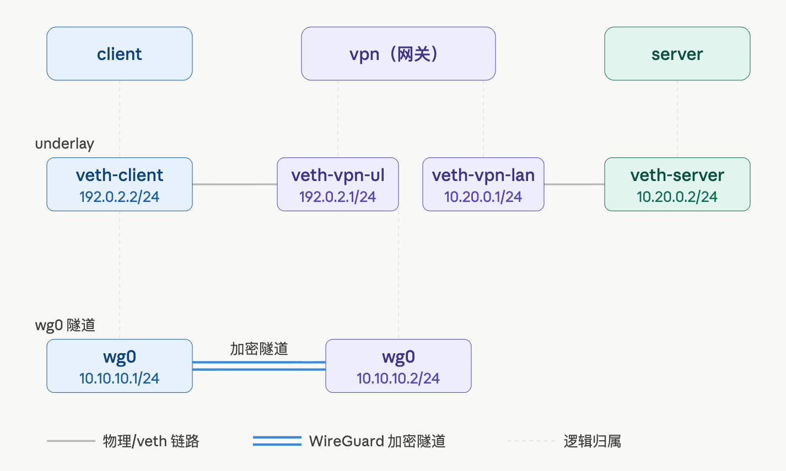
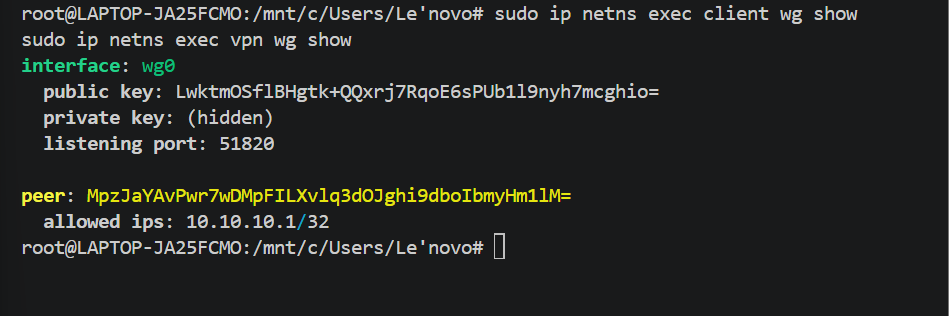
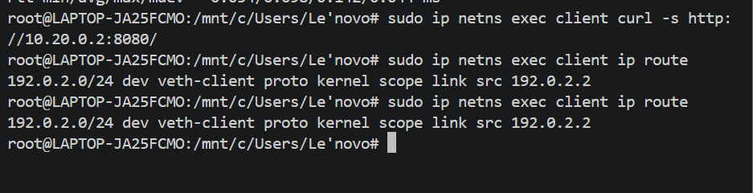
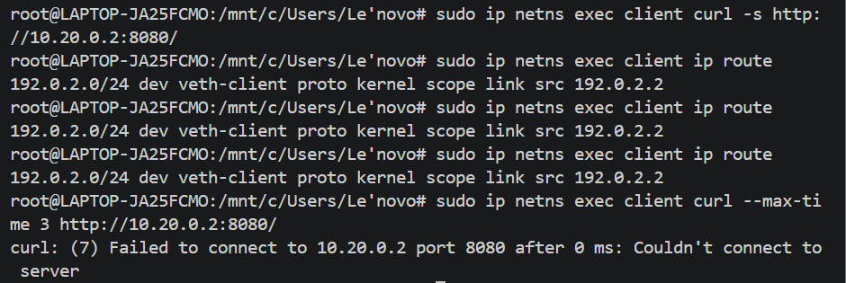
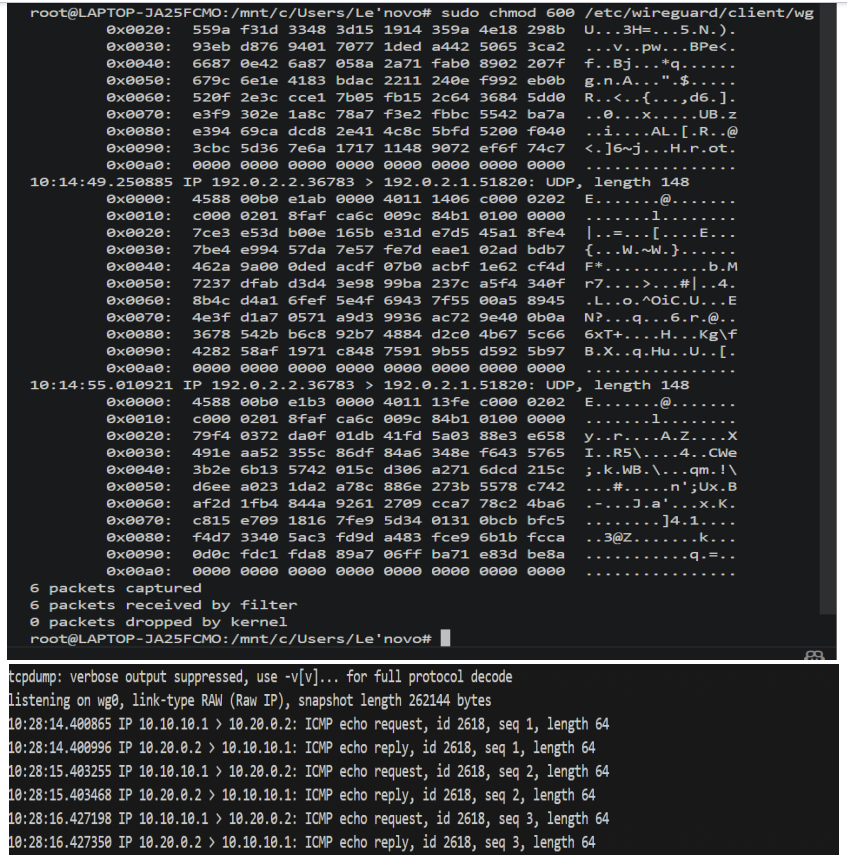

# Lab11：WireGuard VPN 入门——建隧道，并理解 AllowedIPs 如何控制流量

## 

### 防火墙阶段学到了什么

Lab6 到 Lab10 围绕一台防火墙展开。你学会了：

- 用 iptables 在 INPUT 链和 FORWARD 链上写规则，控制谁能过、谁不能过
- 用 conntrack 跟踪连接状态，区分"新连接"和"已有连接的回复"
- 用 NAT 把内网私有地址隐藏在一个公网地址后面
- 用 DNAT 把外网访问映射到内网服务

这些都是**在明路上设关卡**。防火墙假设流量就走在正常的网络路径上，它做的事情是"看这条路上的每个包，决定放还是拦"。

### VPN 解决的是另一个问题

但防火墙管不了一件事：**流量在路上被谁看了**。

当你从内网访问一个公网服务器时，你发出去的每一个包都经过 ISP  (互联网服务提供商) 的路由器、海底光缆、各种中间节点。如果这个包是明文的——比如一个普通的 HTTP 请求——沿途任何一个节点都能看到里面写了什么。即使你用 HTTPS 加密了应用层，IP 层照样暴露"谁在跟谁通信"。

VPN 的思路是**在不可信的公网上方，再修一条受保护的空中走廊**：

```
 内网主机 ←→ VPN 隧道 ←→ 远端网络
            ↑
    底层公网只看到加密后的 UDP 包，
    看不到内层真实地址和内容
```

换句话说：

- **防火墙**关心的是：这个包允不允许过（看包头字段、看状态）
- **VPN** 关心的是：这个包在路上安不安全（把它整个封装进另一个加密包里）

### Lab11 的目标

本次实验用 WireGuard 在一台机器上模拟一个最小的 VPN 场景：一个客户端、一个 VPN 网关、一个内网服务器。

你可以先把 VPN 理解成一条**加密通道**：客户端想访问内网服务器时，不是把原始数据直接丢到普通网络上，而是先把这些数据交给 WireGuard。WireGuard 会把它们加密后装进另一个 UDP 包里，再通过普通网络发出去。外面的网络只负责把这个加密后的包送到对端，看不到里面真正访问了谁、传了什么内容。

完成本实验后，你应该能看懂下面几件事：

1. WireGuard 会在两端各创建一个 `wg0` 虚拟网卡。它像一块看不见的网卡，有自己的 IP 地址，用来接收需要加密转发的数据。
2. 真正要访问服务的数据，例如 `curl` 请求和服务器响应，会先进入 `wg0`，再被 WireGuard 加密后通过真实网卡发出去。
3. 普通网络只能看到外层 UDP 包，源地址和目的地址是底层网络地址，包里的内容已经被加密，看不见内网服务器地址和具体数据。
4. `AllowedIPs` 决定两件事：本机访问哪些地址时要交给 `wg0` 处理，以及对端发来的哪些源地址可以被接受。
5. 为什么 `AllowedIPs` 写错时，`wg show` 仍然可能显示两端联系正常，但真正访问内网服务会失败。

> **说明**：推荐在 Ubuntu 虚拟机中完成，需要 `sudo` 权限。本实验在一台机器上用 namespace 模拟三节点环境。

------

## WireGuard 核心机制

在动手之前，先把 WireGuard 的关键概念看清楚。

### 密钥体系

WireGuard 的认证不靠"用户名+密码"，也不靠"预共享密钥"，而是**直接使用公私钥对**。每个节点生成一对密钥：

- **私钥**（private key）：留在本地，绝不外传。用于解密收到的包、签名发出的包。
- **公钥**（public key）：交给对端，写到对方配置的 `[Peer]` 段里。对端用这个公钥验证"这个包确实是来自声称的那个人"。

这和 SSH 密钥登录的逻辑一样：你把公钥放到服务器上，本地保存私钥。连接时服务器用你给的公钥验证你的身份——不需要密码。

### WireGuard 的两个角色

在一条隧道中，WireGuard 不区分"服务端"和"客户端"。但从连接建立的主动/被动角度看，有两类角色：

**被动监听方**负责在某个固定的 UDP 端口上等待对端发来的握手包。它不知道对端的地址，只知道"如果有合法的握手包到我这个端口，我就响应"。

**主动连接方**需要知道对端监听在哪个地址和端口，才能主动发起握手。配置里用 `Endpoint` 字段来告知这个信息——它就像一个"拨号地址"，格式是 `对端的IP:端口`，例如 `192.0.2.1:51820`。

> `Endpoint` 字段是"我去找谁"，而 `ListenPort` 是"我在哪里等"。两个字段各属于自己的一端配置。

| 角色       | 特征                        | 配置要求                                                     |
| ---------- | --------------------------- | ------------------------------------------------------------ |
| 主动连接方 | 主动向对端发 UDP 包建立连接 | 必须在 `[Peer]` 段里写对端的 `Endpoint`，可以不写自己的 `ListenPort` |
| 被动监听方 | 在固定端口上等待对端连接    | 必须写 `ListenPort`                                          |

如果两端都配了对方的 `Endpoint`，则任意一端掉线后都能主动重连。

### wg0 虚拟接口是怎么来的

WireGuard 工作时，需要在操作系统里创建一个**虚拟网络接口**（通常叫 `wg0`），就像一块"虚拟网卡"。所有要走进隧道的包先交给这块虚拟网卡，WireGuard 内核模块再负责把它加密封装成 UDP 包，从底层物理接口发出去。

手工配置这块虚拟网卡需要多个步骤：建接口、配 IP、配 WireGuard 参数、写路由……为了简化这个流程，WireGuard 提供了一个封装好的脚本命令 `wg-quick`。

### wg-quick 做了什么

`wg-quick up wg0` 读取一个配置文件，自动完成所有准备工作。具体来说，它依次执行了：

1. `ip link add wg0 type wireguard`：创建 `wg0` 虚拟接口
2. `ip addr add <Address>`：把配置文件 `[Interface]` 段里的 `Address` 配到 `wg0` 上
3. 加载密钥、Peer 信息等 WireGuard 参数
4. **把 `[Peer]` 段中 `AllowedIPs` 列出的网段写入操作系统路由表**，路由指向 `wg0`
5. `ip link set wg0 up`：启动接口

`wg-quick down wg0` 则反向执行：删路由、删接口。

这意味着 **`AllowedIPs` 不仅影响 WireGuard 内部的收发逻辑，还直接影响操作系统的路由表**——这是后面任务里你会看到 `ip route` 随 AllowedIPs 变化的根本原因。

> 因为 `wg-quick` 不会热更新已有配置，**每次修改配置文件后都必须先 down 再 up**，让它重新读取配置、重建路由。

------

## WireGuard 配置字段说明

### [Interface] 段——本端的身份和设置

| 字段         | 类型                       | 是否必填   | 作用                                                         |
| ------------ | -------------------------- | ---------- | ------------------------------------------------------------ |
| `Address`    | CIDR（如 `10.10.10.1/24`） | **必填**   | 本端虚拟接口的 IP 地址和子网掩码。`wg-quick up` 会把它配到 `wg0` 接口上 |
| `PrivateKey` | base64（44 字符）          | **必填**   | 本端私钥。用它解密对端发来的包，以及给本端发出的包签名       |
| `ListenPort` | 整数（1-65535）            | 被动端必填 | 监听的 UDP 端口。对端的 `Endpoint` 里写的端口就是这个        |
| `DNS`        | IP 地址                    | 可选       | 连接成功后推送给客户端的 DNS 服务器。本实验不涉及            |
| `MTU`        | 整数                       | 可选       | 虚拟接口的 MTU。WireGuard 默认 1420（比以太网 1500 小 80 字节，留给封装头） |
| `Table`      | `auto` / `off` / 数字      | 可选       | 路由写在哪张表里。默认 `auto`，即主路由表。设 `off` 不让 wg-quick 自动写路由 |

### [Peer] 段——对端的身份和通信策略

| 字段                  | 类型                  | 是否必填   | 作用                                                         |
| --------------------- | --------------------- | ---------- | ------------------------------------------------------------ |
| `PublicKey`           | base64（44 字符）     | **必填**   | 对端公钥。WireGuard 用这个公钥验证"收到的包确实来自这个对端" |
| `Endpoint`            | `IP:端口`             | 主动端必填 | 对端在公网上的监听地址（"拨号地址"）。不填意味着"这个 peer 只能被动接受连接，不主动发起" |
| `AllowedIPs`          | CIDR 列表（逗号分隔） | **必填**   | **双重作用**。详见下一节                                     |
| `PersistentKeepalive` | 秒数                  | 可选       | 每隔 N 秒发一个心跳包，防止 NAT 设备的超时断连。一般设 25    |

### AllowedIPs 的双重作用（这是本实验的核心）

`AllowedIPs` 是 WireGuard 里最容易误解的一个字段。它看起来像"允许哪些地址"，但实际做了两件完全不同的事：

**作用一：出口路由（发包方向）**

前面提到 `wg-quick up` 会把 `AllowedIPs` 里的每个网段写入路由表：

> 发往这个网段的包 → 从 wg0 接口出去

你可以用 `ip route` 直接看到这些路由条目。把这个网段写入 AllowedIPs，就等于告诉操作系统："如果你想访问这个地址，把包交给 wg0 接口。"

本实验中的出口路由例子：

- 正例：client 端的 `AllowedIPs = 10.20.0.0/24`，表示发往 `10.20.0.0/24` 的包交给 vpn 这个 peer。client 访问 `10.20.0.2` 时，目标地址匹配这个网段，包会走进 wg0。
- 反例：如果把 client 端的 `AllowedIPs` 改成 `10.30.0.0/24`，路由表里就没有去 `10.20.0.0/24` 的条目。client 再访问 `10.20.0.2` 时，包根本不走 wg0，出都出不去。

**作用二：入口白名单（收包方向）**

当 wg0 收到一个解密后的内部包时，WireGuard 检查这个包的**源 IP** 是否在该 peer 的 `AllowedIPs` 范围内。如果不在，这个包被直接丢弃——即使隧道已经建立。

注意：这里检查的是**收包这一端本机配置里的 peer AllowedIPs**，不是发包端自己的 `AllowedIPs`。

本实验中的入口白名单例子：

- 正例：vpn 端给 client 这个 peer 配置 `AllowedIPs = 10.10.10.1/32`。client 的请求包到达 vpn 后，解密出的源 IP 是 `10.10.10.1`，匹配这个白名单，所以 vpn 放行并转发到 server。
- 反例：如果 vpn 端把 client 这个 peer 的 `AllowedIPs` 改成 `10.10.10.99/32`，client 发来的包解密后源 IP 仍然是 `10.10.10.1`。vpn 发现它不在白名单里，会直接丢弃这个内层包，哪怕隧道握手完全正常。

**隧道握手和数据传输用的是两套地址**：

- 握手：用 `Endpoint` 里的 underlay 地址（`192.0.2.x`），只要这个地址可达，握手就能完成
- 数据传输：用 `AllowedIPs` 控制出口路由和入口白名单。出口不匹配时，包不会进入隧道；入口不匹配时，包解密后也会被丢弃

这就是为什么 AllowedIPs 写错时，`wg show` 里还有 `latest handshake`，但 `curl` 已经连不上了——握手走的是一条路，数据传输走的是另一条路。

------

## 实验拓扑



完整地址规划：

| 节点     | 接口                | IP 地址         | 角色                                   |
| -------- | ------------------- | --------------- | -------------------------------------- |
| `client` | `veth-client`       | `192.0.2.2/24`  | VPN 客户端，通过隧道访问 server        |
| `client` | `wg0`               | `10.10.10.1/24` | 客户端虚拟接口                         |
| `vpn`    | `veth-vpn-ul`       | `192.0.2.1/24`  | VPN 网关外侧接口，底层互联             |
| `vpn`    | `veth-vpn-lan`      | `10.20.0.1/24`  | VPN 网关内侧接口，接入 server 所在内网 |
| `vpn`    | `wg0`               | `10.10.10.2/24` | 网关虚拟接口                           |
| `server` | `veth-server`       | `10.20.0.2/24`  | 内网服务器，运行 HTTP 服务             |

> 这三个节点各占一个 Linux 网络命名空间（namespace），是一台机器上互相隔离的三个"虚拟小机器"。创建 veth 对连接它们，和 Lab7-Lab10 的用法完全一样。
> 注意：Linux 接口名最多 15 个字符，后续接口名都控制在这个长度以内。

vpn 网关**横跨两个网络**，它的一只脚在公网侧，另一只脚在内网侧，是**内网的边界**。

现实中的 VPN 网关也是同样的角色——它暴露一个公网地址供客户端连入，同时又能访问内网资源，本质是一个"受信任的出入口"。

------

## 准备工作

### 安装实验工具

本实验会用到 WireGuard、抓包、HTTP 访问和临时 HTTP 服务。开始前先安装需要的命令：

```bash
sudo apt update
sudo apt install -y wireguard-tools iproute2 iptables tcpdump curl python3
```

安装完成后检查 `wg` 和 `wg-quick` 是否可用：

```bash
wg --version
command -v wg-quick
```

如果 `wg genkey` 提示 `Command 'wg' not found`，说明还没有安装 `wireguard-tools`。

### 清理残留环境

如果之前做过本实验或中途出错重来，先清理干净：

```bash
sudo ip netns exec client wg-quick down /etc/wireguard/client/wg0.conf 2>/dev/null
sudo ip netns exec vpn wg-quick down /etc/wireguard/vpn/wg0.conf 2>/dev/null
sudo ip netns exec client ip link del wg0 2>/dev/null
sudo ip netns exec vpn ip link del wg0 2>/dev/null
sudo ip netns del client 2>/dev/null; sudo ip netns del vpn 2>/dev/null; sudo ip netns del server 2>/dev/null
sudo ip link del veth-client 2>/dev/null; sudo ip link del veth-vpn-ul 2>/dev/null
sudo ip link del veth-server 2>/dev/null; sudo ip link del veth-vpn-lan 2>/dev/null
```

> `2>/dev/null` 表示忽略"不存在"的报错。即使是第一次执行也可以安全运行。
> 如果中途做乱了，也可以执行上面这组命令，把实验环境恢复到任务一开始前的状态，然后重新从"创建三个网络命名空间"开始。

整个实验建议打开三到四个终端：

| 终端   | 用途                                             |
| ------ | ------------------------------------------------ |
| 终端 A | 在 `server` 中运行 HTTP 服务（一直开着）         |
| 终端 B | 在 `client` 中执行 ping / curl                   |
| 终端 C | 在 `vpn` 上查看 WireGuard 状态、路由表、iptables |
| 终端 D | （可选）在 `vpn` 或 `client` 上运行 tcpdump      |

------

## 任务一：建立拓扑并部署最小隧道

### 第一步：创建三个网络命名空间

```bash
sudo ip netns add client
sudo ip netns add vpn
sudo ip netns add server
```

命令说明：

| 部分                  | 含义                                 |
| --------------------- | ------------------------------------ |
| `ip netns add client` | 创建一个名为 `client` 的网络命名空间 |
| `ip netns add vpn`    | 创建网关命名空间                     |
| `ip netns add server` | 创建内网服务器命名空间               |

执行后用 `sudo ip netns list` 确认三个命名空间都出现在列表里。

### 第二步：创建两对 veth 并分配到各命名空间

```bash
sudo ip link add veth-client type veth peer name veth-vpn-ul
sudo ip link add veth-server type veth peer name veth-vpn-lan

sudo ip link set veth-client netns client
sudo ip link set veth-vpn-ul netns vpn
sudo ip link set veth-server netns server
sudo ip link set veth-vpn-lan netns vpn
```

命令说明：

| 部分                                                         | 含义                                                         |
| ------------------------------------------------------------ | ------------------------------------------------------------ |
| `ip link add veth-client type veth peer name veth-vpn-ul`  | 创建一对 veth，两端分别叫 `veth-client` 和 `veth-vpn-ul`，模拟 client 到 vpn 的底层网线 |
| `ip link add veth-server type veth peer name veth-vpn-lan`   | 创建第二对 veth，模拟 vpn 到 server 的内网网线               |
| `ip link set veth-client netns client`                       | 把 `veth-client` 移入 `client` 命名空间                      |

### 第三步：配置 IP 地址并启用接口

```bash
# client 端
sudo ip netns exec client ip addr add 192.0.2.2/24 dev veth-client
sudo ip netns exec client ip link set veth-client up
sudo ip netns exec client ip link set lo up

# vpn 端
sudo ip netns exec vpn ip addr add 192.0.2.1/24 dev veth-vpn-ul
sudo ip netns exec vpn ip link set veth-vpn-ul up
sudo ip netns exec vpn ip addr add 10.20.0.1/24 dev veth-vpn-lan
sudo ip netns exec vpn ip link set veth-vpn-lan up
sudo ip netns exec vpn ip link set lo up

# server 端
sudo ip netns exec server ip addr add 10.20.0.2/24 dev veth-server
sudo ip netns exec server ip link set veth-server up
sudo ip netns exec server ip link set lo up
```

命令说明：

| 部分                                       | 含义                                        |
| ------------------------------------------ | ------------------------------------------- |
| `ip netns exec client`                     | 在 `client` 命名空间中执行后面的命令        |
| `ip addr add 192.0.2.2/24 dev veth-client` | 给接口配 IP 地址和子网                      |
| `ip link set veth-client up`               | 启用接口（新建接口默认是 DOWN 状态）        |
| `ip link set lo up`                        | 启用回环接口（新建 namespace 回环默认关闭） |

### 第四步：配置路由和 IP 转发

```bash
sudo ip netns exec server ip route add default via 10.20.0.1
sudo ip netns exec vpn sysctl -w net.ipv4.ip_forward=1
```

命令说明：

| 部分                                 | 含义                                                         |
| ------------------------------------ | ------------------------------------------------------------ |
| `ip route add default via 10.20.0.1` | 给 server 配默认网关（指向 vpn 的内侧接口），这样 server 发出的回包知道怎么走出去 |
| `sysctl -w net.ipv4.ip_forward=1`    | 开启 vpn 的 IP 转发功能。没有这个，vpn 不会在两个接口之间传递数据包，隧道里过来的包永远到不了 server |

### 第五步：验证 underlay 连通（终端 B）

```bash
sudo ip netns exec client ping -c 2 192.0.2.1
```

命令说明：

| 部分        | 含义                        |
| ----------- | --------------------------- |
| `ping -c 2` | 发送 2 个 ICMP 包后自动停止 |
| `192.0.2.1` | vpn 的 underlay 地址        |

应该看到 `2 packets transmitted, 2 received`。如果失败，检查前面四步是否有命令遗漏、接口是否 up。

### 第六步：生成密钥（在宿主机上）

WireGuard 的密钥是全局的（不绑定 namespace），直接在宿主机上生成即可：

```bash
umask 077
wg genkey | tee client.key | wg pubkey > client.pub
wg genkey | tee vpn.key | wg pubkey > vpn.pub
```

命令说明：

| 部分                     | 含义                                                         |
| ------------------------ | ------------------------------------------------------------ |
| `umask 077`              | 设置文件创建权限，确保密钥文件只有当前用户可读写（`600`），其他用户不能读 |
| `wg genkey`              | 生成一个 WireGuard 私钥，输出到 stdout                       |
| `tee client.key`         | 把私钥同时输出到屏幕和文件 `client.key`                      |
| `wg pubkey > client.pub` | 从 stdin 读取私钥，计算对应的公钥，写入 `client.pub`         |

分别查看两端密钥（后面配置会用到）：

```bash
echo "=== client 私钥 ===" && cat client.key
echo "=== client 公钥 ===" && cat client.pub
echo "=== vpn 私钥 ===" && cat vpn.key
echo "=== vpn 公钥 ===" && cat vpn.pub
```

### 第七步：创建 WireGuard 配置文件

在写配置之前，先理解这份配置做了什么：

- `[Interface]` 段描述**本节点自己**：虚拟接口的 IP 是什么、用哪个私钥、在哪个端口等待连接（如果是被动端）
- `[Peer]` 段描述**对端**：对端的公钥是什么、在哪里可以找到它（Endpoint）、允许哪些流量通过隧道（AllowedIPs）

`client` 端是主动连接方：它知道 vpn 的地址（`192.0.2.1:51820`），主动去敲门。`vpn` 端是被动监听方：它在 51820 端口等待，不主动发起。

先确认当前目录里有四个密钥文件：

```bash
ls client.key client.pub vpn.key vpn.pub
```

然后创建两个配置目录，并把密钥读入临时变量：

```bash
sudo mkdir -p /etc/wireguard/client /etc/wireguard/vpn
CLIENT_PRIVATE_KEY=$(cat client.key)
CLIENT_PUBLIC_KEY=$(cat client.pub)
VPN_PRIVATE_KEY=$(cat vpn.key)
VPN_PUBLIC_KEY=$(cat vpn.pub)
```

两个配置文件都叫 `wg0.conf`，是为了让 `wg-quick` 创建出来的接口都叫 `wg0`；放在不同目录，是为了避免 client 和 vpn 的配置互相覆盖。

`client` 端配置（创建文件 `/etc/wireguard/client/wg0.conf`）：

```bash
sudo tee /etc/wireguard/client/wg0.conf > /dev/null <<EOF
[Interface]
Address = 10.10.10.1/24
PrivateKey = ${CLIENT_PRIVATE_KEY}

[Peer]
PublicKey = ${VPN_PUBLIC_KEY}
Endpoint = 192.0.2.1:51820
AllowedIPs = 10.20.0.0/24
PersistentKeepalive = 25
EOF
```

`vpn` 端配置（创建文件 `/etc/wireguard/vpn/wg0.conf`）：

```bash
sudo tee /etc/wireguard/vpn/wg0.conf > /dev/null <<EOF
[Interface]
Address = 10.10.10.2/24
PrivateKey = ${VPN_PRIVATE_KEY}
ListenPort = 51820

[Peer]
PublicKey = ${CLIENT_PUBLIC_KEY}
AllowedIPs = 10.10.10.1/32
EOF
```

```bash
sudo chmod 600 /etc/wireguard/client/wg0.conf /etc/wireguard/vpn/wg0.conf
```

> **注意**：这里的 `<<EOF` 前后不要加单引号，因为需要让 shell 把 `${CLIENT_PRIVATE_KEY}` 这些变量替换成真实密钥。`wg-quick` 会根据配置文件名决定接口名，如果文件叫 `wg0-client.conf`，创建出的接口就会叫 `wg0-client`，不是 `wg0`。

配置说明对照前面的字段表：

| 配置项                | client 端取值     | vpn 端取值      | 为什么这样写                                                 |
| --------------------- | ----------------- | --------------- | ------------------------------------------------------------ |
| `Address`             | `10.10.10.1/24`   | `10.10.10.2/24` | 隧道内的虚拟地址，两端在同一个 `/24` 网段                    |
| `ListenPort`          | 无                | `51820`         | vpn 是被动端，需要在此端口等待 client 连接                   |
| `Endpoint`            | `192.0.2.1:51820` | 无              | client 是主动端，需要知道去哪里敲门；vpn 不主动发起所以不填  |
| `AllowedIPs`          | `10.20.0.0/24`    | `10.10.10.1/32` | client 端：发往 server 内网的包走进隧道；vpn 端：只接受来自 client wg0 地址的包 |
| `PersistentKeepalive` | `25`              | 无              | client 在 NAT 后面时每 25 秒发心跳保持隧道存活               |

### 第八步：启动隧道

```bash
sudo ip netns exec client wg-quick up /etc/wireguard/client/wg0.conf
sudo ip netns exec vpn wg-quick up /etc/wireguard/vpn/wg0.conf
```

命令说明：

| 部分          | 含义                                                         |
| ------------- | ------------------------------------------------------------ |
| `wg-quick up` | 创建 wg0 接口、配地址、写路由、设置 WireGuard 参数，一条命令完成所有操作 |

> **wg-quick 在 namespace 中的常见问题**
>
> `wg-quick` 在 namespace 内执行时，有几个常见报错：
>
> 1. **`resolvconf: command not found`**：无害警告，可忽略。namespace 里没有 resolvconf，不影响隧道建立。
> 2. **`RTNETLINK answers: Operation not supported`**：通常是内核没有加载 WireGuard 模块。尝试 `sudo modprobe wireguard` 后重试。
> 3. **`ip: can't open '/run/netns/client': No such file or directory`**：namespace 未正确创建，回到第一步重建。
>
> 如果 `wg-quick` 在 namespace 中持续报错，可以改用底层命令手动搭建：
>
> ```bash
> # 以 client 端为例
> sudo ip netns exec client ip link add wg0 type wireguard
> sudo ip netns exec client ip addr add 10.10.10.1/24 dev wg0
> sudo ip netns exec client wg setconf wg0 /etc/wireguard/client/wg0.conf
> sudo ip netns exec client ip link set wg0 up
> sudo ip netns exec client ip route add 10.20.0.0/24 dev wg0
> ```
>
> 这五条命令与 `wg-quick up` 的效果完全等价，逐条执行便于定位是哪一步出问题。

### 第九步：查看隧道状态（终端 C）

```bash
sudo ip netns exec client wg show
sudo ip netns exec vpn wg show
```

命令说明：

| 部分      | 含义                                                         |
| --------- | ------------------------------------------------------------ |
| `wg show` | 显示当前命名空间中所有 WireGuard 接口的状态，包括 peer 信息、握手时间、收发字节数 |

关注输出中的几个关键字段：

- `latest handshake`：最后一次握手成功的时间。有值说明两端已经完成密钥交换，隧道可用。
- `transfer`：`X MiB received, Y MiB sent`，收发字节数。能看到数据说明已经有流量通过隧道。
- `allowed ips`：本端为这个 peer 配置的 `AllowedIPs`，既用于选择发往哪些目标地址的包交给这个 peer，也用于校验这个 peer 发来的内层包源地址。

### 第十步：填写下表

#### A. 拓扑信息

| 项目                   | 你的填写 |
| ---------------------- | -------- |
| `client` underlay 地址 |203.0.113.2（客户端底层物理 IP）          |
| `vpn` underlay 地址    |203.0.113.1（服务端底层公网 IP，wg 监听 51820）          |
| `client` wg0 地址      |10.10.10.2/24（客户端隧道内网地址）          |
| `vpn` wg0 地址         |10.10.10.1/24（服务端隧道网关）          |
| `server` 地址          |10.20.0.2/24（后端被访问业务服务器）          |

#### B. 隧道状态

| 项目                                   | 你的填写 |
| -------------------------------------- | -------- |
| 是否看到 `latest handshake`            |是（握手成功，隧道连通）          |
| 是否看到 `transfer` 计数               |是（收发数据包有字节统计）          |
| client 端的 `allowed ips` 显示的是什么 |10.10.10.1/32,10.20.0.0/24          |

截图：



------

## 任务二：用隧道访问内网服务——AllowedIPs 写对时

### 第一步：在 server 上启动 HTTP 服务（终端 A）

```bash
sudo ip netns exec server python3 -m http.server 8080
```

命令说明：

| 部分                          | 含义                                                  |
| ----------------------------- | ----------------------------------------------------- |
| `python3 -m http.server 8080` | Python 内置的简单 HTTP 文件服务器，监听 TCP 8080 端口 |

看到 `Serving HTTP on 0.0.0.0 port 8080` 后保持终端 A 不要关闭。

### 第二步：从 client 通过隧道访问 server（终端 B）

```bash
sudo ip netns exec client curl -s http://10.20.0.2:8080/
```

命令说明：

| 部分                     | 含义                                                         |
| ------------------------ | ------------------------------------------------------------ |
| `curl -s`                | `-s` 是 silent 模式，隐藏进度条                              |
| `http://10.20.0.2:8080/` | 目标地址是 server 的内网地址（10.20.0.2），这是一个 client 无法直连的地址——中间隔着 underlay 和 vpn 网关 |

访问成功说明：

1. client 要发往 `10.20.0.2` 的包，路由表告诉它"走 wg0"
2. wg0 把整个 IP 包封装进 WireGuard 加密的 UDP 包，发往 vpn 的 underlay 地址 `192.0.2.1:51820`
3. vpn 收到 UDP 包，用私钥解密，取出内层原始 IP 包
4. vpn 用自己配置中 client peer 的 `AllowedIPs = 10.10.10.1/32` 校验内层包源地址 `10.10.10.1`，匹配后放行
5. vpn 发现内层包的目的地址是 `10.20.0.2`（在自己内网侧），从 `veth-vpn-lan` 转发出去
6. server 收到请求，回复经过 vpn 走同一隧道返回
7. client 收到回包后，用自己配置中 vpn peer 的 `AllowedIPs = 10.20.0.0/24` 校验内层包源地址 `10.20.0.2`，匹配后接受

### 第三步：查看 client 端的路由表（终端 B）

```bash
sudo ip netns exec client ip route
```

关注输出中与 `wg0` 相关的条目：

```text
10.20.0.0/24 dev wg0 scope link
10.10.10.0/24 dev wg0 proto kernel scope link src 10.10.10.1
```

这就是 `wg-quick up` 自动写入的路由——`AllowedIPs = 10.20.0.0/24` 的第一重作用（出口路由）。

### 第四步：填写下表

#### C. 正确配置下的现象

| 项目                         | 你的填写 |
| ---------------------------- | -------- |
| `AllowedIPs` 的值            |10.10.10.1/32,10.20.0.0/24          |
| 是否能访问 `10.20.0.2:8080`  |能          |
| `ip route` 中 wg0 相关的条目 |10.20.0.0/24 dev wg0 scope link          |

截图：



------

## 任务三：AllowedIPs 写错——路由消失，访问失败

### 第一步：修改 client 端的 AllowedIPs（终端 C）

把 client 端配置中的 AllowedIPs 改成：

```ini
AllowedIPs = 10.30.0.0/24
```

> `10.30.0.0/24` 是一个不存在的网段——实验环境里没有任何设备属于这个网段。

`wg-quick` 不会自动感知配置文件的变化，必须先关闭再重新启动，让它重新读取配置、重建路由表：

```bash
sudo ip netns exec client wg-quick down /etc/wireguard/client/wg0.conf
sudo ip netns exec client wg-quick up /etc/wireguard/client/wg0.conf
```

命令说明：

| 部分            | 含义                                               |
| --------------- | -------------------------------------------------- |
| `wg-quick down` | 删除接口、清除 wg-quick 之前写入的路由条目         |
| `wg-quick up`   | 用新配置重新创建接口，并按新的 AllowedIPs 重写路由 |

### 第二步：查看 wg show（终端 C）

```bash
sudo ip netns exec client wg show
```

**关键观察**：`latest handshake` 仍然有值，说明隧道层面没有断开——握手和保活用的是 underlay 地址（`192.0.2.1:51820`），和 AllowedIPs 里写什么完全无关。

### 第三步：查看路由表变化（终端 B）

```bash
sudo ip netns exec client ip route
```

与任务二中看到的路由表对比：

| 观察点                    | AllowedIPs = 10.20.0.0/24      | AllowedIPs = 10.30.0.0/24      |
| ------------------------- | ------------------------------ | ------------------------------ |
| 去 `10.20.0.0/24` 的路由  | **有**（指向 wg0）             | **没有**                       |
| 去 `10.30.0.0/24` 的路由  | 没有                           | **有**（指向 wg0）             |
| 去 `10.10.10.0/24` 的路由 | 有（`proto kernel`，自动生成） | 有（`proto kernel`，自动生成） |

> `10.10.10.0/24` 的路由不是 `AllowedIPs` 写出来的，而是 `wg-quick` 给 `wg0` 配置 `Address = 10.10.10.1/24` 时，Linux 内核自动生成的直连路由（`proto kernel`）。它的作用是让 wg0 接口本身所在的网段可达。

### 第四步：尝试访问 server——失败（终端 B）

```bash
sudo ip netns exec client curl --max-time 3 http://10.20.0.2:8080/
```

命令说明：

| 部分           | 含义                                                         |
| -------------- | ------------------------------------------------------------ |
| `--max-time 3` | 超时 3 秒后自动放弃（不加这个参数，curl 会一直等到默认超时） |

应该看到 `Connection timed out` 或没有回应。失败原因：

- client 要发往 `10.20.0.2`，查路由表：没有匹配条目（去 `10.20.0.0/24` 的路由已经消失）
- 包走默认路由或直接被丢弃
- wg0 接口根本不会收到这个包——**隧道的存在与这个包无关**

### 第五步：填写下表

#### D. 错误配置下的现象

| 项目                             | 你的填写 |
| -------------------------------- | -------- |
| 修改后的 `AllowedIPs`            |10.30.0.0/24          |
| `latest handshake` 是否还在      |仍然存在（底层 UDP 隧道握手正常）          |
| 去 `10.20.0.0/24` 的路由是否消失 |路由已消失，ip route 无 10.20.0.0/24 dev wg0 条目          |
| 是否还能访问 `10.20.0.2:8080`    |不能，curl 超时连接失败          |
| 失败的直接原因                   |AllowedIPs 修改后，wg-quick 自动删除10.20.0.0/24指向 wg0 的内核路由，访问流量没有隧道转发路由，无法送入 WireGuard 隧道          |

> 简答：为什么 `wg show` 显示隧道还在，但业务访问已经失败？隧道握手和业务数据传输用的是两套不同的路径还是同一套？
答：两套不同路径
(1)隧道握手（latest handshake）：依托底层 underlay 公网 UDP 路由（51820 端口），和内网业务路由无关，所以握手正常；
(2)业务数据转发：依赖内核路由表中10.20.0.0/24→wg0路由，路由被删除后业务无法进隧道，访问失败。

截图：



------

## 任务四：内外层抓包对比——看封装前后的差异

### 第一步：在 vpn 的 underlay 接口上抓包（终端 D）

```bash
sudo ip netns exec vpn tcpdump -ni veth-vpn-ul udp port 51820 -X -c 6
```

命令说明：

| 部分                   | 含义                                             |
| ---------------------- | ------------------------------------------------ |
| `tcpdump -n`           | 不把 IP 和端口反解析成域名或服务名               |
| `-i veth-vpn-ul`       | 在 vpn 的 underlay 接口上抓包                    |
| `udp port 51820`       | 过滤器：只看 WireGuard 使用的 UDP 51820 端口     |
| `-X`                   | 把包内容用十六进制和 ASCII 打出来，便于观察内容 |
| `-c 6`                 | 抓到 6 个包后自动停止                            |

### 第二步：从 client ping server（终端 B）

先把 AllowedIPs 改回正确的 `10.20.0.0/24`，重启隧道（down 再 up），然后：

```bash
sudo ip netns exec client ping -c 3 10.20.0.2
```

### 第三步：观察终端 D 的抓包输出

看到的应该类似：

```text
IP 192.0.2.2.xxxxx > 192.0.2.1.51820: UDP, length 128
        0x0000:  4500 009c 3a1f 4000 4011 7c2e c000 0202
        0x0010:  c000 0201 d431 ca6c 0088 0000 0400 0000
        0x0020:  8b71 a93e 5f2c 9d10 2a7e 6c91 ...
IP 192.0.2.1.51820 > 192.0.2.2.xxxxx: UDP, length 128
        0x0000:  4500 009c 12ab 4000 4011 a3b4 c000 0201
        0x0010:  c000 0202 ca6c d431 0088 0000 0400 0000
        0x0020:  f1a0 43bd 7699 0e2c 884e d2aa ...
```

注意这些 UDP 包的**源和目的地址**：

- 源地址是 client 的 underlay 地址 `192.0.2.2`，不是 `10.10.10.1`
- 目的地址是 vpn 的 underlay 地址 `192.0.2.1`，不是 `10.20.0.2`
- 协议是 UDP，不是 ICMP
- `-X` 打出来的内容只是十六进制字节和不可读字符，看不到 `ICMP echo request`、`GET /`、`10.10.10.1`、`10.20.0.2` 这些内层信息

> 上面的十六进制内容每次运行都不同，不需要和示例完全一致。判断重点是：underlay 抓包只能看出"两端在用 UDP 51820 通信"，看不出里面原本是 ICMP 还是 HTTP。

如果想专门验证 HTTP 也被藏起来，可以在终端 D 重新执行同一条 underlay 抓包命令，然后在终端 B 执行：

```bash
sudo ip netns exec client curl -s http://10.20.0.2:8080/
```

underlay 抓包仍然只会显示 UDP 51820 和十六进制内容，不会出现 `GET /`、`HTTP/1.1` 这样的明文 HTTP 内容。

### 第四步：在 vpn 的 wg0 接口上再抓一次（终端 D）

```bash
sudo ip netns exec vpn tcpdump -ni wg0 -l
```

然后在终端 B 再 ping 一次：

```bash
sudo ip netns exec client ping -c 3 10.20.0.2
```

这次看到的是解密后的内层流量：

```text
IP 10.10.10.1 > 10.20.0.2: ICMP echo request
IP 10.20.0.2 > 10.10.10.1: ICMP echo reply
```

### 第五步：填写下表

#### E. 抓包对比

| 观察点                   | underlay 接口（veth-vpn-ul） | wg0 接口 |
| ------------------------ | ---------------------------------- | -------- |
| 看到的源地址             |192.0.2.2                                    |10.10.10.1          |
| 看到的目的地址           |192.0.2.1                                    |10.20.0.2          |
| 协议                     | UDP，目的端口 51820                                   |ICMP          |
| 是否能看到 ICMP/HTTP 内容 |不能，报文全部是加密十六进制乱码，无明文业务内容                                   |可以，明文展示 ICMP echo request/reply 原始报文          |
| 为什么内外两层看到的不同 |WireGuard 采用先加密、再 UDP 封装：内网原始 ICMP 报文整体加密，在外层封装 UDP 头部与公网 IP 头部，在 underlay 底层传输；到达 VPN 服务端后，剥离外层 UDP、IP 头，解密数据，wg0 还原出原始内网 ICMP 报文，因此两层 IP、协议、载荷内容完全不一样。                                    |VPN 服务端剥离外层 UDP 与 IP 头部、解密密文，还原出原始内网 ICMP 报文交由 wg0 处理，因此该接口能够抓到未加密的原始内网流量。          |

> 简答：如果把 VPN 隧道比喻成"信封+信纸"，outer（underlay）抓到的信息对应什么？inner（wg0）抓到的信息对应什么？这样设计对安全性意味着什么？
答：underlay（外层抓包）对应信封，只能看见信封外层的公网收发地址、UDP 封装头部，看不到信封里真实数据；
wg0 内层对应信封里的信纸（原始业务报文）。
安全意义：公网链路上只传输加密后的密文 UDP 包，链路抓包无法破解内网明文数据，防范中间人窃听，保障内网通信安全。

截图：



------

## 任务五：关闭 VPN 隧道

实验结束后关闭隧道，让系统恢复原状：

```bash
sudo ip netns exec client wg-quick down /etc/wireguard/client/wg0.conf
sudo ip netns exec vpn wg-quick down /etc/wireguard/vpn/wg0.conf
```

------

## 思考题

1. WireGuard 的 `AllowedIPs` 做了哪两件不同的事？为什么它"看起来像访问控制，实际上首先影响的是路由"？

   > 答：
   ① 路由生成：wg-quick 根据 AllowedIPs 网段自动在本机添加路由，匹配网段流量全部导向 wg0 隧道接口；
② 入站访问过滤：对等端发来的数据包，源 IP 不在本端 AllowedIPs 网段内会被内核丢弃，实现报文准入过滤。
原因：系统优先依靠内核路由决定流量是否进入隧道，路由是第一层管控，因此修改 AllowedIPs 最先改变路由表，流量转发路径随之变化，路由失效就无法通信，表现出类似访问控制的效果。

2. 本实验中，`wg show` 显示隧道在线，但 `curl` 失败。为什么隧道握手和业务数据传输可以互相独立？

   > 答：
   握手仅完成密钥协商与链路保活，只依赖底层 UDP 连通；业务转发由AllowedIPs 生成的内核路由控制。握手成功代表链路通，但 AllowedIPs 配置错误会导致内网路由缺失，目标网段没有指向 wg0 的路由，业务报文无法送入隧道，因此握手在线但业务访问失败，二者相互独立。

3. 如果只建立隧道而不限制 AllowedIPs（写成 `0.0.0.0/0`），会带来什么风险？

   > 答：
   本机所有全网流量全部默认走 VPN 隧道，出口流量被强制转发到对端，易造成本地断网；
无法做源 IP 过滤，任意来源 IP 报文都能从对端进入本机，失去访问控制，增大内网被入侵、攻击的安全风险；
流量路由不可控，产生不必要的隧道开销与流量泄露。

4. WireGuard 的公私钥模型和 SSH 很像。假设攻击者只拿到了 vpn 节点的私钥，但没有 client 节点的私钥，他能以 client 的身份成功建立隧道吗？为什么？

   > 答：
   不能。WireGuard 是双向非对称验证：客户端用自身私钥签名、服务端用客户端公钥验签；攻击者仅有服务端私钥，无法伪造客户端签名，服务端校验失败直接丢弃报文，无法冒充客户端建立隧道。


5. 底层抓包看到的外层源地址是什么？为什么抓包者看不到内层的真实通信内容？

   > 答：
   外层源地址为公网 IP：192.0.2.2；
原因：WireGuard 对原始内网报文整机加密后再封装 UDP 公网报文，底层链路只传输密文，无任何明文业务载荷，链路抓包无法解密，看不到内层真实 IP 与 ICMP/HTTP 明文。

6. 任务四中内外两层抓包看到的信息完全不同，这说明 VPN 的"封装"机制给通信提供了哪两方面的安全保障？

   > 答：
   数据机密性：原始业务报文全程加密，链路窃听只能拿到密文，无法窃取明文数据；
地址隐藏：公网链路隐藏内网真实网段 IP，中间人无法通过抓包获知内网拓扑、内网 IP 地址，规避内网信息泄露。

------

## 截图要求

- 截图须清晰，终端文字可读。
- 所有截图、拓扑图与本 `Lab11.md` 放在**同一目录**下。

| 截图内容                             | 文件名           |
| ------------------------------------ | ---------------- |
| 实验拓扑图                           | `topology.png`   |
| `wg show` 隧道状态                   | `wg_show.png`    |
| 正确 AllowedIPs 下访问成功与路由表   | `ok_route.png`   |
| 错误 AllowedIPs 下路由变化与访问失败 | `fail_route.png` |
| underlay 和 wg0 双接口抓包对比       | `tcpdump.png`    |

具体要求：

1. `topology.png`：实验拓扑图，需与 Markdown 文件放在同一目录，保证打开实验报告时能直接显示。
2. `wg_show.png`：在 client 或 vpn 中执行 `wg show`，能看到 `latest handshake` 和 `transfer` 计数。
3. `ok_route.png`：能看到 `curl http://10.20.0.2:8080/` 返回成功（目录列表），以及 `ip route` 中指向 wg0 的 `10.20.0.0/24` 路由。
4. `fail_route.png`：能看到改 AllowedIPs 后 `curl` 超时失败，以及 `ip route` 中没有 `10.20.0.0/24` 条目。
5. `tcpdump.png`：能看到 underlay 接口提取的 UDP 51820 加密包，以及 wg0 接口提取的明文 ICMP 包。两张截图拼在一起形成对比，可以使用系统截图工具或 `convert` 命令拼图。

------

## 提交要求

在自己的文件夹下新建 `Lab11/` 目录，提交以下文件：

```text
学号姓名/
└── Lab11/
    ├── Lab11.md       # 本文件（填写完整，含截图与答案）
    ├── topology.png   # 实验拓扑图
    ├── wg_show.png    # 隧道状态截图
    ├── ok_route.png   # 正确配置 + 路由
    ├── fail_route.png # 错误配置 + 路由 + 失败
    └── tcpdump.png    # 内外层抓包对比
```

------

## 截止时间

2026-06-11，届时关于 `Lab11` 的 PR 将不会被合并。
