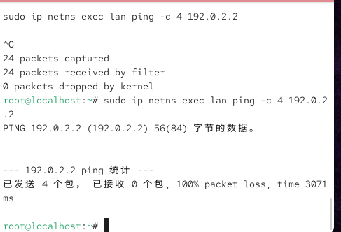
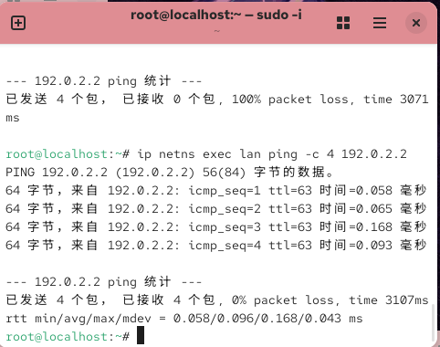
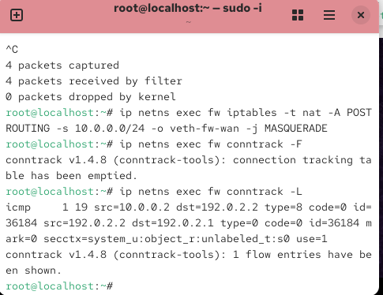

# Lab8：NAT 与地址转换

## 从 Lab7 到 Lab8——还剩一个问题没解决

Lab7 搭建了一套三节点拓扑，在 `fw` 的 FORWARD 链上对比了无状态规则和有状态规则。为了让防火墙任务能跑通，Lab7 在 `wan` 上配了一条回程路由：

```bash
sudo ip netns exec wan ip route add 10.0.0.0/24 via 192.0.2.1
```

这条路由让 `wan` 知道怎么把回复包送回 `lan`。但**真实互联网上不存在这条路由**。

家庭、企业内网用的是私有地址段（`10.0.0.0/8`、`172.16.0.0/12`、`192.168.0.0/16`），互联网上的服务器没有也不可能有到这些地址的路由——全球有无数个内网在用同一批私有地址，服务器根本不知道该把回复包发给哪个 `10.0.0.2`。

Lab8 的第一步就是删掉这条路由，复现真实情况下会发生什么，然后用 NAT 解决它。

---

## NAT 的工作原理

NAT 部署在内网出口（本实验中就是 `fw`）。当内网包从出口接口发出时，NAT 把源地址从内网地址改成出口接口的公网地址：

```
原始包：  src=10.0.0.2   dst=192.0.2.2   （wan 不认识 10.0.0.2）
NAT 后：  src=192.0.2.1  dst=192.0.2.2   （wan 认识 192.0.2.1，这是 fw 的外侧地址）
```

`wan` 收到后，回复包的目标地址是 `192.0.2.1`（即 `fw` 的外侧地址），`fw` 能收到它。`fw` 再根据 conntrack 里记录的映射关系，把目标地址还原成 `10.0.0.2`，转发给 `lan`：

```
wan 回复：  src=192.0.2.2  dst=192.0.2.1   （fw 收到）
还原后：    src=192.0.2.2  dst=10.0.0.2    （fw 转发给 lan）
```

**NAT 依赖 conntrack**：如果没有 conntrack 记录"这条连接的内网地址是 `10.0.0.2`"，`fw` 就不知道该把回复包转给谁。这就是 Lab7 中学的状态检测和 Lab8 的 NAT 都依赖同一套 conntrack 机制的原因。

### iptables 中的 NAT 表

Lab7 操作的是 `filter` 表的 `FORWARD` 链。NAT 规则写在另一张表——`nat` 表——的 `POSTROUTING` 链上：

| 表 | 链 | 用途 |
| :--- | :--- | :--- |
| `filter` | `FORWARD` | 决定包是否允许通过（Lab7 用的） |
| `nat` | `POSTROUTING` | 包即将从接口发出前，改写源地址（本实验用的） |

`POSTROUTING` 的意思是"路由决策之后"——包已经确定从哪个接口出去，在真正发出的最后一步改写地址。

---

## 网络拓扑（与 Lab7 相同）

```
lan (10.0.0.2) ── fw (10.0.0.1 / 192.0.2.1) ── wan (192.0.2.2)
     内网                  防火墙                      外网
```

Lab7 结束时你保留了拓扑。如果已经删除，或者需要重建干净的环境，先清理残留再重建：

```bash
# 清理残留（可安全重复执行）
sudo ip netns del lan 2>/dev/null; sudo ip netns del fw 2>/dev/null; sudo ip netns del wan 2>/dev/null
sudo ip link del veth-lan 2>/dev/null; sudo ip link del veth-wan 2>/dev/null
```

然后重建（与 Lab7 任务一相同）：

```bash
sudo ip netns add lan
sudo ip netns add fw
sudo ip netns add wan

sudo ip link add veth-lan type veth peer name veth-fw-lan
sudo ip link add veth-wan type veth peer name veth-fw-wan

sudo ip link set veth-lan netns lan
sudo ip link set veth-fw-lan netns fw
sudo ip link set veth-wan netns wan
sudo ip link set veth-fw-wan netns fw

sudo ip netns exec lan ip addr add 10.0.0.2/24 dev veth-lan
sudo ip netns exec lan ip link set veth-lan up
sudo ip netns exec lan ip link set lo up

sudo ip netns exec fw ip addr add 10.0.0.1/24 dev veth-fw-lan
sudo ip netns exec fw ip link set veth-fw-lan up
sudo ip netns exec fw ip addr add 192.0.2.1/24 dev veth-fw-wan
sudo ip netns exec fw ip link set veth-fw-wan up
sudo ip netns exec fw ip link set lo up

sudo ip netns exec wan ip addr add 192.0.2.2/24 dev veth-wan
sudo ip netns exec wan ip link set veth-wan up
sudo ip netns exec wan ip link set lo up

sudo ip netns exec lan ip route add default via 10.0.0.1
sudo ip netns exec wan ip route add 10.0.0.0/24 via 192.0.2.1
sudo ip netns exec fw sysctl -w net.ipv4.ip_forward=1
```

---

## tmux 基础操作

本实验需要同时操作四个终端。推荐使用 **tmux** 在一个窗口内管理多个终端面板，避免来回切换窗口。

### 安装 tmux

```bash
sudo apt install tmux   # Debian/Ubuntu
```

### 启动与退出

| 操作 | 命令 |
| :--- | :--- |
| 启动新会话 | `tmux` |
| 启动并命名会话 | `tmux new -s lab8` |
| 退出当前会话（后台保留） | `Ctrl+B`，然后按 `D` |
| 重新连接会话 | `tmux attach -t lab8` |
| 列出所有会话 | `tmux ls` |

> `Ctrl+B` 是 tmux 的**前缀键**，所有快捷键都先按前缀键，松开后再按功能键。

### 面板分割

| 操作 | 快捷键 |
| :--- | :--- |
| 左右分割（新建右侧面板） | `Ctrl+B`，然后按 `%` |
| 上下分割（新建下方面板） | `Ctrl+B`，然后按 `"` |
| 关闭当前面板 | `Ctrl+B`，然后按 `X`，确认 `Y` |

### 面板切换与调整

| 操作 | 快捷键 |
| :--- | :--- |
| 切换到指定方向的面板 | `Ctrl+B`，然后按方向键 |
| 用鼠标点击切换面板 | 先执行 `Ctrl+B` 然后 `:set mouse on` 开启鼠标模式 |
| 调整面板大小 | `Ctrl+B`，按住 `Ctrl` 再按方向键 |

### 推荐布局：四面板

启动 tmux 后，执行以下步骤快速建立四个面板：

```bash
# 1. 左右分割
Ctrl+B %

# 2. 在左侧面板上下分割
Ctrl+B "

# 3. 切换到右侧面板，上下分割
Ctrl+B →
Ctrl+B "
```

得到如下布局：

```
┌─────────────┬─────────────┐
│  终端 A     │  终端 B     │
│  (wan 服务) │  (lan 客户) │
├─────────────┼─────────────┤
│  终端 C     │  终端 D     │
│  (fw 配置)  │  (tcpdump)  │
└─────────────┴─────────────┘
```

### tcpdump 实时输出

tcpdump 默认缓冲输出，只有 Ctrl+C 退出时才会刷新显示。加 `-l` 参数强制每包立即输出：

```bash
sudo ip netns exec fw tcpdump -ni veth-fw-wan -l icmp
```

---

## 准备工作

建议打开四个终端（推荐用上方介绍的 tmux 四面板布局）：

| 终端 | 用途 |
| :--- | :--- |
| 终端 A | 在 `wan` 中运行服务端（一直开着） |
| 终端 B | 从 `lan` 运行客户端或 ping |
| 终端 C | 在 `fw` 上查看和配置规则、conntrack |
| 终端 D | 在 `fw` 上运行 tcpdump（任务三用） |

确认服务端正在运行（终端 A）：

```bash
sudo ip netns exec wan python3 firewall_lab7_server.py
```

命令说明同 Lab7 任务一第五步，此处不再重复。

---

## 任务一：删除回程路由——复现路由不可达

### 第一步：删除 wan 上的回程路由（终端 C）

```bash
sudo ip netns exec wan ip route del 10.0.0.0/24
```

命令说明：

| 部分 | 含义 |
| :--- | :--- |
| `ip route del 10.0.0.0/24` | 从路由表中删除到 `10.0.0.0/24` 的路由条目 |

执行后确认路由已删除：

```bash
sudo ip netns exec wan ip route show
```

命令说明：

| 部分 | 含义 |
| :--- | :--- |
| `ip route show` | 列出当前命名空间的完整路由表 |

输出里应该只剩 `192.0.2.0/24` 这一条直连路由，没有 `10.0.0.0/24`。

### 第二步：从 lan ping wan（终端 B）

```bash
sudo ip netns exec lan ping -c 4 192.0.2.2
```

命令说明：

| 部分 | 含义 |
| :--- | :--- |
| `ping` | 发送 ICMP Echo Request，用于测试网络可达性 |
| `-c 4` | 发送 4 个包后自动停止（count） |
| `192.0.2.2` | 目标地址，即 `wan` 的 IP |

### 第三步：理解失败原因

`lan` 发出的 ICMP 包源地址是 `10.0.0.2`，经 `fw` 转发到达 `wan`。`wan` 尝试回复时目标地址是 `10.0.0.2`，但路由表里没有这条路，回复包无处可去，`lan` 收不到任何响应。

可以在 `fw` 上抓包确认：包到达了 `wan` 一侧，但没有回程：

```bash
sudo ip netns exec fw tcpdump -ni veth-fw-wan icmp
```

命令说明：

| 部分 | 含义 |
| :--- | :--- |
| `tcpdump` | 抓包工具，实时捕获并显示经过接口的数据包 |
| `-n` | 直接显示 IP 地址，不做域名反查 |
| `-i veth-fw-wan` | 在 `fw` 的外侧接口上抓包 |
| `icmp` | 过滤器，只显示 ICMP 协议的包 |

在终端 B 再 ping 一次，观察抓包里只有 `echo request`，没有 `echo reply`。

### 第四步：填写下表

| 项目 | 你的填写内容 |
| :--- | :--- |
| ping 是否有回应 |无回应，请求超时无法连通 |
| `wan` 收到的请求源地址 |10.0.0.2 |
| `wan` 无法回复的原因 |外网 wan 设备路由表中不存在去往内网 10.0.0.0/24 网段的路由条目，不知道回程数据包转发路径，无法向内网发送响应数据包，导致内网主机收不到任何回应 |



---

## 任务二：配置 NAT

### 第一步：在 fw 上添加 MASQUERADE 规则（终端 C）

```bash
sudo ip netns exec fw iptables -t nat -A POSTROUTING -s 10.0.0.0/24 -o veth-fw-wan -j MASQUERADE
```

命令说明：

| 部分 | 含义 |
| :--- | :--- |
| `-t nat` | 操作 nat 表（区别于 Lab7 用的 filter 表） |
| `-A POSTROUTING` | 追加到 POSTROUTING 链 |
| `-s 10.0.0.0/24` | 只匹配来自内网的包 |
| `-o veth-fw-wan` | 只匹配从外侧接口发出的包 |
| `-j MASQUERADE` | 把源地址替换为出口接口的当前 IP（`192.0.2.1`） |

`MASQUERADE` 是一种动态 SNAT：它自动读取出口接口的当前 IP 地址来做替换。如果出口 IP 固定不变，也可以写成 `-j SNAT --to-source 192.0.2.1`，效果相同，但出口 IP 变化时需要手动更新规则；`MASQUERADE` 会自动跟随接口 IP 变化，更适合动态拨号场景。

### 第二步：再次 ping wan（终端 B）

```bash
sudo ip netns exec lan ping -c 4 192.0.2.2
```

命令说明同任务一第二步，此处不再重复。

这次应该能收到回复。

### 第三步：填写下表

| 项目 | 你的填写内容 |
| :--- | :--- |
| 加 NAT 后 ping 是否成功 |成功正常连通，能够收到回复数据包 |

---

## 任务三：用 tcpdump 观察地址变化

### 第一步：在 fw 外侧接口开始抓包（终端 D）

```bash
sudo ip netns exec fw tcpdump -ni veth-fw-wan -l icmp
```

命令说明：

| 部分 | 含义 |
| :--- | :--- |
| `-n` | 直接显示 IP 地址，不做域名反查 |
| `-i veth-fw-wan` | 在 `fw` 外侧接口上抓包 |
| `icmp` | 只显示 ICMP 包（ping 使用的协议） |

### 第二步：从 lan ping wan（终端 B）

```bash
sudo ip netns exec lan ping -c 4 192.0.2.2
```

命令说明同任务一第二步，此处不再重复。

### 第三步：观察终端 D 的抓包输出

注意 ICMP request 包的源地址是 `192.0.2.1`（`fw` 的外侧 IP），而不是 `10.0.0.2`（`lan` 的真实地址）。NAT 在包离开 `fw` 之前完成了地址替换。

### 第四步：填写下表

| 项目 | 你的填写内容 |
| :--- | :--- |
| 抓包中看到的 request 源地址 |192.0.2.1 |
| `lan` 的真实地址是什么 |10.0.0.2 |
| NAT 把源地址改成了什么 |防火墙外网接口地址 192.0.2.1 |
| reply 包的目的地址是什么 |192.0.2.1 |



---

## 任务四：用 conntrack 验证 NAT 映射关系

NAT 依赖 conntrack 记录映射关系。本任务观察 conntrack 在 NAT 场景下存储了哪些额外信息。

### 第一步：清空旧的 conntrack 条目（终端 C）

```bash
sudo ip netns exec fw conntrack -F
```

命令说明：

| 部分 | 含义 |
| :--- | :--- |
| `conntrack -F` | flush，清空当前命名空间内所有 conntrack 条目，方便观察新产生的条目 |

### 第二步：从 lan ping wan 一次（终端 B）

```bash
sudo ip netns exec lan ping -c 2 192.0.2.2
```

命令说明同任务一第二步，`-c 2` 表示只发 2 个包，产生少量条目便于观察。

### 第三步：查看 fw 的 conntrack 表（终端 C）

```bash
sudo ip netns exec fw conntrack -L
```

命令说明：

| 部分 | 含义 |
| :--- | :--- |
| `conntrack -L` | list，列出当前所有 conntrack 条目的快照 |

> **提示**：与 Lab7 的 TCP 连接不同，ICMP 连接结束很快，这里用 `-L` 即可，不需要 `-E`，因为 ping 结束后条目仍会在表里保留一段时间。

找到 ICMP 条目，格式类似：

```text
icmp  1  29  src=10.0.0.2  dst=192.0.2.2  ...
              src=192.0.2.2 dst=192.0.2.1  ...
```

与 Lab7 里看到的 TCP 条目对比：

- **Lab7（只做状态检测）**：conntrack 记录连接的双向地址，用于判断"这个包属不属于合法连接"
- **Lab8（加了 NAT）**：conntrack 额外记录了地址映射关系——原始源地址 `10.0.0.2` 和 NAT 后的地址 `192.0.2.1`，`fw` 收到 `wan` 的回复后，用这条记录把目标地址从 `192.0.2.1` 还原为 `10.0.0.2`

### 第四步：填写下表

| 项目 | 你的填写内容 |
| :--- | :--- |
| conntrack 条目中 `lan` 的真实源地址 |10.0.0.2 |
| `wan` 回复时的目的地址（NAT 前） |192.0.2.1 |
| `fw` 收到回复后，目的地址还原为 |10.0.0.2 |

简答题：

1. 在 Lab7 中，conntrack 帮助防火墙判断"这个包属不属于合法连接"。在 Lab8 中，conntrack 还额外记录了什么信息？这两个功能都依赖 conntrack，说明了什么？
答：在 Lab7 状态检测实验中，conntrack 连接跟踪模块仅用来识别数据包所属连接状态，区分新建连接与已建立连接。在本次 NAT 实验中，conntrack 除了判断连接合法性之外，还额外记录了内网真实 IP 地址和外网转换之后的 IP 地址之间的映射对应关系。这两种网络功能都依托 Linux 内核同一套连接跟踪机制实现，底层运行机制一致，能够互相兼容配合使用，让防火墙既具备访问控制能力，又可以实现内网地址共享上网。

2. 如果两台内网主机同时访问同一个外网服务器的同一个端口，NAT 如何区分两条连接的回复分别属于哪台内网主机？
答：当局域网内多台内网主机同时访问同一个外网服务器的同一个服务端口时，NAT 技术不仅会修改数据包的源 IP 地址，还会自动替换内网主机发起连接使用的随机源端口号。防火墙依靠外网 IP + 转换后端口的组合来区分每一条独立连接，在外网数据回复之后，对照连接跟踪表里记录的端口映射信息，精准把数据报文转发到对应的内网主机与对应进程，以此实现多主机共享同一公网地址访问外网。



---

## 任务五：验证 NAT 与状态检测可以同时工作

Lab7 配置了有状态防火墙规则，Lab8 又加了 NAT。两者可以同时启用，互不干扰——conntrack 是它们共同的底层机制。

### 第一步：加回 Lab7 的有状态规则（终端 C）

```bash
sudo ip netns exec fw iptables -P FORWARD DROP
sudo ip netns exec fw iptables -A FORWARD -m conntrack --ctstate ESTABLISHED,RELATED -j ACCEPT
sudo ip netns exec fw iptables -A FORWARD -p tcp --dport 38070 -m conntrack --ctstate NEW -j ACCEPT
```

命令说明同 Lab7 任务三，此处不再重复。

### 第二步：用客户端访问（终端 B）

```bash
sudo ip netns exec lan python3 firewall_lab7_client.py 192.0.2.2 38070
```

命令说明同 Lab7 任务一第六步，此处不再重复。

应该成功。此时 FORWARD 链有状态规则在控制哪些连接允许建立，nat 表的 MASQUERADE 在处理地址转换，两者独立运作，共用同一份 conntrack 记录。

### 第三步：确认 ping 不通（终端 B）

```bash
sudo ip netns exec lan ping -c 3 192.0.2.2
```

命令说明同任务一第二步，`-c 3` 表示发 3 个包。

ping 用的是 ICMP，不是 TCP，当前 FORWARD 规则只允许 TCP 38070 的新连接。ICMP 的 ping 包会被 DROP。这是预期行为：FORWARD 链没有放行 ICMP 的规则。

### 第四步：填写下表

| 项目 | 你的填写内容 |
| :--- | :--- |
| TCP 38070 访问是否成功 |访问成功，客户端正常收到服务端响应 |
| ping 是否成功 |ping 测试失败无法连通 |
| ping 失败的原因 |防火墙 FORWARD 转发链仅配置了允许 TCP 协议 38070 端口新建连接以及已有连接通行的规则，没有添加放行 ICMP 协议数据包的策略，ping 所使用的 ICMP 请求报文匹配不到放行规则，被防火墙默认丢弃 |

---

## 任务六：清理拓扑

实验结束后删除所有命名空间，其中的接口、路由、iptables 规则会自动清除：

```bash
sudo ip netns del lan
sudo ip netns del fw
sudo ip netns del wan
```

命令说明：

| 部分 | 含义 |
| :--- | :--- |
| `ip netns del <名称>` | 删除命名空间，其中所有接口、路由、iptables 规则随之销毁 |

确认已清理：

```bash
sudo ip netns list
```

命令说明：

| 部分 | 含义 |
| :--- | :--- |
| `ip netns list` | 列出当前系统中所有存在的网络命名空间 |

输出为空即可。

---

## 思考题

1. 为什么私有地址（如 `10.0.0.0/8`）的主机通常无法被互联网直接访问？NAT 是怎么解决这个问题的？

   > 答：私有 IP 地址段仅能在局域网内部使用，在整个互联网中不具备唯一性，全网路由设备没有配置私有网段的路由转发规则，外网设备无法主动定位并访问内网私有地址主机。NAT 技术部署在内网出口防火墙上，将内网所有主机发出的数据包源地址统一转换为防火墙可在公网路由的外网地址，外网设备仅需向该公网地址回复数据，防火墙再通过地址映射表还原内网真实地址，从而实现大量内网设备共用少量公网 IP 访问互联网。


2. `MASQUERADE` 和 `SNAT --to-source 192.0.2.1` 在本实验中效果相同。实际场景中应如何选择？

   > 答：SNAT 属于静态源地址转换，需要手动指定固定转换后的公网 IP 地址，适合出口外网 IP 固定不变的企业专线、静态公网 IP 场景使用。MASQUERADE 地址伪装属于动态 SNAT，能够自动读取防火墙外网接口当前生效 IP 完成地址转换，无需手动填写 IP，适合家庭宽带、拨号上网等外网 IP 经常动态变化的场景，日常实验与家用网络优先选择 MASQUERADE。


3. NAT 对外隐藏了内网拓扑，但它给哪些应用层协议带来了麻烦？为什么？

   > 答：NAT 会修改数据包头部的 IP 与端口信息，会对 FTP 文件传输协议、实时音视频通话、P2P 点对点传输、部分游戏联机等应用层协议造成影响。这类协议在通信过程中会在应用数据内部携带自身真实内网 IP 地址与通信端口，经过 NAT 地址改写后，数据包头部地址和数据内部记录地址不一致，导致通信握手失败、数据通道无法建立，最终业务无法正常使用。


4. 状态检测和 NAT 都依赖 conntrack，从这个角度看，为什么家用路由器通常把这两个功能集成在一起？

   > 答：状态检测防火墙用来拦截外网恶意主动访问、管控内网对外访问权限，NAT 用来实现内网多设备共享公网网络资源，两种功能都是现代家用路由器必备核心功能。二者底层全部依靠内核 conntrack 连接跟踪模块实现，共用同一份连接会话记录表，不需要单独占用两份系统资源，集成在一起能够简化设备配置、降低硬件性能消耗，同时满足家庭网络安全防护与上网需求。


5. 任务五里 ping 被 FORWARD 链拦截。如果要在保留现有规则的基础上，让 ICMP 也能通过，应该怎么写规则？

   > 答：在保留原有 TCP 状态过滤规则不修改的前提下，直接在防火墙 FORWARD 链中新增一条放行 ICMP 所有报文的规则即可实现 ping 正常通信，执行命令：sudo ip netns exec fw iptables -A FORWARD -p icmp -j ACCEPT


---

## 截图要求

- 截图须清晰，终端文字可读。
- 所有截图与本 `Lab8.md` 放在**同一目录**下。

| 截图内容 | 文件名 |
| :--- | :--- |
| 未配置 NAT 时 ping 失败或无响应 | `before_nat.png` |
| 配置 NAT 后 ping 成功与 tcpdump 地址变化 | `after_nat.png` |
| conntrack 中的 NAT 映射条目 | `conntrack_nat.png` |

具体要求：

1. `before_nat.png`：能看到 ping 无响应（或 tcpdump 中只有 request 没有 reply）。
2. ###### `after_nat.png`：能看到 ping 成功，以及 tcpdump 中源地址已被转换为 `192.0.2.1`。
3. `conntrack_nat.png`：能看到 conntrack 条目中的原始源地址（`10.0.0.2`）和 NAT 映射关系。

---

## 提交要求

在自己的文件夹下新建 `Lab8/` 目录，提交以下文件：

```text
学号姓名/
└── Lab8/
    ├── Lab8.md
    ├── before_nat.png
    ├── after_nat.png
    └── conntrack_nat.png
```

---

## 截止时间

2026-05-22，届时关于 `Lab8` 的 PR 将不会被合并。