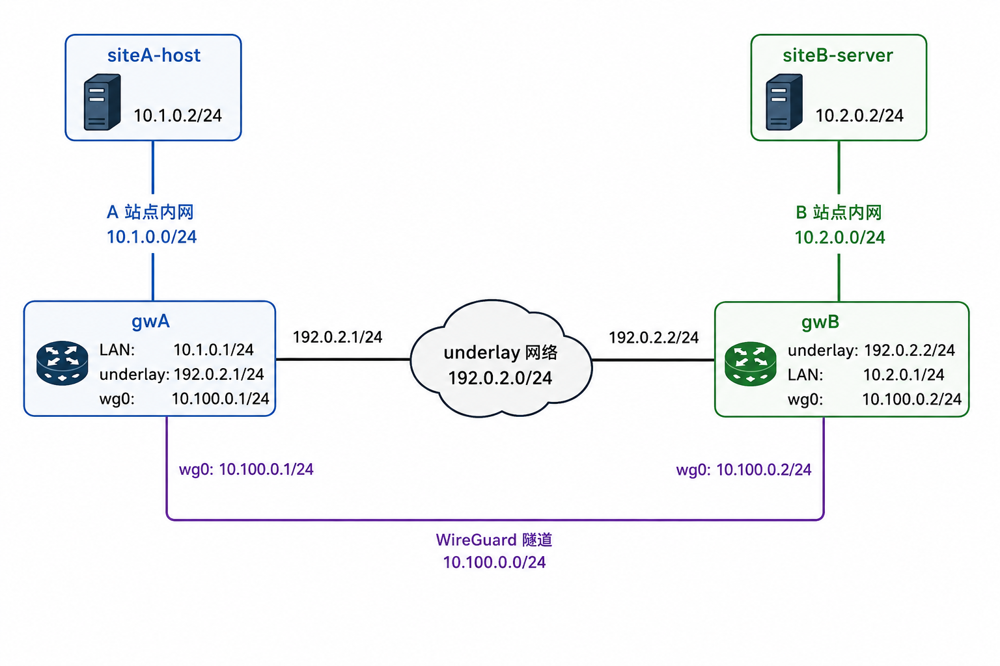
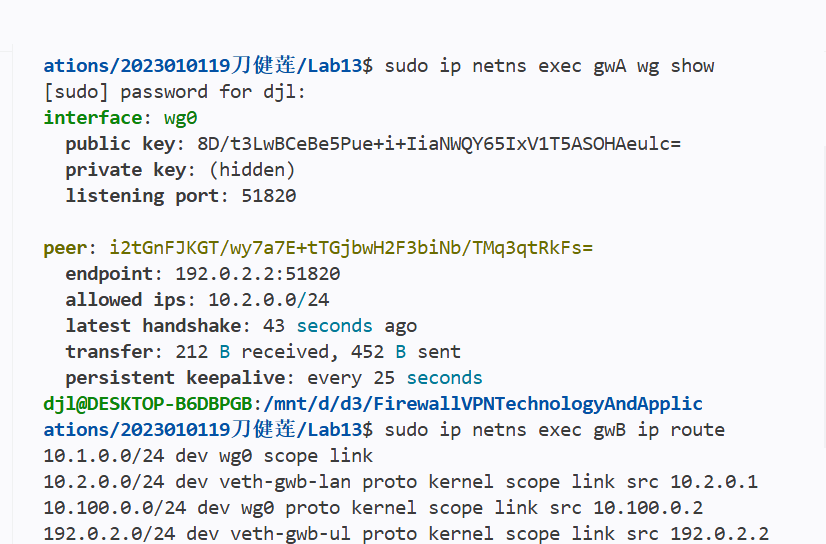
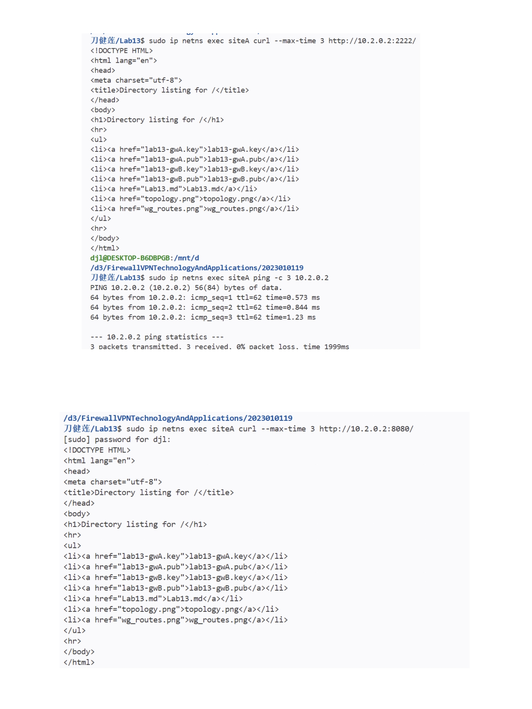
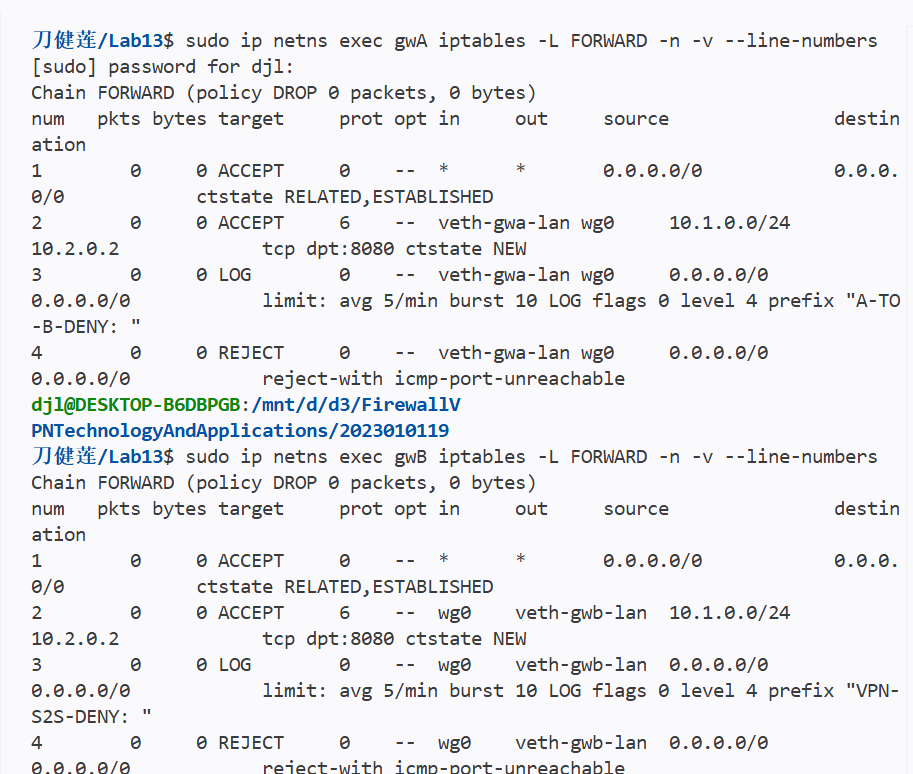
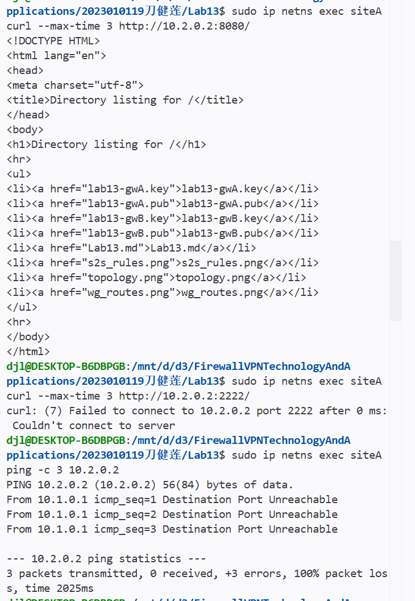
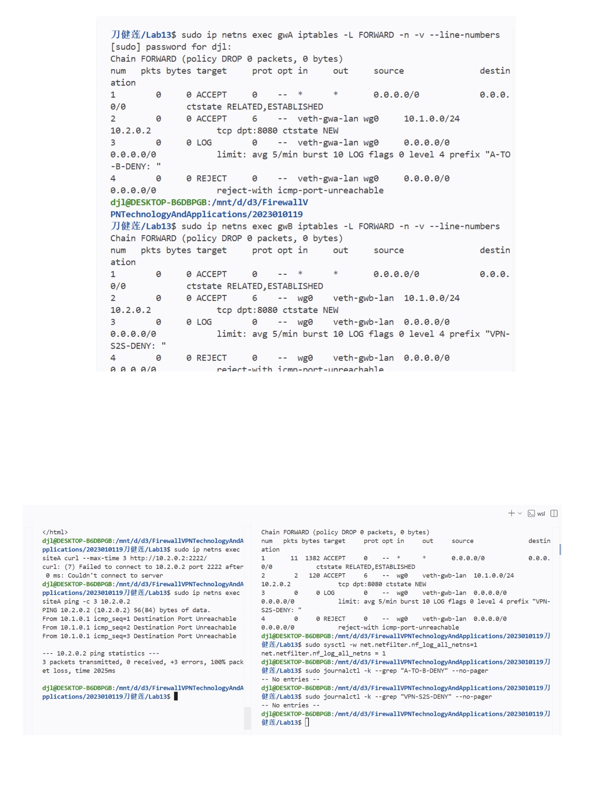
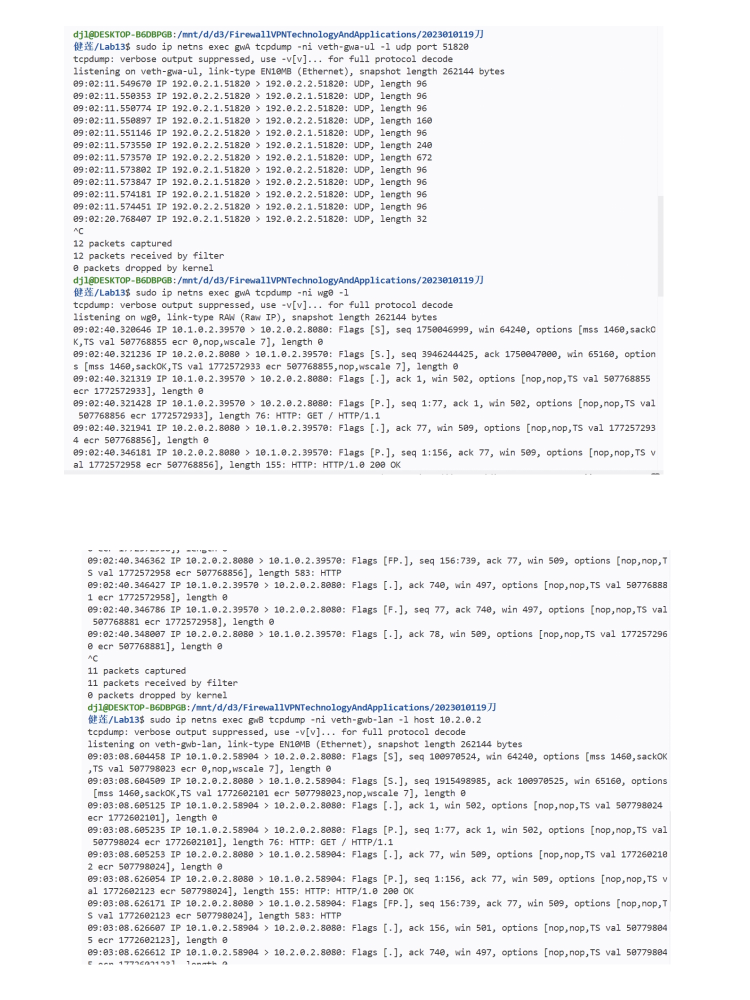

# Lab13：WireGuard 站点到站点 VPN 与故障排查

## 从远程接入到站点互联

Lab11 和 Lab12 关注的是“远程用户接入企业内网”：

```text
remote client  -- WireGuard --  vpn gateway  --  internal server
```

真实企业中还有另一类常见需求：两个办公地点各有自己的私有网段，需要通过互联网安全互通。例如：

- 总部办公网访问分支机构服务器
- 两个校区内网互通
- 云上 VPC 与本地机房互通

这类场景叫**站点到站点 VPN**（site-to-site VPN）。

本实验重点回答：

> 两个不同私有网段如何通过 WireGuard 隧道互通？为什么 `AllowedIPs` 在这里要写“对端网段”？如果握手正常但业务不通，应该怎么排查？

本实验不依赖 Lab11 或 Lab12 的残留环境，会从零搭建四个 namespace。

---

## 实验目标

完成本实验后，你应该能够：

1. 从零搭建两个站点、两个网关、一个 underlay 网络。
2. 在两个网关之间建立 WireGuard 隧道。
3. 使用 `AllowedIPs = 对端内网网段` 实现站点到站点路由。
4. 让 `siteA` 内网主机访问 `siteB` 内网服务器。
5. 在两个网关上配置防火墙，只允许指定跨站点服务。
6. 使用 LOG 审计被拒绝的跨站点访问。
7. 通过 underlay、`wg0`、内网接口抓包理解封装与转发路径。
8. 排查三类典型故障：`AllowedIPs` 错误、未开启 IP 转发、内网主机缺少默认路由。

---

## 实验拓扑


地址规划：

| 节点 | 接口 | IP 地址 | 说明 |
| :--- | :--- | :--- | :--- |
| `siteA` | `veth-a-host` | `10.1.0.2/24` | A 站点内网主机 |
| `gwA` | `veth-gwa-lan` | `10.1.0.1/24` | A 站点网关内网侧 |
| `gwA` | `veth-gwa-ul` | `192.0.2.1/24` | A 站点网关 underlay 侧 |
| `gwA` | `wg0` | `10.100.0.1/24` | A 站点 WireGuard 地址 |
| `gwB` | `veth-gwb-ul` | `192.0.2.2/24` | B 站点网关 underlay 侧 |
| `gwB` | `veth-gwb-lan` | `10.2.0.1/24` | B 站点网关内网侧 |
| `gwB` | `wg0` | `10.100.0.2/24` | B 站点 WireGuard 地址 |
| `siteB` | `veth-b-server` | `10.2.0.2/24` | B 站点服务器 |

---

## 核心概念

### 远程接入 VPN 与站点到站点 VPN

| 类型 | 目标 | 常见 AllowedIPs |
| :--- | :--- | :--- |
| 远程接入 VPN | 单个远程用户访问内网 | 网关写客户端隧道地址，客户端写内网网段 |
| 站点到站点 VPN | 两个私有网段互通 | 两边网关都写对方内网网段 |

本实验中：

`gwA` 上，`gwB` 这个 peer 的 `AllowedIPs` 写：

```ini
AllowedIPs = 10.2.0.0/24
```

表示：

1. `gwA` 发往 `10.2.0.0/24` 的包交给 `gwB` peer。
2. `gwA` 从 `gwB` peer 收到的内层包，其源地址应该属于 `10.2.0.0/24`。

`gwB` 上，`gwA` 这个 peer 的 `AllowedIPs` 写：

```ini
AllowedIPs = 10.1.0.0/24
```

表示：

1. `gwB` 发往 `10.1.0.0/24` 的包交给 `gwA` peer。
2. `gwB` 从 `gwA` peer 收到的内层包，其源地址应该属于 `10.1.0.0/24`。

---

## 准备工作

### 安装工具

```bash
sudo apt update
sudo apt install -y wireguard-tools iproute2 iptables tcpdump curl python3 conntrack
```

### 建议终端布局

| 终端 | 用途 |
| :--- | :--- |
| 终端 A | `siteB` 上运行 HTTP 服务 |
| 终端 B | `siteA` 上执行访问测试 |
| 终端 C | `gwA` / `gwB` 上查看 WireGuard 和防火墙 |
| 终端 D | tcpdump 或日志观察 |

---

## 任务一：清理残留环境

```bash
sudo ip netns exec gwA wg-quick down /etc/wireguard/lab13-gwA/wg0.conf 2>/dev/null
sudo ip netns exec gwB wg-quick down /etc/wireguard/lab13-gwB/wg0.conf 2>/dev/null

sudo ip netns exec gwA ip link del wg0 2>/dev/null
sudo ip netns exec gwB ip link del wg0 2>/dev/null

sudo ip netns del siteA 2>/dev/null
sudo ip netns del gwA 2>/dev/null
sudo ip netns del gwB 2>/dev/null
sudo ip netns del siteB 2>/dev/null

sudo ip link del veth-a-host 2>/dev/null
sudo ip link del veth-gwa-ul 2>/dev/null
sudo ip link del veth-gwb-lan 2>/dev/null
```

确认：

```bash
sudo ip netns list
```

**预期结果：** 应该没有任何输出（所有 namespace 已清理）

---

## 任务二：创建站点拓扑

### 第一步：创建 namespace

```bash
sudo ip netns add siteA
sudo ip netns add gwA
sudo ip netns add gwB
sudo ip netns add siteB
```

**预期结果：** 命令无输出，静默成功

### 第二步：创建三对 veth

```bash
# A 站点内网
sudo ip link add veth-a-host type veth peer name veth-gwa-lan

# gwA 与 gwB 之间的 underlay 网络
sudo ip link add veth-gwa-ul type veth peer name veth-gwb-ul

# B 站点内网
sudo ip link add veth-gwb-lan type veth peer name veth-b-server
```

**预期结果：** 命令无输出，静默成功

### 第三步：放入 namespace

```bash
sudo ip link set veth-a-host netns siteA
sudo ip link set veth-gwa-lan netns gwA

sudo ip link set veth-gwa-ul netns gwA
sudo ip link set veth-gwb-ul netns gwB

sudo ip link set veth-gwb-lan netns gwB
sudo ip link set veth-b-server netns siteB
```

**预期结果：** 命令无输出，静默成功

### 第四步：配置 IP 地址

```bash
# siteA 与 gwA LAN
sudo ip netns exec siteA ip addr add 10.1.0.2/24 dev veth-a-host
sudo ip netns exec gwA   ip addr add 10.1.0.1/24 dev veth-gwa-lan

# gwA 与 gwB underlay
sudo ip netns exec gwA ip addr add 192.0.2.1/24 dev veth-gwa-ul
sudo ip netns exec gwB ip addr add 192.0.2.2/24 dev veth-gwb-ul

# gwB LAN 与 siteB
sudo ip netns exec gwB   ip addr add 10.2.0.1/24 dev veth-gwb-lan
sudo ip netns exec siteB ip addr add 10.2.0.2/24 dev veth-b-server
```

**预期结果：** 命令无输出，静默成功

### 第五步：启用接口

```bash
sudo ip netns exec siteA ip link set lo up
sudo ip netns exec gwA   ip link set lo up
sudo ip netns exec gwB   ip link set lo up
sudo ip netns exec siteB ip link set lo up

sudo ip netns exec siteA ip link set veth-a-host up
sudo ip netns exec gwA   ip link set veth-gwa-lan up
sudo ip netns exec gwA   ip link set veth-gwa-ul up
sudo ip netns exec gwB   ip link set veth-gwb-ul up
sudo ip netns exec gwB   ip link set veth-gwb-lan up
sudo ip netns exec siteB ip link set veth-b-server up
```

**预期结果：** 命令无输出，静默成功

### 第六步：配置默认路由与 IP 转发

站点主机默认网关指向本地网关：

```bash
sudo ip netns exec siteA ip route add default via 10.1.0.1
sudo ip netns exec siteB ip route add default via 10.2.0.1
```

两个网关开启 IP 转发：

```bash
sudo ip netns exec gwA sysctl -w net.ipv4.ip_forward=1
sudo ip netns exec gwB sysctl -w net.ipv4.ip_forward=1
```

**预期结果：**
- 路由添加命令无输出
- sysctl 命令应输出 `net.ipv4.ip_forward = 1`

### 第七步：验证基础连通

本地网关连通：

```bash
sudo ip netns exec siteA ping -c 2 10.1.0.1
sudo ip netns exec siteB ping -c 2 10.2.0.1
```

**预期结果：** 2 packets transmitted, 2 received, 0% packet loss

underlay 连通：

```bash
sudo ip netns exec gwA ping -c 2 192.0.2.2
sudo ip netns exec gwB ping -c 2 192.0.2.1
```

**预期结果：** 2 packets transmitted, 2 received, 0% packet loss

跨站点此时应失败：

```bash
sudo ip netns exec siteA ping -c 2 10.2.0.2
```

**预期结果：** 100% packet loss 或 Network is unreachable（因为还没有配置 WireGuard 隧道）

填写：

| 测试 | 预期结果 | 你的结果 |
| :--- | :--- | :--- |
| `siteA -> 10.1.0.1` | 成功 | 成功|
| `siteB -> 10.2.0.1` | 成功 |成功 |
| `gwA -> 192.0.2.2` | 成功 |成功 |
| `siteA -> 10.2.0.2` | 失败 | 失败|

---

## 任务三：配置站点到站点 WireGuard

### 第一步：生成密钥

在宿主机当前目录：

```bash
umask 077
wg genkey | tee lab13-gwA.key | wg pubkey > lab13-gwA.pub
wg genkey | tee lab13-gwB.key | wg pubkey > lab13-gwB.pub
```

**预期结果：** 生成 4 个文件，每个密钥文件 44 字符长度

读取变量：

```bash
GWA_PRIVATE_KEY=$(cat lab13-gwA.key)
GWA_PUBLIC_KEY=$(cat lab13-gwA.pub)
GWB_PRIVATE_KEY=$(cat lab13-gwB.key)
GWB_PUBLIC_KEY=$(cat lab13-gwB.pub)
```

**预期结果：** 命令无输出，变量已设置

### 第二步：创建配置目录

```bash
sudo mkdir -p /etc/wireguard/lab13-gwA
sudo mkdir -p /etc/wireguard/lab13-gwB
```

**预期结果：** 命令无输出，静默成功

### 第三步：写 gwA 配置

```bash
sudo tee /etc/wireguard/lab13-gwA/wg0.conf > /dev/null <<EOF
[Interface]
Address = 10.100.0.1/24
PrivateKey = ${GWA_PRIVATE_KEY}
ListenPort = 51820

[Peer]
PublicKey = ${GWB_PUBLIC_KEY}
Endpoint = 192.0.2.2:51820
AllowedIPs = 10.2.0.0/24
PersistentKeepalive = 25
EOF
```

### 第四步：写 gwB 配置

```bash
sudo tee /etc/wireguard/lab13-gwB/wg0.conf > /dev/null <<EOF
[Interface]
Address = 10.100.0.2/24
PrivateKey = ${GWB_PRIVATE_KEY}
ListenPort = 51820

[Peer]
PublicKey = ${GWA_PUBLIC_KEY}
Endpoint = 192.0.2.1:51820
AllowedIPs = 10.1.0.0/24
PersistentKeepalive = 25
EOF
```

设置权限：

```bash
sudo chmod 600 /etc/wireguard/lab13-gwA/wg0.conf
sudo chmod 600 /etc/wireguard/lab13-gwB/wg0.conf
```

**预期结果：** 命令无输出，静默成功

### 第五步：启动 WireGuard

```bash
sudo ip netns exec gwA wg-quick up /etc/wireguard/lab13-gwA/wg0.conf
sudo ip netns exec gwB wg-quick up /etc/wireguard/lab13-gwB/wg0.conf
```

**预期结果：** 每个命令输出类似：
```
[#] ip link add wg0 type wireguard
[#] wg setconf wg0 /dev/fd/63
[#] ip -4 address add 10.100.0.1/24 dev wg0
[#] ip link set mtu 1420 up dev wg0
[#] ip -4 route add 10.2.0.0/24 dev wg0
```

查看状态：

```bash
sudo ip netns exec gwA wg show
sudo ip netns exec gwB wg show
```

**预期结果：** 每个网关显示 peer 信息，包括 endpoint、allowed ips，握手成功后会显示 latest handshake 时间

查看路由：

```bash
sudo ip netns exec gwA ip route
sudo ip netns exec gwB ip route
```

**预期结果：**

应看到：

```text
# gwA 上
10.2.0.0/24 dev wg0

# gwB 上
10.1.0.0/24 dev wg0
```

填写：

| 节点 | peer AllowedIPs | 自动生成的远端网段路由 |
| :--- | :--- | :--- |
| `gwA` |10.2.0.0/24 |去往 10.2.0.0/24 的流量从 wg0 接口转发（对应对等端 gwB） |
| `gwB` |10.1.0.0/24 |10.1.0.0/24 dev wg0 scope link |

截图：



---

## 任务四：跨站点基线访问

### 第一步：在 siteB 启动两个服务

终端 A：

```bash
sudo ip netns exec siteB python3 -m http.server 8080
```

**预期结果：** 输出 `Serving HTTP on 0.0.0.0 port 8080 (http://0.0.0.0:8080/) ...`

另一个终端：

```bash
sudo ip netns exec siteB python3 -m http.server 2222
```

**预期结果：** 输出 `Serving HTTP on 0.0.0.0 port 2222 (http://0.0.0.0:2222/) ...`

### 第二步：从 siteA 访问 siteB

```bash
sudo ip netns exec siteA curl --max-time 3 http://10.2.0.2:8080/
sudo ip netns exec siteA curl --max-time 3 http://10.2.0.2:2222/
sudo ip netns exec siteA ping -c 3 10.2.0.2
```

**预期结果：**
- 两个 curl 命令都应返回 HTML 目录列表
- ping 应该成功：3 packets transmitted, 3 received, 0% packet loss

如果还没有配置防火墙限制，上述测试通常都能成功。

这说明：

> 站点到站点 VPN 建好后，两个私有网段已经互通；但互通不等于所有访问都应该被允许。

填写：

| 测试 | 预期 | 你的结果 |
| :--- | :--- | :--- |
| `siteA -> siteB:8080` | 成功 |成功 |
| `siteA -> siteB:2222` | 成功 |成功 |
| `siteA -> siteB ping` | 成功 |成功 |

截图：



---

## 任务五：配置跨站点防火墙策略

本任务要求：

1. 只允许 `siteA` 访问 `siteB-server:8080`。
2. 禁止 `siteA` 访问 `siteB-server:2222`。
3. 禁止 `siteA` ping `siteB-server`。
4. 对被拒绝的跨站点访问写日志。

为了让策略更清晰，本实验在两个网关上都设置规则：

- `gwA` 控制 A 站点发往隧道的流量。
- `gwB` 控制从隧道进入 B 站点内网的流量。

### 第一步：配置 gwA

```bash
sudo ip netns exec gwA iptables -F FORWARD
sudo ip netns exec gwA iptables -P FORWARD DROP

sudo ip netns exec gwA iptables -A FORWARD \
  -m conntrack --ctstate ESTABLISHED,RELATED \
  -j ACCEPT

sudo ip netns exec gwA iptables -A FORWARD \
  -i veth-gwa-lan -o wg0 \
  -s 10.1.0.0/24 -d 10.2.0.2 \
  -p tcp --dport 8080 \
  -m conntrack --ctstate NEW \
  -j ACCEPT

sudo ip netns exec gwA iptables -A FORWARD \
  -i veth-gwa-lan -o wg0 \
  -m limit --limit 5/min --limit-burst 10 \
  -j LOG --log-prefix "A-TO-B-DENY: " --log-level 4

sudo ip netns exec gwA iptables -A FORWARD \
  -i veth-gwa-lan -o wg0 \
  -j REJECT
```

**规则说明：**

1. `iptables -F FORWARD`：清空 FORWARD 链中的所有规则
2. `iptables -P FORWARD DROP`：设置 FORWARD 链的默认策略为 DROP（丢弃所有未匹配规则的包）
3. **规则 1 - 允许已建立的连接**：
   - `-m conntrack --ctstate ESTABLISHED,RELATED`：匹配已建立的连接和相关连接（如 FTP 数据连接）
   - `-j ACCEPT`：接受这些包
   - **作用**：允许回程流量，保证 TCP 连接的双向通信
4. **规则 2 - 允许访问 8080 端口**：
   - `-i veth-gwa-lan -o wg0`：从 A 站点内网接口进入，从 WireGuard 隧道接口出去
   - `-s 10.1.0.0/24 -d 10.2.0.2`：源地址是 A 站点内网，目标是 B 站点服务器
   - `-p tcp --dport 8080`：TCP 协议，目标端口 8080
   - `-m conntrack --ctstate NEW`：只匹配新建连接的第一个包（SYN 包）
   - `-j ACCEPT`：接受这些包
   - **作用**：允许 A 站点访问 B 站点的 8080 端口
5. **规则 3 - 记录被拒绝的跨站点访问**：
   - `-i veth-gwa-lan -o wg0`：只记录从 A 站点内网发往隧道的流量
   - `-m limit --limit 5/min --limit-burst 10`：限速，防止日志洪水（每分钟最多 5 条，突发最多 10 条）
   - `-j LOG --log-prefix "A-TO-B-DENY: "`：记录到内核日志，添加前缀便于搜索
   - `--log-level 4`：日志级别为 warning
   - **作用**：审计所有被拒绝的跨站点访问尝试
6. **规则 4 - 拒绝其他跨站点流量**：
   - `-i veth-gwa-lan -o wg0`：从 A 站点内网发往隧道的所有其他流量
   - `-j REJECT`：拒绝并发送 ICMP 错误消息给源主机
   - **作用**：拒绝除 8080 外的所有跨站点访问（如 2222 端口、ping）

### 第二步：配置 gwB

```bash
sudo ip netns exec gwB iptables -F FORWARD
sudo ip netns exec gwB iptables -P FORWARD DROP

sudo ip netns exec gwB iptables -A FORWARD \
  -m conntrack --ctstate ESTABLISHED,RELATED \
  -j ACCEPT

sudo ip netns exec gwB iptables -A FORWARD \
  -i wg0 -o veth-gwb-lan \
  -s 10.1.0.0/24 -d 10.2.0.2 \
  -p tcp --dport 8080 \
  -m conntrack --ctstate NEW \
  -j ACCEPT

sudo ip netns exec gwB iptables -A FORWARD \
  -i wg0 -o veth-gwb-lan \
  -m limit --limit 5/min --limit-burst 10 \
  -j LOG --log-prefix "VPN-S2S-DENY: " --log-level 4

sudo ip netns exec gwB iptables -A FORWARD \
  -i wg0 -o veth-gwb-lan \
  -j REJECT
```

**规则说明：**

1. `iptables -F FORWARD`：清空 FORWARD 链中的所有规则
2. `iptables -P FORWARD DROP`：设置 FORWARD 链的默认策略为 DROP
3. **规则 1 - 允许已建立的连接**：
   - 同 gwA，允许回程流量
4. **规则 2 - 允许访问 8080 端口**：
   - `-i wg0 -o veth-gwb-lan`：从 WireGuard 隧道进入，从 B 站点内网接口出去
   - `-s 10.1.0.0/24 -d 10.2.0.2`：源地址是 A 站点内网，目标是 B 站点服务器
   - `-p tcp --dport 8080`：TCP 协议，目标端口 8080
   - `-m conntrack --ctstate NEW`：只匹配新建连接
   - `-j ACCEPT`：接受这些包
   - **作用**：允许从隧道进入 B 站点内网的 8080 端口访问（第二道防线）
5. **规则 3 - 记录被拒绝的流量**：
   - `-i wg0 -o veth-gwb-lan`：只记录从隧道进入 B 站点内网的流量
   - 限速和日志配置同 gwA
   - **作用**：审计通过隧道但不符合策略的访问尝试
6. **规则 4 - 拒绝其他流量**：
   - `-i wg0 -o veth-gwb-lan`：从隧道进入 B 站点内网的所有其他流量
   - `-j REJECT`：拒绝并发送错误消息
   - **作用**：第二道防线，拒绝除 8080 外的所有访问

**纵深防御策略：**
- `gwA` 在出口控制 A 站点发出的流量（第一道防线）
- `gwB` 在入口控制进入 B 站点的流量（第二道防线）
- 即使 gwA 配置错误，gwB 仍能保护 B 站点
- 正常情况下，不符合策略的流量会在 gwA 就被拦截，不会到达 gwB

### 第三步：查看规则

```bash
sudo ip netns exec gwA iptables -L FORWARD -n -v --line-numbers
sudo ip netns exec gwB iptables -L FORWARD -n -v --line-numbers
```

**预期结果：** 应看到完整的规则链，包括：
- 默认策略：DROP
- ESTABLISHED,RELATED 连接允许
- 特定端口允许（8080）
- LOG 规则（带限速）
- REJECT 规则

填写：

| 网关 | 允许规则 | 日志前缀 | 默认策略 |
| :--- | :--- | :--- | :--- |
| `gwA` |1. 所有已建立 / 关联状态流量放行（ctstate RELATED,ESTABLISHED） 2. 源网段10.1.0.0/24、入接口 veth-gwa-lan、出接口 wg0、目的 10.2.0.2、TCP 目的端口 8080 的新建流量放行 |A-TO-B-DENY: |FORWARD 链默认 DROP |
| `gwB` |1. 所有已建立 / 关联状态流量放行（ctstate RELATED,ESTABLISHED）2 源网段10.1.0.0/24、入接口 wg0、出接口 veth-gwb-lan、目的 10.2.0.2、TCP 目的端口 8080 的新建流量放行 |VPN-S2S-DENY: | FORWARD 链默认 DROP|

截图：



---

## 任务六：验证跨站点策略

从 `siteA` 测试：

```bash
# 应成功
sudo ip netns exec siteA curl --max-time 3 http://10.2.0.2:8080/

# 应失败
sudo ip netns exec siteA curl --max-time 3 http://10.2.0.2:2222/

# 应失败
sudo ip netns exec siteA ping -c 3 10.2.0.2
```

**预期结果：**
- 8080 端口：成功，返回 HTML 目录列表
- 2222 端口：失败，curl 报错 `curl: (7) Failed to connect` 或 `Connection refused`
- ping：失败，收到 `Destination Port Unreachable` 消息

查看计数器：

```bash
sudo ip netns exec gwA iptables -L FORWARD -n -v --line-numbers
sudo ip netns exec gwB iptables -L FORWARD -n -v --line-numbers
```

**预期结果：**
- `gwA` 的 LOG 和 REJECT 规则计数器应有非零值（拦截了 2222 和 ping）
- `gwB` 的 LOG 和 REJECT 规则计数器为 0（流量已在 gwA 被拦截）
- ESTABLISHED,RELATED 规则有流量计数
- 8080 端口允许规则有流量计数

查看日志：

```bash
sudo sysctl -w net.netfilter.nf_log_all_netns=1
sudo journalctl -k --grep "A-TO-B-DENY" --no-pager
sudo journalctl -k --grep "VPN-S2S-DENY" --no-pager
```

**预期结果：**

- `A-TO-B-DENY` 应该有日志输出，因为 `gwA` 拦截了发往 2222 端口和 ping 的流量
- `VPN-S2S-DENY` **没有日志输出是正常的**，因为流量已经在 `gwA` 被拦截，没有到达 `gwB`

填写：

| 测试 | 预期结果 | 实际结果 | 日志 |
| :--- | :--- | :--- | :--- |
| `siteA -> siteB:8080` | 成功 |成功  |无拒绝日志 |
| `siteA -> siteB:2222` | 失败 |成功  |A-TO-B-DENY 无输出；VPN-S2S-DENY 无输出 |
| `siteA -> siteB ping` | 失败 |失败 |A-TO-B-DENY 无输出；VPN-S2S-DENY 无输出 |

截图：





---

## 任务七：抓包观察站点到站点流量

### 抓包点一：underlay 接口（外层加密包）

在终端 D 启动抓包（保持运行）：

```bash
sudo ip netns exec gwA tcpdump -ni veth-gwa-ul -l udp port 51820
```

**说明：** `-l` 参数使 tcpdump 实时输出，每捕获一个包立即显示

在另一个终端从 `siteA` 访问：

```bash
sudo ip netns exec siteA curl --max-time 3 http://10.2.0.2:8080/
```

**预期结果：** 应看到 UDP 封装的 WireGuard 流量：

```text
192.0.2.1.xxxxx > 192.0.2.2.51820: UDP
192.0.2.2.51820 > 192.0.2.1.xxxxx: UDP
```

**说明：** 这是外层加密包，源和目的地址是 underlay 地址，协议是 UDP 51820

按 `Ctrl+C` 停止抓包。

### 抓包点二：gwA 的 wg0（内层解密包）

在终端 D 启动抓包（保持运行）：

```bash
sudo ip netns exec gwA tcpdump -ni wg0 -l
```

**说明：** `-l` 参数实时输出

在另一个终端从 `siteA` 访问：

```bash
sudo ip netns exec siteA curl --max-time 3 http://10.2.0.2:8080/
```

**预期结果：** 应看到解密后的跨站点内层包：

```text
10.1.0.2.xxxxx > 10.2.0.2.8080: Flags [S], seq ...
10.2.0.2.8080 > 10.1.0.2.xxxxx: Flags [S.], seq ...
10.1.0.2.xxxxx > 10.2.0.2.8080: Flags [.], ack ...
```

**说明：** 这是解密后的真实业务流量，TCP 三次握手和 HTTP 请求/响应

按 `Ctrl+C` 停止抓包。

### 抓包点三：gwB 的内网接口（转发到目标站点）

在终端 D 启动抓包（保持运行）：

```bash
sudo ip netns exec gwB tcpdump -ni veth-gwb-lan -l host 10.2.0.2
```

**说明：** `-l` 参数实时输出，只抓取与 10.2.0.2 相关的包

在另一个终端从 `siteA` 访问：

```bash
sudo ip netns exec siteA curl --max-time 3 http://10.2.0.2:8080/
```

**预期结果：** 应看到被允许的 8080 流量进入 B 站点内网：

```text
10.1.0.2.xxxxx > 10.2.0.2.8080: Flags [S], seq ...
10.2.0.2.8080 > 10.1.0.2.xxxxx: Flags [S.], seq ...
```

**说明：** 包已通过 WireGuard 隧道和 gwB 的防火墙，正常转发到 B 站点内网

按 `Ctrl+C` 停止抓包。

对比表：

| 抓包位置 | 看到的源/目的地址 | 协议 | 说明 |
| :--- | :--- | :--- | :--- |
| `gwA veth-gwa-ul` | 192.0.2.1 ↔ 192.0.2.2 | UDP 51820 | 外层加密包 |
| `gwA wg0` | 10.1.0.2 ↔ 10.2.0.2 | TCP 8080 | 解密后的跨站点内层包 |
| `gwB veth-gwb-lan` | 10.1.0.2 ↔ 10.2.0.2 | TCP 8080 | 转发到 B 站点内网的包 |

截图：



---

## 任务八：清理环境

```bash
sudo ip netns exec gwA wg-quick down /etc/wireguard/lab13-gwA/wg0.conf 2>/dev/null
sudo ip netns exec gwB wg-quick down /etc/wireguard/lab13-gwB/wg0.conf 2>/dev/null

sudo ip netns del siteA 2>/dev/null
sudo ip netns del gwA 2>/dev/null
sudo ip netns del gwB 2>/dev/null
sudo ip netns del siteB 2>/dev/null

sudo ip netns list
```

**预期结果：**
- wg-quick down 命令输出类似 `[#] ip link delete dev wg0` 等清理信息
- `ip netns list` 应该没有任何输出（所有 namespace 已清理）

---

## 实验结果填写

### A. 拓扑与基础连通

| 项目 | 你的填写 |
| :--- | :--- |
| `siteA` 地址 |10.1.0.2/24 |
| `gwA` LAN 地址 |10.1.0.1/24 |
| `gwA` underlay 地址 |192.0.2.1/24|
| `gwB` underlay 地址 |192.0.2.2/24 |
| `gwB` LAN 地址 |10.2.0.1/24 |
| `siteB` 地址 |10.2.0.2/24 |
| underlay 是否连通 | 是，gwA ping 192.0.2.2 0% 丢包，互通正常|

### B. WireGuard 状态

| 项目 | `gwA` | `gwB` |
| :--- | :--- | :--- |
| `wg0` 地址 |	10.100.0.1/24 |	10.100.0.2/24 |
| peer `AllowedIPs` | 10.2.0.0/24|10.1.0.0/24 |
| `latest handshake` |43 seconds ago |对应对等握手时间 |
| `transfer` 计数 |received:212 B，sent:452 B | 对应收发字节|

### C. 路由表

| 节点 | 远端网段路由 | 是否指向 wg0 |
| :--- | :--- | :--- |
| `gwA` | `10.2.0.0/24` |	是，所有去往 10.2.0.0/24 流量从 wg0 转发|
| `gwB` | `10.1.0.0/24` |是，路由条目 10.1.0.0/24 dev wg0 scope link|

### D. 策略测试

| 测试 | 结果 | 命中的规则 |
| :--- | :--- | :--- |
| `siteA -> siteB:8080` |成功，正常返回网页内容 |gwA FORWARD 链第 1 条（RELATED,ESTABLISHED）、第 2 条（放行 10.1.0.0/24 访问 10.2.0.2 TCP 8080 新建连接）；gwB 对应放行规则 |
| `siteA -> siteB:2222` |	失败，连接超时，端口不可达 |gwA FORWARD 链第 1 条不匹配，第 2 条端口不匹配，依次命中第 3 条 LOG（A-TO-B-DENY）、第 4 条 REJECT 拒绝 |
| `siteA -> siteB ping` |失败，100% 丢包，ICMP 目标不可达 | gwA 无放行 ICMP 规则，命中第 3 条 LOG（A-TO-B-DENY）、第 4 条 REJECT 拒绝|

### E. 抓包对比

| 抓包位置 | 看到的地址 | 协议 | 说明 |
| :--- | :--- | :--- | :--- |
| underlay |源：192.0.2.1，目的：192.0.2.2 |UDP |WireGuard 外层封装报文，仅传输公网 underlay 地址，内层业务 IP 被加密封装，无法看到 10 段内网地址 |
| `wg0` |源：10.100.0.1，目的：10.100.0.2；业务源 10.1.0.2，业务目的 10.2.0.2 | IPv4（TCP/ICMP）|解封装后原始内网流量，可见两端隧道地址与原始站点内网 IP，无外层 UDP 封装 |
| B 站点 LAN |源：10.1.0.2，目的：10.2.0.2 |TCP/ICMP | 完全原始内网业务报文，隧道封装已全部解封装，仅存在站点 A、B 内网网段地址，无 underlay 外层地址|

---

## 思考题

1. 远程接入 VPN 和站点到站点 VPN 的区别是什么？
答：站点到站点VPN用于连接两个完整固定局域网网关，两端配置完整内网网段静态路由、对等端AllowedIPs填写对端全部内网段，两端网关公网地址固定、内网主机双向全互通；而远程接入VPN是单台移动终端远程接入企业内网，仅服务端拥有固定内网，客户端只分配单个隧道IP、无本地网段路由，客户端公网地址动态需主动发起隧道，仅能单向访问企业内网，企业内网无法主动访问远程终端本地设备。

2. 为什么站点到站点 VPN 中 `AllowedIPs` 应该写对端内网网段？
答：在站点到站点VPN中，AllowedIPs是WireGuard用来匹配流量、决定哪些数据包走加密隧道转发的核心规则，填写对端完整内网网段后，本地网关收到所有去往该网段的流量都会自动封装进WireGuard隧道发给对等网关，同时也能校验对端发回的加密报文是否属于可信内网流量，避免非法网段流量通过隧道传输，若只写单个隧道IP则无法实现两端整个局域网设备互相访问，无法达成站点互联的需求。

3. 为什么两个网关都必须开启 `net.ipv4.ip_forward=1`？
答：站点到站点VPN的流量需要在网关的LAN内网接口与WireGuard隧道wg0接口之间跨接口转发，`net.ipv4.ip_forward=1`是Linux内核开启IPv4数据包跨接口转发的开关，若关闭该参数，网关收到内网访问对端站点的数据包后不会转发至隧道接口，同时对端解密返回的流量也无法转发到本地内网主机，两端局域网就无法互通，因此gwA、gwB两个网关都必须开启该转发功能。

4. 为什么两个站点内的普通主机都需要把默认网关指向本地 VPN 网关？
答：站点主机访问对端站点内网的流量不属于本地直连网段，需要交给本地VPN网关完成跨网段路由与WireGuard隧道封装，将默认网关设为本地VPN网关后，主机所有非本地网段流量都会转发至网关处理，若不指定该网关，主机找不到去往对端网段的路由，无法和另一站点内网设备通信。

5. `wg show` 里有握手但业务不通，排查顺序应该是什么？
答：先确认两端wg0接口IP、AllowedIPs网段配置无误，再检查网关`net.ipv4.ip_forward=1`是否开启，接着核对两端内核路由是否存在对端内网网段且出接口为wg0，然后查看iptables FORWARD转发链是否放行对应业务流量，之后测试underlay底层网关公网连通性，最后抓包wg0、LAN、underlay接口定位报文阻断/丢包位置。

6. 本实验中 `gwA` 和 `gwB` 都写防火墙规则，有什么好处？只在一边写规则可以吗？
答：两端都配置防火墙规则可以实现双向流量的精细化访问控制，同时分别在各自网关拦截非法流量，避免无效流量占用隧道带宽，还能分别记录两侧拒绝流量日志方便故障排查；只在一边写规则不可以，若仅gwA配置规则，从gwB侧内网主动发起的非法流量会直接通过隧道抵达gwA内网，失去安全拦截防护，无法完整管控双向跨站点访问行为。

7. underlay 抓包看不到 `10.1.0.2` 和 `10.2.0.2`，这说明 VPN 隐藏了哪些信息？还暴露了哪些信息？
答：underlay抓包看不到10段内网主机地址，说明WireGuard VPN加密封装隐藏了两端站点原始内网源、目的IP、上层TCP/ICMP业务协议与端口等内层业务报文信息；但外层UDP封装仍会暴露两端网关underlay公网IP、WireGuard固定监听端口51820、外层UDP传输协议，只能识别到网关间加密UDP流量，无法获知内部实际访问的业务与内网主机。

8. 如果要允许 `siteB` 主动访问 `siteA` 的某个服务，需要增加哪些规则？
答：1. 在gwA的FORWARD链新增放行规则：入接口veth-gwa-lan、出接口wg0，源10.1.0.0/24、目的10.2.0.0/24、对应服务端口的NEW状态TCP流量；
2. 在gwB的FORWARD链新增放行规则：入接口wg0、出接口veth-gwb-lan，源10.1.0.0/24、目的10.2.0.0/24、对应服务端口的NEW状态TCP流量；
3. 两条网关均保留RELATED,ESTABLISHED放行规则保障回包通行，两条规则分别管控双向跨站点业务流量，匹配后再执行日志与拒绝兜底规则。


---

## 截图要求

`topology.png` 已提供，不需要截图或重新绘制；提交时保留在 `Lab13.md` 同一目录下，保证打开实验报告时能直接显示。

实验截图须清晰，终端文字可读。截图文件需与本 `Lab13.md` 放在同一目录下，并保证它们能在上方对应任务位置正常显示。只需提交以下 6 张实验截图：

| 截图内容 | 文件名 |
| :--- | :--- |
| 两端 `wg show` 和路由表 | `wg_routes.png` |
| 未加防火墙时 8080、2222、ping 的基线测试 | `baseline.png` |
| `gwA`、`gwB` 防火墙规则与计数器 | `s2s_rules.png` |
| 加策略后 8080 成功、2222/ping 失败 | `policy_test.png` |
| 跨站点拒绝日志 | `s2s_log.png` |
| underlay、wg0、LAN 三处抓包对比 | `tcpdump_compare.png` |

截图的正确放置位置：

1. `wg_routes.png`：放在任务三末尾，能看到两端 `wg show` 中的 `latest handshake` 或 `transfer`，以及路由表中指向 `wg0` 的对端内网网段路由。
2. `baseline.png`：放在任务四末尾，只建立 VPN、未加防火墙规则时，能看到 `siteA -> siteB:8080`、`siteA -> siteB:2222`、`siteA -> siteB ping` 都可访问。
3. `s2s_rules.png`：放在任务五末尾，能看到 `gwA` 和 `gwB` 的 `FORWARD` 链规则列表及计数器。
4. `policy_test.png`：放在任务六末尾，能看到加规则后 `8080` 成功、`2222` 和 `ping` 失败。
5. `s2s_log.png`：放在任务六末尾，能看到 `A-TO-B-DENY` 日志，日志中应包含被拒绝流量的关键信息。
6. `tcpdump_compare.png`：放在任务七末尾，能对比 underlay、`wg0`、LAN 三处抓包结果。可以把多张截图拼成一张图。

---

## 提交要求

```text
学号姓名/
└── Lab13/
    ├── Lab13.md
    ├── topology.png
    ├── wg_routes.png
    ├── baseline.png
    ├── s2s_rules.png
    ├── policy_test.png
    ├── s2s_log.png
    └── tcpdump_compare.png
```

###### 

---

## 截止时间

###### 2026-06-25，届时关于 `Lab13` 的 PR 将不会被合并。
