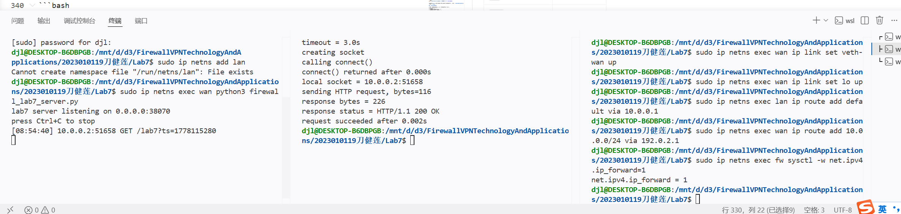
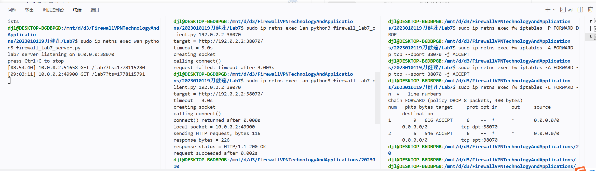
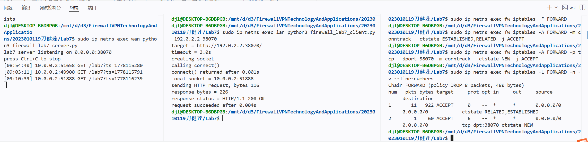
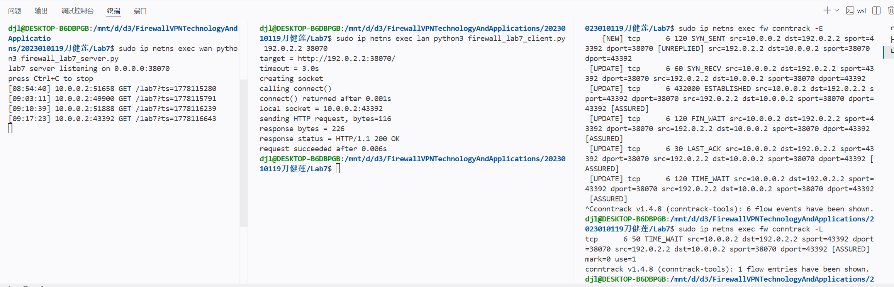

# Lab7：状态检测防火墙

## 从 Lab6 到 Lab7——你已经知道什么，还缺什么

### Lab6 做了什么

Lab6 的实验场景是：服务端和客户端在**同一台机器**上，流量走回环接口（`127.0.0.1`），目的地是本机进程，所以操作的是 `INPUT` 链。

你在 Lab6 中学会了：

- 用 `-p tcp --dport` 匹配协议和端口
- 用 `-s` 匹配源地址
- 用 `-j ACCEPT / REJECT / DROP` 控制放行、拒绝、丢弃
- 规则顺序影响匹配结果
- 规则计数器帮助排错

这些技能是包过滤的核心，Lab7 全部继续用到。

### iptables 的三条链

iptables 根据数据包的去向把流量分给三条不同的链处理：

```
                              ┌─────────────┐
           ┌─── INPUT ──────→ │   本机进程   │ ──── OUTPUT ───┐
           │                  └─────────────┘                 │
 入接口 ───┤                                                   ├─── 出接口
           │                                                   │
           └──────────────────── FORWARD ─────────────────────┘
```

| 链 | 处理什么流量 | 典型场景 |
| :--- | :--- | :--- |
| `INPUT` | 目的地是本机进程的包 | 别人访问本机的服务、SSH |
| `OUTPUT` | 本机进程发出的包 | 本机主动发起的 HTTP 请求 |
| `FORWARD` | 经过本机转发、目的地是其他主机的包 | 防火墙在两个网段之间传递流量 |

> 一个包在同一台机器上只会经过这三条链中的一条，不会同时经过多条。

Lab6 操作的是 `INPUT` 链——流量目的地是本机进程，这没有问题。但真实的防火墙部署在两个网段之间，流量穿越它、不进入它的任何进程，走的是 `FORWARD` 链。这引出了下面两个问题。

### Lab6 留下了两个问题

**问题一：真正的防火墙用的是哪条链？**

Lab6 的服务端和客户端在同一台机器上，流量从本机发出、进入本机进程，走的是 `INPUT` 链。但真实防火墙的位置不同——它坐在两个网段之间，流量从一个接口进来、从另一个接口出去，**不进入防火墙自己的任何进程**。iptables 把这类"路过"的流量交给 `FORWARD` 链处理，`INPUT` 链对它没有任何作用。

也就是说，Lab6 的规则写在了一条在真实防火墙场景里根本不会被命中的链上。

**问题二：返回流量怎么处理？**

Lab6 里客户端和服务端在同一台机器，所有流量——不管请求还是响应——都经过同一条 `INPUT` 链，一套规则管得住。到了 Lab7 的三节点拓扑，情况完全不同：

- 请求包从 `lan` 出发，经 `fw` 转发到 `wan`：
  ```
  src=10.0.0.2:随机端口   dst=192.0.2.2:38070
  ```
- 响应包从 `wan` 出发，经 `fw` 转发回 `lan`：
  ```
  src=192.0.2.2:38070    dst=10.0.0.2:随机端口
  ```

两个包都经过 `fw` 的 `FORWARD` 链，但**方向相反，字段不同**。把 FORWARD 链默认策略设为 DROP，只写 `--dport 38070` 放行请求，响应包的目的端口是客户端的随机端口，根本不匹配，直接被丢弃，通信无法完成。

那再加一条 `--sport 38070` 放行响应？响应包确实能过，但这条规则匹配的是"所有源端口为 38070 的 TCP 包"，根本不区分这个包是响应还是新发起的连接。外网主机只需要把自己程序的本地端口绑到 38070，发出的 SYN 包就满足 `--sport 38070`，照样被放行进内网。

**Lab7 解决的就是这个问题：不靠端口号猜方向，而是让防火墙记住每条连接的状态，只放行"属于合法连接"的包。**

---

## 新工具：网络命名空间与 veth

Lab6 直接在本机上操作，不需要模拟多台机器。Lab7 要搭一个三节点拓扑，需要两个 Linux 工具。在看拓扑之前先把它们搞清楚。

### 网络命名空间（network namespace）

Linux 允许在同一台物理机上创建多个相互隔离的网络环境，每个环境有自己独立的：

- 网络接口
- 路由表
- iptables 规则

这个隔离单位叫**网络命名空间**（network namespace，简称 netns）。

本实验用三个命名空间模拟三台独立的"机器"：`lan`、`fw`、`wan`。它们之间完全隔离，互相看不到对方的接口和规则。在某个命名空间里执行命令，需要在前面加 `sudo ip netns exec <名称>` 前缀，后面的任务步骤里每条命令都会带着这个前缀。

### veth（虚拟网线）

veth 是成对出现的虚拟网络接口，像一根网线的两端：从一端发出的数据，从另一端出来。

```
veth-lan  <──────────>  veth-fw-lan
（lan 命名空间里）        （fw 命名空间里）
```

本实验创建两对 veth，分别连接 `lan↔fw` 和 `fw↔wan`，把它们的两端分别放进对应的命名空间，就模拟出了两段网线。

---

## 状态检测

### 问题：只看包头字段，防不住返回流量

现在链的问题解决了：真实防火墙操作 FORWARD 链。但开头提到的第二个问题还没有答案。

把 FORWARD 链默认策略设为 DROP，然后只写一条规则：

```bash
sudo ip netns exec fw iptables -A FORWARD -p tcp --dport 38070 -j ACCEPT
```

`lan` 发出的请求包目的端口是 38070，命中规则，放行。`wan` 收到后发出响应包，响应包的目的端口是 `lan` 的**临时端口**（操作系统随机分配，不是 38070），不命中任何规则，被 DROP 丢弃。通信无法完成。

那再加一条：

```bash
sudo ip netns exec fw iptables -A FORWARD -p tcp --sport 38070 -j ACCEPT
```

这条规则的含义是"放行所有源端口为 38070 的 TCP 包"。`wan` 的响应包源端口确实是 38070，能通过。但问题来了：**这条规则不区分方向，不区分这个包是响应还是新发起的连接**。如果 `wan` 侧有主机想主动连进内网，只需要把自己程序的本地端口设成 38070，发出的 SYN 包就会被这条规则放行。

根本原因在于：这两条规则只看**包头里的字段**（协议、源端口、目的端口），而这些字段在请求包和伪造的连接请求里可以完全一样。防火墙没有办法仅凭包头判断"这个包是属于一条我已经放行的连接的响应，还是一个全新的连接请求"。

### 解决思路：让防火墙记住连接

真正需要的是：防火墙**记住**"这条连接是由内网发起的，我已经放行过它的请求包"，然后对属于这条连接的后续包——不管方向——都放行。

要做到这一点，防火墙必须跟踪每条连接的生命周期，而不是对每个包独立判断。这就是**状态检测**（stateful inspection）和**无状态包过滤**（stateless packet filtering）最本质的区别：

- **无状态包过滤**（Lab6 的方式）：每个包独立判断，只看包头字段，防火墙不记得"之前发生过什么"。
- **状态检测**：防火墙维护一张连接状态表，把每个包放到它所属的连接上下文里判断。

### Linux 的实现：conntrack

Linux 内核通过**连接跟踪**（connection tracking，简称 conntrack）来实现状态检测。conntrack 在内核里为每一条活跃的连接维护一条记录，并把流过防火墙的每个包对照这张表做分类：

| 状态 | 含义 |
| :--- | :--- |
| `NEW` | 这个包属于一条新发起的连接，conntrack 表里还没有它的记录（典型如 TCP SYN 包） |
| `ESTABLISHED` | 这个包属于一条已经建立的连接，conntrack 表里有它的记录，双向流量都算 |
| `RELATED` | 这个包与一条已有连接相关，但本身属于另一条连接（典型如 FTP 数据通道、ICMP 错误回应） |
| `INVALID` | 这个包不属于任何已知连接，也无法归入上面任何一类 |

有了这个分类，防火墙可以这样写规则：

> 只允许从内网发起的新连接（`NEW`），以及所有已建立连接的后续流量（`ESTABLISHED`）通过。

效果：

- `lan` 发出的请求是 `NEW`，匹配"允许内网发起新连接"的规则，放行，conntrack 记录这条连接。
- `wan` 返回的响应属于同一条连接，状态是 `ESTABLISHED`，匹配"允许已建立连接的包"的规则，放行。**不需要为返回方向单独写规则。**
- `wan` 主动发起到内网的连接，它的第一个包是 `NEW`，不满足"从内网发起"的条件，被丢弃。**构造源端口也无法绕过，因为判断依据是 conntrack 表里有没有这条连接的记录，而不是端口号。**

---

## 网络拓扑

```
lan (10.0.0.2) ── fw (10.0.0.1 / 192.0.2.1) ── wan (192.0.2.2)
     内网                  防火墙                      外网
```

| 节点 | 接口 | IP 地址 | 角色 |
| :--- | :--- | :--- | :--- |
| `lan` | `veth-lan` | `10.0.0.2/24` | 内网客户端，默认网关指向 `fw` |
| `fw` | `veth-fw-lan` | `10.0.0.1/24` | 防火墙，在两个网段之间转发流量 |
| `fw` | `veth-fw-wan` | `192.0.2.1/24` | 同上，外侧接口 |
| `wan` | `veth-wan` | `192.0.2.2/24` | 外网服务端 |

Lab7 会在 `wan` 上配一条回程路由，让端到端通信能跑通，方便专注观察防火墙规则。Lab8 会把这条路由删掉，演示没有回程路由时会发生什么，再用 NAT 解决它。

---

## 准备工作

整个实验建议打开三个终端，并一直保持：

| 终端 | 用途 |
| :--- | :--- |
| 终端 A | 在 `wan` 中运行服务端（一直开着） |
| 终端 B | 从 `lan` 运行客户端（按需执行） |
| 终端 C | 在 `fw` 上查看和配置 iptables 规则 |

---

## 任务一：建立拓扑并验证基础连通

> **开始前：清理残留环境**
>
> 如果你之前做过本实验，或者中途出错重来，命名空间和 veth 可能已经存在，会导致后续命令报错（`File exists`）或行为异常。执行下面的命令先清理干净：
>
> ```bash
> sudo ip netns del lan 2>/dev/null; sudo ip netns del fw 2>/dev/null; sudo ip netns del wan 2>/dev/null
> sudo ip link del veth-lan 2>/dev/null; sudo ip link del veth-wan 2>/dev/null
> ```
>
> `2>/dev/null` 表示忽略"不存在"的报错，所以即使是第一次执行也可以安全运行。执行后用 `sudo ip netns list` 确认输出为空。

### 第一步：创建三个网络命名空间

```bash
sudo ip netns add lan
sudo ip netns add fw
sudo ip netns add wan
```

命令说明：

| 部分 | 含义 |
| :--- | :--- |
| `ip netns add <名称>` | 创建一个新的网络命名空间，名称自定义 |
| `lan` / `fw` / `wan` | 命名空间的名字，后续用 `ip netns exec <名称>` 进入 |

执行后用 `sudo ip netns list` 确认三个命名空间都出现在列表里。

### 第二步：创建两对 veth 并分配到各命名空间

```bash
sudo ip link add veth-lan type veth peer name veth-fw-lan
sudo ip link add veth-wan type veth peer name veth-fw-wan

sudo ip link set veth-lan netns lan
sudo ip link set veth-fw-lan netns fw
sudo ip link set veth-wan netns wan
sudo ip link set veth-fw-wan netns fw
```

命令说明：

| 部分 | 含义 |
| :--- | :--- |
| `ip link add veth-lan type veth peer name veth-fw-lan` | 创建一对 veth，两端分别叫 `veth-lan` 和 `veth-fw-lan` |
| `ip link set veth-lan netns lan` | 把 `veth-lan` 移入 `lan` 命名空间 |

每条 `ip link set ... netns ...` 执行后，对应接口就从宿主机消失，进入目标命名空间。可以用 `sudo ip netns exec fw ip link show` 确认 `fw` 里现在有 `veth-fw-lan` 和 `veth-fw-wan`。

### 第三步：配置 IP 地址并启用接口

```bash
sudo ip netns exec lan ip addr add 10.0.0.2/24 dev veth-lan
sudo ip netns exec lan ip link set veth-lan up
sudo ip netns exec lan ip link set lo up

sudo ip netns exec fw ip addr add 10.0.0.1/24 dev veth-fw-lan
sudo ip netns exec fw ip link set veth-fw-lan up
sudo ip netns exec fw ip addr add 192.0.2.1/24 dev veth-fw-wan
sudo ip netns exec fw ip link set veth-fw-wan up
sudo ip netns exec fw ip link set lo up

sudo ip netns exec wan ip addr add 192.0.2.2/24 dev veth-wan
sudo ip netns exec wan ip link set veth-wan up
sudo ip netns exec wan ip link set lo up
```

命令说明：

| 部分 | 含义 |
| :--- | :--- |
| `ip netns exec lan` | 在 `lan` 命名空间中执行后面的命令 |
| `ip addr add 10.0.0.2/24 dev veth-lan` | 给 `veth-lan` 配 IP，子网掩码 `/24` |
| `ip link set veth-lan up` | 启用接口（新建接口默认是 DOWN 状态） |
| `ip link set lo up` | 启用回环接口（新建的 namespace 回环默认关闭） |

### 第四步：配置路由和 IP 转发

```bash
sudo ip netns exec lan ip route add default via 10.0.0.1
sudo ip netns exec wan ip route add 10.0.0.0/24 via 192.0.2.1
sudo ip netns exec fw sysctl -w net.ipv4.ip_forward=1
```

命令说明：

| 部分 | 含义 |
| :--- | :--- |
| `ip route add default via 10.0.0.1` | 给 `lan` 配默认路由，所有非本网段流量发给 `fw` |
| `ip route add 10.0.0.0/24 via 192.0.2.1` | 给 `wan` 配回程路由，发往内网的包经 `fw` 转发。 |
| `sysctl -w net.ipv4.ip_forward=1` | 开启 `fw` 的 IP 转发，允许在两个接口之间传递数据包 |

### 第五步：启动服务端（终端 A）

```bash
sudo ip netns exec wan python3 firewall_lab7_server.py
```

命令说明：

| 部分 | 含义 |
| :--- | :--- |
| `ip netns exec wan` | 在 `wan` 命名空间中执行后面的命令 |
| `python3 firewall_lab7_server.py` | 启动实验用的 TCP 服务端，监听端口 38070 |

看到如下输出后不要关闭终端 A：

```text
lab7 server listening on 0.0.0.0:38070
press Ctrl+C to stop
```

### 第六步：验证基础连通（终端 B）

此时 `fw` 的 FORWARD 链默认策略是 ACCEPT，`lan` 应能直接访问 `wan`：

```bash
sudo ip netns exec lan python3 firewall_lab7_client.py 192.0.2.2 38070
```

命令说明：

| 部分 | 含义 |
| :--- | :--- |
| `ip netns exec lan` | 在 `lan` 命名空间中执行后面的命令 |
| `python3 firewall_lab7_client.py` | 启动实验用的 TCP 客户端 |
| `192.0.2.2` | 目标 IP，即 `wan` 的地址 |
| `38070` | 目标端口 |

看到 `request succeeded` 说明拓扑正确，可以继续。如果失败，检查前面四步中是否有命令遗漏。

### 第七步：填写下表

| 项目 | 你的填写内容 |
| :--- | :--- |
| `lan` 的 IP 地址 |10.0.0.2 |
| `fw` 内侧 IP 地址 |10.0.0.1 |
| `fw` 外侧 IP 地址 |192.0.2.1 |
| `wan` 的 IP 地址 |192.0.2.2 |
| `lan` 的默认网关 |10.0.0.1 |
| 初始访问是否成功 |成功 |



---

## 任务二：无状态规则——先撞墙，再找漏洞

把 `fw` 的 FORWARD 链默认策略改为 DROP，用无状态规则（和 Lab6 写法相同）来允许 `lan` 访问 `wan`。

### 第一步：设置默认 DROP（终端 C）

```bash
sudo ip netns exec fw iptables -P FORWARD DROP
```

命令说明：

| 部分 | 含义 |
| :--- | :--- |
| `ip netns exec fw iptables` | 在 `fw` 命名空间中操作 iptables |
| `-P FORWARD DROP` | 把 FORWARD 链的默认策略改为 DROP |

### 第二步：只加请求方向规则

和 Lab6 的写法一样，匹配目的端口：

```bash
sudo ip netns exec fw iptables -A FORWARD -p tcp --dport 38070 -j ACCEPT
```

命令说明：

| 部分 | 含义 |
| :--- | :--- |
| `-A FORWARD` | append，在 FORWARD 链末尾追加一条规则 |
| `-p tcp` | 只匹配 TCP 协议的包 |
| `--dport 38070` | 匹配目的端口为 38070 的包（destination port） |
| `-j ACCEPT` | 动作：放行 |

### 第三步：测试——超时失败（终端 B）

```bash
sudo ip netns exec lan python3 firewall_lab7_client.py 192.0.2.2 38070
```

命令说明同第六步，此处不再重复。

会看到 `request failed: timeout`。

分析：`lan` 发出的 SYN 包目的端口是 38070，命中规则被放行。`wan` 收到后发出响应包，响应包方向是 `wan → lan`，目的端口是 `lan` 的**临时端口**（不是 38070）。这个响应包没有匹配任何规则，被默认 DROP 丢弃，客户端一直等不到回应。

这和 Lab6 里单机场景的区别在于：Lab6 的响应走 INPUT 链，还会再经过一次规则检查；Lab7 的响应走的是 FORWARD 链的反方向，规则根本没有为这个方向写任何条目。

### 第四步：加上返回方向规则

```bash
sudo ip netns exec fw iptables -A FORWARD -p tcp --sport 38070 -j ACCEPT
```

命令说明：

| 部分 | 含义 |
| :--- | :--- |
| `--sport 38070` | 匹配源端口为 38070 的包（source port），即 `wan` 发出的响应包 |

### 第五步：再次测试——成功（终端 B）

```bash
sudo ip netns exec lan python3 firewall_lab7_client.py 192.0.2.2 38070
```

看到 `request succeeded` 说明两条规则组合后流量可以双向通过。

### 第六步：查看当前规则（终端 C）

```bash
sudo ip netns exec fw iptables -L FORWARD -n -v --line-numbers
```

命令说明：

| 部分 | 含义 |
| :--- | :--- |
| `-L FORWARD` | list，列出 FORWARD 链的所有规则 |
| `-n` | 不把 IP 和端口反解析成域名或服务名，直接显示数字（更快、更清晰） |
| `-v` | verbose，显示包计数、字节计数、接口信息 |
| `--line-numbers` | 在每条规则前显示行号，便于用 `-D <行号>` 删除指定规则 |

### 第七步：填写下表

| 项目 | 你的填写内容 |
| :--- | :--- |
| 只有第一条规则时是否成功 |失败 |
| 第一条规则放行的是什么方向的包 |仅放行 lan→wan 方向、目的端口为 38070 的 TCP 请求包 |
| 失败的原因 |只有请求包被放行，服务器返回的响应包（源端口 38070）被默认策略 DROP，无法回到客户端 |
| 第二条规则匹配的是什么 |放行 wan→lan 方向、源端口为 38070 的 TCP 响应包 |
| 加第二条规则后是否成功 |	成功|
| 当前规则共几条 |2条 |

简答题：

1. 第二条规则 `--sport 38070 -j ACCEPT` 放行的是"所有源端口为 38070 的 TCP 包"，不区分这个包是响应还是新发起的连接。如果 `wan` 侧有主机想主动连接 `lan`，只需要让程序从端口 38070 发起连接，这条规则就会放行它的 SYN 包。用一句话概括这个问题的本质：
这是静态端口规则无法区分连接方向与状态，会被反向利用，导致规则存在安全漏洞。
2. 写出一个无状态规则无法解决、但有状态规则能解决的场景（不限于本实验）：
当防火墙仅配置静态端口放行规则时，外部攻击者可伪装源端口发起反向连接，而有状态防火墙能通过连接状态跟踪，仅放行已建立连接的响应包，拒绝主动发起的外部连接，避免规则被反向利用。


---

## 任务三：改用有状态规则，对比效果

### 第一步：清除无状态规则（终端 C）

```bash
sudo ip netns exec fw iptables -F FORWARD
```

命令说明：

| 部分 | 含义 |
| :--- | :--- |
| `-F FORWARD` | flush，清空 FORWARD 链中所有规则，默认策略 DROP 不变 |

### 第二步：添加有状态规则

```bash
sudo ip netns exec fw iptables -A FORWARD -m conntrack --ctstate ESTABLISHED,RELATED -j ACCEPT
sudo ip netns exec fw iptables -A FORWARD -p tcp --dport 38070 -m conntrack --ctstate NEW -j ACCEPT
```

命令说明：

| 部分 | 含义 |
| :--- | :--- |
| `-m conntrack` | 加载连接跟踪（conntrack）模块 |
| `--ctstate ESTABLISHED,RELATED` | 匹配已建立连接中的包，以及与已有连接相关的包 |
| `--ctstate NEW` | 只匹配新发起的连接请求 |

两条规则的逻辑：

- **第一条**：任何已建立连接的包（含所有方向的响应流量）都放行。这一条放在最前面，大多数包（响应、数据传输）命中它就直接放行，不需要再往下匹配。
- **第二条**：只有目的端口 38070 的**新连接请求**才允许建立。其他端口的新连接全部 DROP。

第一条规则放在第二条前面的原因和 Lab6 一样：匹配范围更广、命中率更高的规则放前面，提高效率，也让逻辑更清晰。

### 第三步：测试 lan → wan（终端 B）

```bash
sudo ip netns exec lan python3 firewall_lab7_client.py 192.0.2.2 38070
```

看到 `request succeeded` 说明有状态规则生效。

### 第四步：查看规则（终端 C）

```bash
sudo ip netns exec fw iptables -L FORWARD -n -v --line-numbers
```

命令说明同任务二第六步，此处不再重复。确认能看到两条规则，第一条匹配 `ESTABLISHED,RELATED`，第二条匹配 `NEW`。

### 第五步：填写下表

| 项目 | 无状态规则（任务二） | 有状态规则（任务三） |
| :--- | :--- | :--- |
| 规则条数 |	2 条 |	2 条 |
| 是否需要手动考虑返回方向 |是，需分别放行请求包和响应包 |否，由状态规则自动处理响应包 |
| 能否区分"新连接"和"响应包" |不能，仅按端口匹配，不区分连接状态 |能，通过--ctstate区分NEW和ESTABLISHED/RELATED |
| `wan` 能否主动发起到 `lan` 的连接 |能，只要匹配源端口 38070 的规则就会被放行 |不能，仅放行lan主动发起的新连接，外部主动发起的连接会被拒绝 |

简答题：

1. 有状态规则没有写任何关于"返回方向"的规则，为什么 `wan` 的响应包仍然能通过 `fw`？
因为有状态防火墙通过 连接跟踪（conntrack）模块 维护了连接状态表，lan 主动向 wan 发起的新连接会被标记为 NEW 状态并记录，后续 wan 返回的响应包会被识别为属于该已建立连接的 ESTABLISHED/RELATED 状态包，被第一条 --ctstate ESTABLISHED,RELATED 规则自动放行，因此无需单独写返回方向的规则。
2. 为什么有状态规则能阻止 `wan` 主动发起到 `lan` 的连接，而无状态规则的 `--sport 38070` 做不到？
因为无状态的--sport 38070仅按源端口匹配数据包，不区分连接状态，只要包的源端口是 38070，无论它是lan发起连接的响应包，还是wan主动发起连接的 SYN 包，都会被放行，无法阻止外部主动连接；而有状态规则通过连接跟踪，仅放行lan主动发起的NEW连接请求，且只允许该连接的ESTABLISHED/RELATED响应包返回，因此能阻止wan主动发起的新连接。


---

## 任务四：用 conntrack 观察连接状态

### 第一步：开启实时事件监控（终端 C）

> **这里用 `-E` 而不是 `-L`。**
>
> `-L` 是快照，只显示当前表里已有的条目。但实验用的客户端连接很快，等你去查的时候连接可能已经关闭，状态变成 `TIME_WAIT` 而不是 `ESTABLISHED`。
>
> `-E` 是事件流，持续监听内核的 conntrack 事件，连接状态每次变化都会实时打印出来，不需要卡时间。

```bash
sudo ip netns exec fw conntrack -E
```

命令说明：

| 部分 | 含义 |
| :--- | :--- |
| `conntrack` | 连接跟踪工具，用于查看和管理 conntrack 记录 |
| `-E` | event，持续输出 conntrack 事件流，有新事件才打印一行 |

如果提示命令不存在，先安装：

```bash
sudo apt install conntrack
```

`-E` 启动后终端会阻塞等待事件，**不要关闭，切换到终端 B 继续下一步**。

### 第二步：从 lan 访问 wan（终端 B）

```bash
sudo ip netns exec lan python3 firewall_lab7_client.py 192.0.2.2 38070
```

### 第三步：观察终端 C 的事件输出

切回终端 C，应该能看到类似：

```text
[NEW]     tcp  6  120  SYN_SENT   src=10.0.0.2 dst=192.0.2.2 sport=XXXXX dport=38070 ...
[UPDATE]  tcp  6  432  ESTABLISHED src=10.0.0.2 dst=192.0.2.2 sport=XXXXX dport=38070 ...
                                   src=192.0.2.2 dst=10.0.0.2  sport=38070 dport=XXXXX ...
[UPDATE]  tcp  6  120  TIME_WAIT  src=10.0.0.2 dst=192.0.2.2 ...
```

每条 conntrack 记录包含两行方向：上面是"原始方向"（`lan → wan`），下面是"回复方向"（`wan → lan`）。`ESTABLISHED` 行就是防火墙判断"这个包属于一条已知连接"时依据的状态。

按 `Ctrl+C` 停止 `-E` 监控。

### 第四步：查看当前连接表快照（可选，终端 C）

如果想看连接表的静态列表（连接还没超时消失时）：

```bash
sudo ip netns exec fw conntrack -L
```

命令说明：

| 部分 | 含义 |
| :--- | :--- |
| `-L` | list，列出当前所有 conntrack 条目的快照，执行后立即退出 |

### 第五步：填写下表

| 项目 | 你的填写内容 |
| :--- | :--- |
| 条目中的源地址和源端口（原始方向） |10.0.0.2:43392 |
| 条目中的目的地址和目的端口 |192.0.2.2:38070 |
| 连接状态（`-E` 中看到的 `[UPDATE]` 行） |SYN_RECV → ESTABLISHED → FIN_WAIT → LAST_ACK → TIME_WAIT |

简答题：

1. 防火墙放行一个 `ESTABLISHED` 包时，依据的是包头里的字段，还是 conntrack 表里的记录？这两者有什么区别？
防火墙放行ESTABLISHED包时，依据的是 conntrack 表里的记录，而非单纯的包头字段；仅靠包头字段只能做无状态的源 / 目的端口匹配，无法区分连接的发起方向和会话阶段，而 conntrack 表会记录连接的完整上下文，能识别出哪些包是已建立会话的合法响应，从而精准放行这些包，同时拒绝外部主动发起的新连接请求。


> **`conntrack.png` 截图说明**：请截 `-E` 的输出，包含 `[UPDATE] ESTABLISHED` 那一行。

---

## 任务五：清理规则，保留拓扑

实验结束前把 FORWARD 链恢复原状：

```bash
sudo ip netns exec fw iptables -P FORWARD ACCEPT
sudo ip netns exec fw iptables -F FORWARD
```

命令说明：

| 部分 | 含义 |
| :--- | :--- |
| `-P FORWARD ACCEPT` | 把 FORWARD 链的默认策略改回 ACCEPT |
| `-F FORWARD` | flush，清空 FORWARD 链中所有规则 |

> **顺序很重要**：必须先把默认策略改回 ACCEPT，再清空规则。如果顺序反了，清空规则后默认策略仍是 DROP，所有流量会被丢弃。

确认访问恢复（终端 B）：

```bash
sudo ip netns exec lan python3 firewall_lab7_client.py 192.0.2.2 38070
```

> 命名空间和地址配置保留，Lab8 直接在这套拓扑上继续，**不需要重建**。

---

## 思考题

1. 无状态包过滤和有状态检测防火墙最本质的区别是什么？

   > 答：无状态包过滤仅基于单个数据包的源 / 目的 IP、端口等静态包头字段进行规则匹配，不感知连接上下文；而有状态检测防火墙会通过连接跟踪模块维护会话状态，基于数据包所属连接的上下文（如连接方向、会话阶段）进行动态规则匹配，这是两者最本质的区别。

2. 有状态规则中，`ESTABLISHED,RELATED` 放在第一条、`NEW` 放在第二条，这个顺序有什么意义？能否调换？

   > 答：在有状态规则中，ESTABLISHED,RELATED 放在第一条、NEW 放在第二条的顺序意义在于：让已建立连接的响应包优先被匹配放行，避免后续规则的不必要检查，同时也能保证规则的逻辑清晰，让所有已被跟踪的连接流量快速通过；这个顺序不能调换，如果把 NEW 放在前面，虽然功能上依然可以匹配新连接，但会让每一个已建立连接的响应包都先经过 NEW 规则的检查，降低匹配效率，更重要的是违背了 “优先处理已有连接、再处理新连接” 的常规设计思路，也容易在后续添加更多规则时出现逻辑混乱。

3. 如果 conntrack 条目因超时被删除，属于这条连接的后续包会变成什么状态？防火墙会如何处理它？

   > 答：如果 conntrack 条目因超时被删除，属于这条连接的后续包会被视为无法匹配到已有会话的独立包，在连接跟踪中会被标记为 INVALID 状态，防火墙会按默认策略（通常是 DROP）直接丢弃这些包，导致连接无法正常继续或完成断开流程。

4. `RELATED` 状态主要描述什么类型的流量？本实验没有观察到它，你认为在哪种场景下会出现？

   > 答：RELATED 状态主要描述和已有连接相关、但本身不是主连接的附属 / 衍生流量，它不属于 ESTABLISHED 状态，但又和一个已建立的会话有明确关联。
 本实验没有观察到它，是因为实验场景里只有单一的 TCP 连接，没有衍生流量；典型的出现场景比如 FTP 协议：FTP 的控制连接先建立（处于 ESTABLISHED 状态），后续数据传输会使用一个独立的端口建立数据连接，这个数据连接的流量就会被标记为 RELATED 状态，因为它是和主控制连接关联的衍生流量。

5. "默认拒绝，按需放行"相比"默认允许，事后补堵"在安全上有什么本质优势？

   > 答：“默认拒绝，按需放行” 相比 “默认允许，事后补堵”，在安全上的本质优势在于：它通过最小权限原则从源头收缩攻击面，只有明确授权的流量才能通行，任何未被定义的流量都会被直接拦截，避免了 “默认允许” 模式下因配置遗漏、端口误开或新服务上线导致的潜在暴露风险；而 “默认允许，事后补堵” 是先放开所有流量，再通过规则补漏，无法覆盖未知的攻击面和新出现的漏洞，一旦补堵不及时或有疏漏，就会被攻击者利用，安全防线本质上是被动且不可控的。

---

## 截图要求

- 截图须清晰，终端文字可读。
- 所有截图与本 `Lab7.md` 放在**同一目录**下。

| 截图内容 | 文件名 |
| :--- | :--- |
| 拓扑建立与初始访问成功 | `topology.png` |
| 无状态规则：一条规则失败、两条规则成功 | `stateless.png` |
| 有状态规则列表与访问成功 | `stateful.png` |
| conntrack 表中的 ESTABLISHED 条目 | `conntrack.png` |

具体要求：

1. `topology.png`：能看到三个节点的 IP 配置和初始访问 `request succeeded`。
2. `stateless.png`：能看到只有一条规则时客户端超时，加第二条规则后成功，以及规则列表。
3. `stateful.png`：能看到两条有状态规则（含行号）和访问 `request succeeded`。
4. `conntrack.png`：能看到状态为 `ESTABLISHED` 的 TCP 条目及其双向地址记录。

---

## 提交要求

在自己的文件夹下新建 `Lab7/` 目录，提交以下文件：

```text
学号姓名/
└── Lab7/
    ├── Lab7.md
    ├── topology.png
    ├── stateless.png
    ├── stateful.png
    └── conntrack.png
```

---

## 截止时间

2026-05-14，届时关于 `Lab7` 的 PR 将不会被合并。
