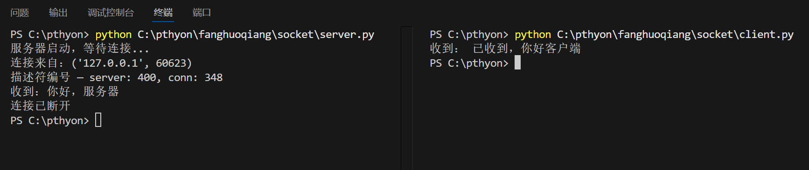
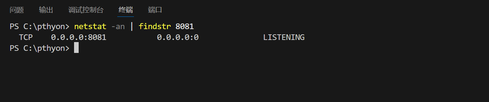
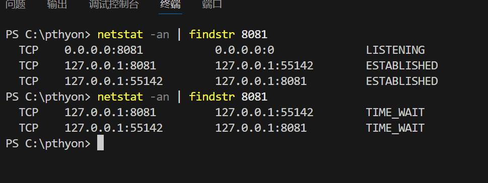
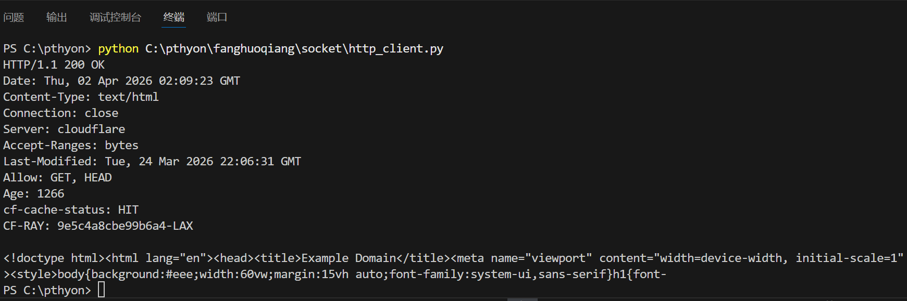
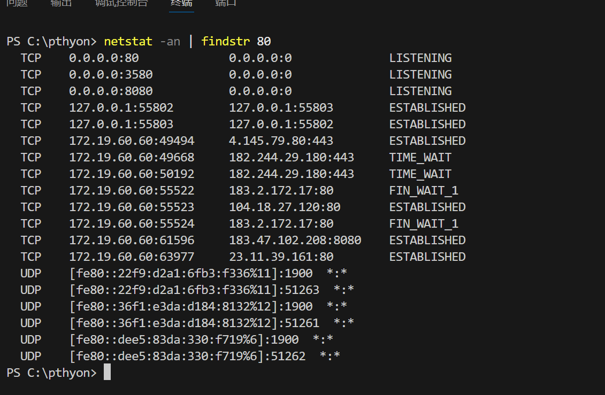

# Lab3：委托协议栈 && Socket 通信

## 实验背景

上一个实验中，我们观察了 DNS 把域名解析成 IP 地址的过程。拿到 IP 地址之后，下一步就是用这个地址真正发送数据——这件事由操作系统内部的**协议栈**来完成。

应用程序（比如浏览器）并不会自己把数据发出去，它只是调用操作系统提供的 **Socket 接口**，把"帮我发这条消息"这个任务委托给协议栈，协议栈再负责拆包、加头、交给网卡。这就是书中反复强调的"委托"二字的含义。

一次完整的 Socket 通信分为四个阶段：

```text
阶段 1：创建套接字   socket()
阶段 2：连接         connect() / accept()
阶段 3：收发数据     send() / recv()
阶段 4：断开         close()
```

本实验中，你将用 Python 完成一次完整的 Socket 通信，观察每个阶段的系统状态，并手动构造一条 HTTP 请求发送给真实的服务器。

---

## 实验任务

1. 编写并运行 `server.py`，在本机启动一个简单的 TCP 服务器。
2. 补全并运行 `client.py`，连接到本机服务器，完成一次完整的收发过程。
3. 在通信的不同阶段，用 `ss` 命令观察套接字状态，并截图记录。
4. 修改 `client.py`，手动构造一条 HTTP/1.0 请求，发送给 `example.com`，观察服务器响应和断开行为。
5. 将 `HTTP/1.0` 改为 `HTTP/1.1`，对比行为差异，用 `ss` 截图佐证。
6. 根据实验结果完成下方的表格和思考题。

---

## 参考代码

### server.py

将下列代码保存为 `server.py`，实验开始前先运行它：

```python
import socket

server = socket.socket(socket.AF_INET, socket.SOCK_STREAM)
server.setsockopt(socket.SOL_SOCKET, socket.SO_REUSEADDR, 1)
server.bind(('0.0.0.0', 8080))
server.listen(1)
print('服务器启动，等待连接...')

conn, addr = server.accept()
print(f'连接来自：{addr}')
print(f'描述符编号 — server: {server.fileno()}, conn: {conn.fileno()}')

data = conn.recv(1024)
print(f'收到：{data.decode()}')
conn.send('已收到，你好客户端'.encode())

conn.close()
server.close()
print('连接已断开')
```

### client.py（填空版）

将下列代码保存为 `client.py`，**补全空白处后再运行**：

```python
import socket

# 阶段 1：创建套接字
client = socket.socket(________, ________)

# 阶段 2：连接服务器
client.________(('127.0.0.1', 8080))

# 阶段 3：发送数据
client.________('你好，服务器'.encode())

# 阶段 3：接收响应
data = client.________(1024)
print('收到：', data.decode())

# 阶段 4：断开
client.________()
```

> **运行顺序**：必须先启动 `server.py`，再运行 `client.py`。两个文件分别在两个终端窗口中运行。

### http_client.py

将下列代码保存为 `http_client.py`，**不需要修改**，直接运行：

```python
import socket

client = socket.socket(socket.AF_INET, socket.SOCK_STREAM)
client.connect(('example.com', 80))

request = (
    'GET / HTTP/1.0\r\n'
    'Host: example.com\r\n'
    '\r\n'
)
client.send(request.encode())

response = b''
while True:
    chunk = client.recv(4096)
    if not chunk:
        break
    response += chunk

print(response.decode(errors='ignore')[:500])
client.close()
```

---

## 截图要求

- 截图须清晰，终端文字可读。
- 所有截图与本 `socket.md` 放在**同一目录**下。
- 命名规范如下：

| 截图内容 | 文件名 |
| :------- | :----- |
| `client.py` 填空完成后，server 和 client 两个终端的完整输出 | `run.png` |
| `server.py` 运行后、`client.py` 连接前，`ss` 命令输出（LISTEN 状态） | `ss_listen.png` |
| `client.py` 连接成功后，`ss` 命令输出（ESTABLISHED 状态） | `ss_established.png` |
| `http_client.py` 运行结果，显示收到的响应内容 | `http_run.png` |
| 将 `HTTP/1.0` 改为 `HTTP/1.1` 后程序卡住时，`ss` 命令输出 | `ss_keepalive.png` |

截图嵌入位置见下方实验结果填写区域。

---

## 实验结果填写

> 根据你自己的运行结果填写。若某项确实无法观察到，可写"未能观察到，原因：……"，**不得留空**。

### A. client.py 填空答案

将你补全的五处空白依次填入：

| 空白位置 | 你填写的内容 |
| :------- | :----------- |
| `socket()` 的第一个参数 |AF_INET |
| `socket()` 的第二个参数 |SOCK_STREAM |
| 连接服务器的方法名 |connect() |
| 发送数据的方法名 |send() |
| 接收数据的方法名（含参数） |recv(1024) |
| 断开连接的方法名 |close() |

**嵌入截图：**



---

### B. 套接字状态观察

在以下三个时刻，分别打开新终端运行 `ss -tnp | grep 8080`，记录输出中的 State 字段：

| 时刻 | `ss` 输出中的 State | 对应四阶段中的哪个阶段 |
| :--- | :------------------ | :--------------------- |
| `server.py` 已启动，`client.py` 尚未运行 |LISTENING |监听阶段 |
| `client.py` 已连接，数据尚未发送完毕 |ESTABLISHED |连接建立阶段 |
| `server.py` 执行 `close()` 之后 |TIME_WAIT |连接关闭阶段 |

**嵌入截图（LISTEN 状态）：**



**嵌入截图（ESTABLISHED 状态）：**



---

### C. 描述符观察

`server.py` 运行时会打印两个描述符编号，填写如下：

| 项目 | 你的值 |
| :--- | :----- |
| `server` 套接字的描述符编号 |400 |
| `conn` 套接字的描述符编号 |348 |
| 两者是否相同 |否 |

---

### D. HTTP/1.0 实验结果

运行 `http_client.py` 后，填写以下内容：

| 项目 | 你的填写 |
| :--- | :------- |
| 连接的目标地址和端口 |example.com:80 |
| 响应的第一行（状态行） |HTTP/1.1 200 OK |
| 程序是否自动退出（不需要手动 Ctrl+C）|是 |
| 是你调用 `close()` 触发的断开，还是服务器主动断开的 |服务器主动断开的 |

**嵌入截图：**



---

### E. HTTP/1.0 vs HTTP/1.1 对比

将 `http_client.py` 中的 `HTTP/1.0` 改为 `HTTP/1.1`，重新运行，填写观察结果：

| 项目 | HTTP/1.0 | HTTP/1.1 |
| :--- | :------- | :------- |
| 程序是否自动退出 |是 |否 |
| `ss` 中连接的 State |TIME_WAIT |ESTABLISHED |
| 需要手动 Ctrl+C 才能结束吗 |否 |是 |

**嵌入截图（HTTP/1.1 卡住时的 ss 输出）：**



---

## 思考题

1. 实验中 `server.py` 必须比 `client.py` 先启动。如果顺序反过来，`client.py` 会报什么错误？用今天学到的概念解释：此时套接字存在吗？管道存在吗？

   > 答：客户端会报ConnectionRefusedError错误。此时，服务端的监听套接字还不存在（因为server.py未运行，没有执行bind和listen），因此客户端无法找到目标端口上的监听服务，连接请求直接被操作系统拒绝；同时，客户端和服务端之间的通信管道（即TCP连接）也尚未建立，因为三次握手的第一个SYN包就无法得到确认。


2. `server.py` 打印出了两个不同的描述符编号（`server` 和 `conn`）。为什么 `accept()` 要返回一个新的套接字，而不是直接复用原来的 `server` 套接字？

   > 答：因为监听套接字（server）和通信套接字（conn）职责完全不同，必须分开：server套接字专门负责监听、接收新的客户端连接请求，不参与实际数据传输；accept()返回的新conn套接字专门负责和当前客户端收发数据。如果复用同一个套接字，服务端会在和一个客户端通信时，无法接收其他新客户端的连接，既无法实现并发处理，也会混淆 “监听连接” 和 “数据传输” 两种功能，因此必须用新套接字独立承担通信任务，保证服务端持续监听和稳定通信。

3. 描述符和端口号都可以用来标识一个套接字，它们的本质区别是什么？各自解决了什么问题？

   > 答：端口号和描述符的本质区别在于：端口号是网络层的全局标识，由操作系统统一管理，用于在网络中定位到主机上的特定进程（解决“数据包该送给哪个程序”的问题）；而描述符是进程内部的局部整数标识，仅在单个进程内有效，用于区分该进程打开的不同文件或套接字（解决“进程内如何操作多个资源”的问题）。简单类比：端口号像大楼的门牌号（对外公开寻址），描述符像你手中钥匙的编号（对内区分不同钥匙）。


4. `client.py` 中，你有没有指定过客户端自己的端口号？这个端口号是谁分配的？在 `ss` 的输出中能看到它吗？

   > 答：没有在client.py中指定客户端自己的端口号。这个端口号是由操作系统内核自动分配的，具体是从系统的临时端口范围（ephemeral port range，通常为32768-60999或49152-65535）中挑选一个未被占用的端口。在netstat的输出中能看到这个端口号，执行netstat-an会显示类似192.168.1.100:54321这样的记录，其中冒号后面的数字就是客户端操作系统自动分配的临时端口，它与服务器端的固定端口（如 9999）共同标识了这一条 TCP 连接的两个端点。


5. HTTP/1.0 实验中，即使你没有调用 `close()`，`recv()` 循环也会自动退出。解释这是为什么？

   > 答：这是因为HTTP/1.0服务器在发送完响应数据后会自动关闭连接，客户端的recv()在读取完所有数据后，再次调用时会返回0，表示连接已被对方正常关闭（收到了 FIN 包）。while True循环检测到recv()返回 0 就会触发break退出循环，因此即使客户端没有显式调用close()，也能正常结束接收过程。服务器主动关闭连接充当了“数据传输完毕”的信号，避免了客户端因不知道数据何时结束而永久阻塞。

6. HTTP/1.1 实验中，程序卡在 `recv()` 不退出，`ss` 显示连接仍是 `ESTABLISHED`。这说明 HTTP/1.1 和 HTTP/1.0 在连接管理上有什么根本区别？

   > 答： HTTP/1.1默认采用长连接（Keep-Alive），一次传输完成后服务器不会主动关闭连接，因此客户端recv()收不到0字节会一直阻塞等待，连接保持ESTABLISHED状态；而HTTP/1.0默认是短连接，响应发送完毕立即关闭连接

---

## 提交要求

在自己的文件夹下新建 `Lab3/` 目录，提交以下文件：

```text
学号姓名/
└── Lab3/
    ├── socket.md          # 本文件（填写完整，含截图与答案）
    ├── client.py          # 填空完成后的客户端代码
    ├── run.png            # server 和 client 终端输出截图
    ├── ss_listen.png      # LISTEN 状态截图
    ├── ss_established.png # ESTABLISHED 状态截图
    ├── http_run.png       # http_client.py 运行结果截图
    └── ss_keepalive.png   # HTTP/1.1 卡住时的 ss 截图
```

---

## 截止时间

2026-04-10，届时关于 Lab3 的 PR 将不会被合并。

---

## 参考资料

- [socket — Python 官方文档](https://docs.python.org/zh-cn/3/library/socket.html)
- [ss 命令使用说明 - Linux man page](https://man7.org/linux/man-pages/man8/ss.8.html)
- [HTTP/1.0 vs HTTP/1.1 - MDN](https://developer.mozilla.org/zh-CN/docs/Web/HTTP/Connection_management_in_HTTP_1.x)
