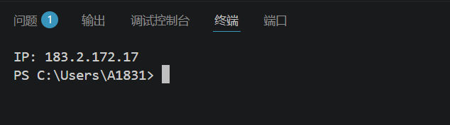
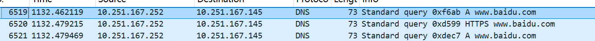
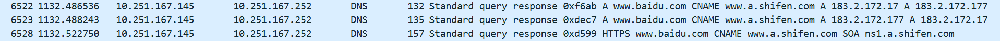

# Lab2：DNS 初体验，域名是怎么变成 IP 的？

## 实验背景

当我们在浏览器中输入 `www.yxnu.edu.cn` 这样的域名时，计算机并不能直接依靠这个名字找到目标主机，它首先需要通过 **DNS（Domain Name System，域名系统）** 把域名解析成 IP 地址，然后才能继续访问目标服务器。

一次典型的 DNS 解析过程可以简单理解为：

```text
应用程序 ──── 发起域名解析请求 ────▶ DNS 服务器
应用程序 ◀──── 返回域名对应 IP ──── DNS 服务器
```

本实验中，我们使用 C 语言调用系统提供的域名解析接口，查询某个域名对应的 IP 地址；同时使用 Wireshark 抓取 DNS 请求包和响应包，观察域名解析在网络中的实际表现。

> **说明**：本次实验为了降低难度，使用 `gethostbyname()` 完成解析。  
> 这个函数是较老的接口，不支持 IPv6，线程安全性也较差，在实际工程中通常更推荐使用 `getaddrinfo()`。  
> 但在入门阶段，`gethostbyname()` 更容易帮助大家理解“域名解析”这件事是如何发生的。

---

## 实验任务

1. 阅读并使用下方提供的 C 语言代码，完成对某个域名的 IP 查询。
2. 在终端编译并运行程序，查询一个你自己指定的域名，例如 `www.yxnu.edu.cn`、`www.baidu.com` 或 `www.qq.com`。
3. 打开 Wireshark，选择当前正在联网的网卡。
4. 在 Wireshark 过滤栏中输入 `dns`，只观察 DNS 相关报文。
5. 运行程序，抓取本次解析对应的 **DNS 请求包** 和 **DNS 响应包**。
6. 抓到数据后，只保留本次解析对应的 **两个包**：1 个 DNS 请求包、1 个 DNS 响应包。
7. 将这两个包导出为 `CSV` 文件。
8. 分别对**程序运行结果**、DNS 请求包和 DNS 响应包截图，并按要求命名。
9. 将三张截图嵌入 Markdown 文件中。
10. 根据抓包结果，完成下方的表格填写和思考题。

> **提示 1**：如果你没有抓到 DNS 包，可能是该域名刚刚解析过，结果被系统缓存了。可以尝试更换一个最近没有访问过的域名后重新抓包。  
> **提示 2**：这里所说的“过滤器”，指的是 **Wireshark 的显示过滤器**。常用写法可以是 `dns`，也可以是 `udp.port == 53`。  
> **提示 3**：截图时尽量同时显示“分组列表”和“分组详细信息”区域，方便后续填写。

---

## 参考代码

将下列代码保存为 `dns_lookup.c`，然后编译运行。

```c
#include <stdio.h>
#include <netdb.h>
#include <arpa/inet.h>

int main()
{
    struct hostent *host = gethostbyname("www.yxnu.edu.cn");
    if (!host)
    {
        herror("查询失败");
        return 1;
    }
    printf("IP: %s\n", inet_ntoa(*(struct in_addr *)host->h_addr));
    return 0;
}

```

编译与运行示例：

```bash
gcc dns_lookup.c -o dns_lookup
./dns_lookup 
```

---

## 截图要求

- 本次实验**不要求提交完整代码**，只需要提交程序运行结果截图和 Wireshark 抓包截图。
- 运行结果截图中，应能清晰看到程序输出的 IP 地址。
- 截图须清晰显示 Wireshark 中的 DNS 报文内容。
- 请求包截图中，应尽量能看到查询域名（Query Name）和查询类型（如 A）。
- 响应包截图中，应尽量能看到返回的 IP 地址（Answers 部分）。
- 截图文件与本 `dns.md` 放在**同一目录**下。
- 命名规范如下：

| 截图内容                    | 文件名                                      |
| :-------------------------- | :------------------------------------------ |
| 程序运行结果截图            | `run.png`（也可以使用 jpg 或 jpeg）         |
| DNS 请求包截图              | `dns_req.png`（也可以使用 jpg 或 jpeg）     |
| DNS 响应包截图              | `dns_resp.png`（也可以使用 jpg 或 jpeg）    |

截图示例位置如下，填写时请直接在下方嵌入：

```markdown



```

---

## CSV 文件要求

- 抓包完成后，只保留与你这次实验对应的 **2 个数据包**：1 个请求包、1 个响应包。
- 将这 2 个数据包导出为 `CSV` 文件，并与实验报告一起提交。
- CSV 文件命名为 `dns_packets.csv`。
- CSV 文件与本 `dns.md` 放在**同一目录**下。

---

## 实验结果填写

> 根据你自己的程序运行结果和 Wireshark 抓包结果填写。若某项在截图中看不清，可写“截图中未见”，但不得留空。

### A. 程序运行结果

| 项目             | 你的填写内容 |
| :--------------- | :----------- |
| 你查询的域名     |      www.baidu.com        |
| 程序输出的 IP 地址 |      IP: 183.2.172.17      |

**嵌入程序运行结果截图：**


---

### B. Wireshark 抓包结果：DNS 请求包（Request）

| 字段                         | 你的截图中的值 |
| :--------------------------- | :------------- |
| 事务 ID（Transaction ID）    |        0xf6ab        |
| 查询域名（Query Name）       |        www.baidu.com        |
| 查询类型（Type）             |        A        |
| 目的端口                     |        53        |

**嵌入截图：**


---

### C. Wireshark 抓包结果：DNS 响应包（Response）

| 字段                         | 你的截图中的值 |
| :--------------------------- | :------------- |
| 事务 ID（Transaction ID）    |       0xf6ab         |
| 返回码（Response Code）      |        0        |
| 回答记录数（Answers）        |         2       |
| 返回的 IP 地址               |        183.2.172.17,183.2.172.177        |
| TTL（若可见）                |        无        |

**嵌入截图：**


---

## 思考题

1. DNS 的作用是什么？为什么访问网站时通常要先进行 DNS 解析？

   > 答：DNS（域名系统）的核心作用是将人类易记的域名（如www.baidu.com）转换为计算机能识别的 IP 地址

2. 你抓到的 DNS 请求包和响应包中的 **Transaction ID** 是否一致？这个字段有什么作用？

   > 答：一致。Transaction ID（事务 ID）是 DNS 报文的唯一标识，核心作用是匹配请求和对应的响应：客户端发送请求时生成随机 ID，服务器返回响应时沿用该 ID，客户端通过这个 ID 能准确识别哪条响应对应哪条请求，避免在多并发 DNS 请求时混淆报文。

3. 这次实验中查询类型通常是 `A` 记录。`A` 记录表示什么含义？

   > 答：A 记录（Address Record）是 DNS 最基础的记录类型，含义是将域名映射到对应的 IPv4 地址。实验中查询 A 记录，就是请求 DNS 服务器返回www.baidu.com对应的 IPv4 地址，这也是访问 IPv4 网络服务的核心解析需求。

4. DNS 默认通常使用哪个传输层协议和端口？在什么情况下可能会改用 TCP？

   > 答：DNS 默认使用UDP 协议，默认端口是53。改用 TCP 的场景：
DNS 响应报文长度超过 512 字节（UDP 报文默认最大 512 字节，无法承载）；
进行 DNS 区域传输（主从 DNS 服务器同步数据）；
客户端主动要求使用 TCP（如高可靠性需求的场景）。

5. 为什么说 `gethostbyname()` 不是现代工程中推荐继续使用的接口？请至少写出两点原因。

   > 答：不支持 IPv6：gethostbyname() 仅能解析 IPv4 的 A 记录，无法处理 IPv6 的 AAAA 记录，不符合现代网络 IPv6 普及的趋势；
线程不安全：该函数使用全局变量存储解析结果，多线程环境下调用会导致数据覆盖、结果错乱；
无超时控制：无法设置解析超时时间，可能导致程序长时间阻塞；

6. 如果一个域名返回了多个 IP 地址，这通常说明了什么？

   > 答：负载均衡：网站为了分散访问压力，将流量分配到多个不同 IP 的服务器节点，提升服务可用性和响应速度；
容灾备份：多个 IP 对应不同机房 / 地域的服务器，某一个节点故障时，客户端可切换到其他 IP，保证服务不中断；
多线路部署：不同 IP 对应电信、联通、移动等不同运营商线路，提升不同网络环境下的访问速度。

---

## 提交要求

在自己的文件夹下新建 `Lab2/` 目录，提交以下文件：

```text
学号姓名/
└── Lab2/
    ├── dns.md             # 本文件（填写完整，含截图与答案）
    ├── run.png            # 程序运行结果截图（也可以是 jpg 或 jpeg）
    ├── dns_req.png        # DNS 请求包截图（也可以是 jpg 或 jpeg）
    ├── dns_resp.png       # DNS 响应包截图（也可以是 jpg 或 jpeg）
    └── dns_packets.csv    # 只包含 1 个请求包和 1 个响应包的 CSV 文件
```

---

## 截止时间

2026-04-02，届时关于Lab2的pr将不会被合并。

---
