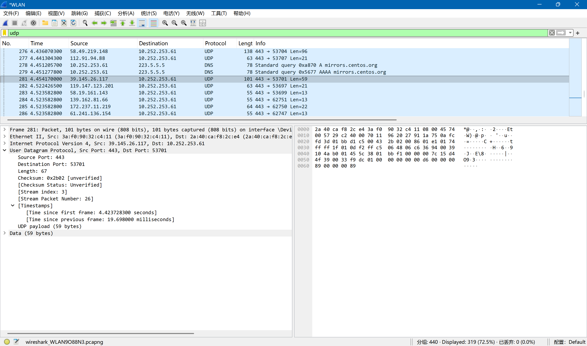
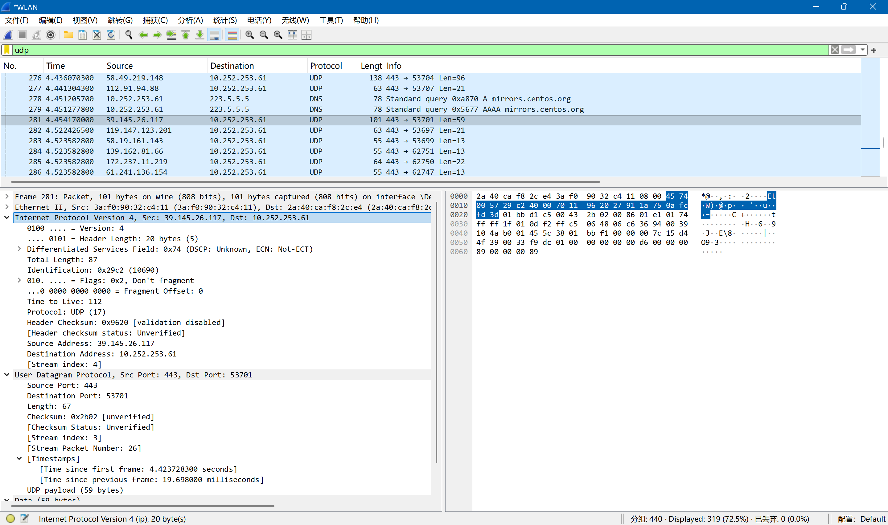
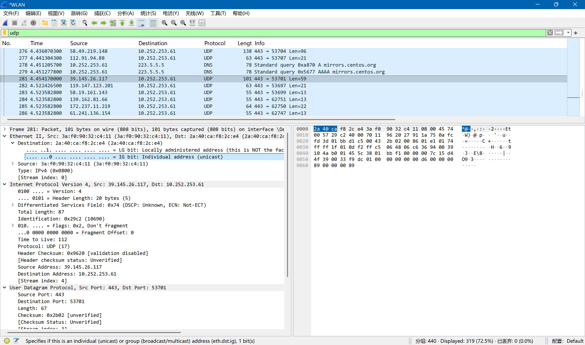
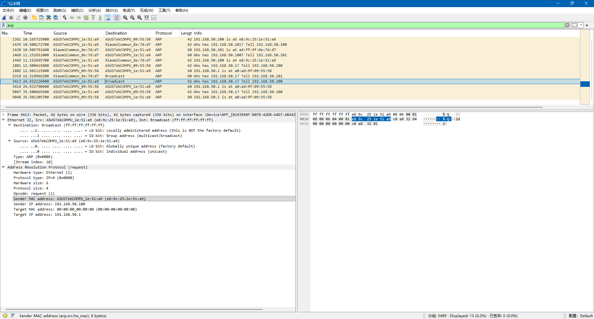
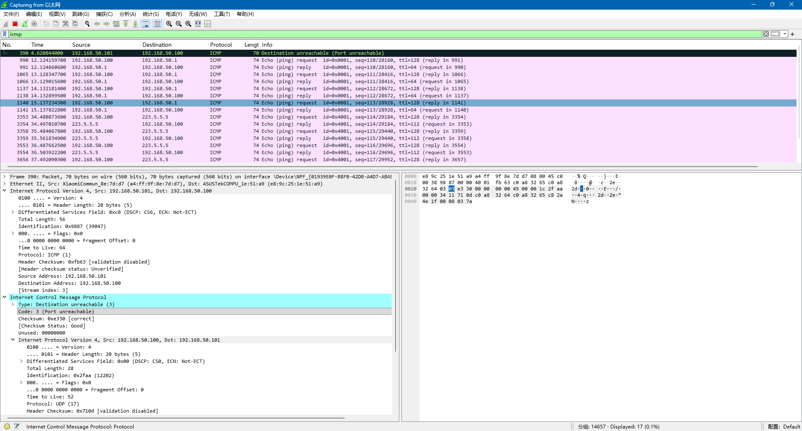

# Lab5：IP 与以太网的包收发操作

## 实验背景

本实验围绕 IP 模块与以太网在包收发过程中的角色展开，重点观察以下内容：

1. 网络包的基本结构：头部（IP 头部 + MAC 头部）与数据
2. IP 头部各字段的含义：版本号、TTL、协议号、发送方/接收方 IP 地址等
3. MAC 头部各字段的含义：接收方/发送方 MAC 地址、以太类型
4. IP 地址与 MAC 地址的区别与协作
5. ARP 协议如何通过 IP 地址查询 MAC 地址
6. 路由表的结构与查询方式
7. UDP 协议与 TCP 协议的区别：无连接、无确认、无重传
8. UDP 头部结构：发送方端口号、接收方端口号、数据长度、校验和
9. ICMP 协议的作用与常见消息类型（Echo、Destination Unreachable 等）

---

## 实验任务

### 任务一：查看路由表、ARP 缓存并启动 Wireshark

**第一步：打开 Wireshark，选择主网络接口，开始抓包**

> **注意**：本次实验必须使用真实网络接口（`en0`/`eth0`/`以太网`），不要选回环接口。回环接口不经过以太网，无法观察到 MAC 头部和 ARP 过程。

选择你的主网络接口，开始抓包。本次实验的大部分任务会共用同一次抓包。

**第二步：查看本机路由表**

```bash
# Linux
route -n
ip route show

# macOS
netstat -rn

# Windows
route print
```

截图并保存为 `route_table.png`。

**第三步：查看本机 ARP 缓存**

```bash
# Linux / macOS / Windows
arp -a
```

截图并保存为 `arp_cache.png`。

**第四步：填写下表**

从路由表和 ARP 缓存的输出中提取信息：

| 项目                         | 你的填写内容 |
| :--------------------------- | :----------- |
| 本机 IP 地址                 |192.168.35.134|
| 本机所在子网                 |192.168.35.0|
| 子网掩码                     |255.255.255.0|
| 默认网关 IP                  |192.168.35.2|
| 默认网关 MAC 地址            |00:50:56:f8:1b:c7|
| 本机网卡 MAC 地址            |00:0c:29:e3:3f:e1|

简答题：

1. 路由表的每一行包含哪些关键字段？教材中提到的 `Network Destination`、`Netmask`、`Gateway`、`Interface` 分别对应什么含义？
> 路由表的每一行代表一条可达的路径，包含五个关键字段：`Network Destination`（网络目标）指明目标网络的地址，`Netmask`（子网掩码）定义该网段的范围，两者结合确定匹配范围；`Gateway`（网关/下一跳）是数据包离开本子网后应送达的下一个路由器地址，`Interface`（接口）指明数据包从本机的哪块物理或虚拟网卡发出，此外还有`Metric`（跃点数）用于在多条路径中衡量开销优劣。


2. 当目标 IP 地址不在本子网时，包会先发给谁？路由表的哪一列提供了这个信息？
> 当目标IP地址不在本子网时，数据包会先发往默认网关，路由表中的`Gateway`列提供了该下一跳的具体IP信息，指导数据包跳出本地链路。


3. 路由表的默认网关（`0.0.0.0`）条目的作用是什么？什么时候会匹配到这一行？
> 默认网关条目是网络中的“兜底”路径，当数据包的目标IP在路由表中找不到任何更具体、更精确的匹配项时，就会强制匹配到这一行，确保数据包能够被转发到外网路由器处理。


4. 教材提到，确定发送方 IP 地址的关键在于"判断应该使用哪块网卡"。结合你查到的本机网卡信息，说明 IP 模块是如何做出这个判断的。
> IP模块在发送数据前会遍历路由表，将目标IP与每一行的`Netmask`进行按位与运算，若结果等于`Network Destination`则视为匹配；在找到的所有匹配项中，系统遵循“最长前缀匹配”原则选择掩码最长（最精确）的行，随后提取该行对应的`Interface`字段，从而决定使用哪块网卡的IP地址作为源地址封装数据包。


---

### 任务二：观察 UDP 头部

只要计算机处于联网状态，Wireshark 中就会持续出现大量 UDP 流量（DNS、mDNS、DHCP、NTP 等），无需手动生成。

**第一步：在 Wireshark 中设置过滤器**

```text
udp
```

**第二步：在包列表中找一个 UDP 包**

随便选一个即可。如果包太多，可以加上源或目的 IP 来缩小范围，例如 `udp && ip.addr == 你的IP`。如果需要 DNS 包，也可以用 `udp.port == 53` 过滤。

> **可选**：如果想明确看到一个完整的请求-响应对，可以在终端中执行 `nslookup example.com`，Wireshark 中就会出现对应的 DNS 请求包。

**第三步：点击选中的 UDP 包，在详情栏展开 `User Datagram Protocol`**

填写下表：

| 项目               | 你的填写内容 |
| :----------------- | :----------- |
| UDP 头部总长度     |8|
| 源端口             |443|
| 目的端口           |53701|
| 长度（Length）     |67|
| 校验和（Checksum） |0x2b02|

简答题：

1. 你观察到的 UDP 头部长度是多少字节？TCP 头部至少 20 字节。UDP 省略了哪些字段？这些字段的缺失带来了什么后果？
> UDP头部固定为8字节，相比TCP至少20字节的结构，它省略了序列号、确认号、窗口大小以及复杂的标志位（如 `SYN`/`ACK`/`FIN`），这意味着UDP彻底放弃了数据重传、顺序保证、流量控制和拥塞控制机制，虽然极大地降低了协议开销并提升了传输速度，但也导致了其“尽力而为”的不可靠特性。


2. UDP 头部中的"长度"字段指的是什么长度？
> UDP 头部中的“长度”字段（`Length`）是一个16位的字段，它表示的是整个UDP数据报的总字节数，即UDP头部长度与应用层数据长度的总和。




---

### 任务三：观察 IP 头部字段

点击任务二中的同一个 UDP 包，在详情栏展开 `Internet Protocol Version 4`。

填写下表：

| 字段名称               | 你的填写内容 | 含义说明 |
| :--------------------- | :----------- | :------- |
| Version（版本号）      |4|表明报文使用`IPv4`协议|
| Header Length（头部长度） |20 bytes|基本头部长度|
| Time to Live（TTL）    |112|生存时间，为0丢弃|
| Protocol（协议号）     |UDP (17)|表明使用的传输层的协议|
| Source Address（源 IP） |39.145.26.117|发送方的IP地址|
| Destination Address（目的 IP） |10.252.253.61|接收方的IP地址|

简答题：

1. 协议号字段的值是多少？它代表什么协议？如果抓一个 HTTP 请求的包，协议号会变成多少？
> 协议号字段的值是17，它代表使用UDP协议。HTTP请求的包协议号变为6.


2. TTL 字段的作用是什么？如果 TTL 降为 0 会发生什么？
> TTL的作用是防止数据包在网络中无限环路的计数器，每经过一个路由器转发，该值就会减1；一旦TTL降为0，路由器就会丢弃该数据包，并向发送方发送一个ICMP超时报文，从而避免因配置错误或环路导致网络资源被耗尽。


3. 有教材提到 IP 地址"实际上并不是分配给计算机的，而是分配给网卡的"。你的本机有几块网卡？每块网卡的 IP 地址分别是什么？（提示：可参考任务一中路由表的 Interface 列，或用 `ip addr`（Linux）/`ifconfig`（macOS）/`ipconfig`（Windows）查看。）
> 3块，分别为127.0.0.1，192.168.35.134，172.17.0.1


4. IP 头部中的源 IP 地址和目的 IP 地址分别是谁的地址？它们与 MAC 头部中的源/目的 MAC 地址有什么区别？
> IP头部中的源和目的IP地址代表数据传输的最终起点和终点，在整个传输过程中保持不变；而MAC地址则代表每一跳的物理设备地址，随着数据包在不同网段间转发，源/目的MAC地址会在每一个路由器节点被重新封装，以确保数据能在当前局域网链路内正确寻址。




---

### 任务四：观察 MAC 头部与以太网帧

点击任务二中的同一个 UDP 包，在详情栏展开 `Ethernet II`。

填写下表：

| 字段名称               | 你的填写内容 | 含义说明 |
| :--------------------- | :----------- | :------- |
| Source（源 MAC）       |3a:f0:90:32:c4:11|发送端物理地址|
| Destination（目的 MAC） |2a:40:ca:f8:2c:e4|接收端物理地址|
| Type（以太类型）       |IPv4 (0x0800)|协议标识，表明使用的是什么协议的数据报文|

关于 MAC 地址格式，填写下表：

| 项目               | 你的填写内容 |
| :----------------- | :----------- |
| MAC 地址长度       | 48 比特（6 字节） |
| 本机网卡的 MAC 地址 |2a:40:ca:f8:2c:e4|
| 目的 MAC 地址      |3a:f0:90:32:c4:11|
| MAC 地址的书写格式 |十六进制，通常使用冒号分隔或连字符分隔|

简答题：

1. 以太类型字段的值是多少？它代表后面承载的是什么协议的包？
> 在以太网首部中，以太类型字段的值通常为0x0800，这代表该帧后面承载的是IPv4协议的数据包；如果承载的是IPv6协议，该值则会变为0x86DD，它充当了链路层通往网络层的“导向牌”。


2. DNS 服务器的 IP 通常是外网地址。本任务中目的 MAC 地址是 DNS 服务器的 MAC 地址还是你本机网关（路由器）的 MAC 地址？为什么？
> 是本机网关的MAC地址，这是因为MAC地址仅在局域网内部有效，当数据包需要跨越不同网络时，本机只能通过ARP协议获取出口网关的物理地址，将包交给网关进行下一跳的路由转发。


3. IP 地址和 MAC 地址在功能上有什么相似之处？又有什么本质区别？
> IP地址和MAC地址在功能上都用于标识网络节点的身份，但本质区别在于：IP地址是逻辑地址，代表节点在互联网拓扑中的位置，可以随网络环境改变；而MAC地址是物理地址，通常由网卡生产商固化在硬件中，代表设备的全球唯一物理属性。


4. 为什么以太网帧中需要同时有 IP 地址（在 IP 头部中）和 MAC 地址？不能只用其中一种吗？
> 这种“双重寻址”机制是为了实现层级解耦：IP地址负责全局路径规划，确定数据包最终要去向哪个网络；而MAC地址负责局部链路传输，确定在当前局域网内哪台物理设备负责接收。如果只用MAC地址，全球交换机将需要存储海量的寻址表，导致网络崩溃；如果只用IP地址，则无法在共享物理介质的局域网内通过硬件直接定位目标设备。




---

### 任务五：观察 ARP 协议

ARP（Address Resolution Protocol，地址解析协议）用于根据 IP 地址查询 MAC 地址。只要计算机处于联网状态，Wireshark 中通常会持续出现 ARP 包（邻居发现、缓存刷新等），可以直接观察。如果抓包一段时间后仍未看到 ARP 包，再手动触发。

**第一步：在 Wireshark 中设置过滤器**

```text
arp
```

**第二步：在包列表中找 ARP 包**

正常联网的设备每隔几分钟就会自动发送 ARP 请求，等待即可。如果等了一会儿仍没有，可以选择以下任一方式手动触发：

- **方式 A（推荐）**：在终端中执行 `arping`

  ```bash
  # Linux（通常已预装）
  sudo arping -c 3 <网关IP>

  # macOS（如果没有，先执行：brew install arping）
  sudo arping -c 3 <网关IP>

  # Windows（可从 https://github.com/ThomasHabets/arping/releases 下载）
  arping -c 3 <网关IP>
  ```

- **方式 B**：先清除 ARP 缓存，再 ping 同网段地址

  ```bash
  # 清除 ARP 缓存
  # Linux:   sudo ip neigh flush all
  # macOS:   sudo arp -d -a
  # Windows: arp -d *

  # 然后 ping 网关
  ping <网关IP> -c 2
  ```

> **注意**：如果目标是 `127.0.0.1` 或外网地址，ARP 不会出现。回环接口不经过以太网，外网地址的 MAC 地址是路由器的（通常已缓存）。

**第三步：点击 ARP 请求包（Opcode 为 request），展开详情**

**第四步：填写下表**

| 项目                     | 你的填写内容 |
| :----------------------- | :----------- |
| ARP 请求的目的 MAC 地址 |ff:ff:ff:ff:ff:ff|
| ARP 请求中查询的目标 IP |192.168.50.1|
| ARP 响应中返回的 MAC 地址 |a0:ad:9f:09:55:58|
| 该 ARP 包是自动出现还是手动触发的 |自动|

简答题：

1. ARP 请求的目的 MAC 地址为什么是 `ff:ff:ff:ff:ff:ff`（广播地址）？
> 是因为在发起请求时，发送方只知道目标的IP地址而不知道其物理位置，通过将帧发送到广播地址，局域网内的所有主机都能接收并处理该请求，从而允许拥有对应IP的主机识别并作出回应。


2. 为什么 ARP 缓存中的条目会在几分钟后自动删除？
> 这是一种动态维护机制，旨在防止网络拓扑变化导致通信故障，通过定期清理过期数据，确保主机能够及时通过重新发起ARP请求来获取最新的映射关系。


3. 如果 ARP 缓存中的 MAC 地址已经过期（对方 IP 对应的设备已更换），会出现什么问题？如何解决？
> 数据包将被发送到错误的物理地址或不存在的硬件，导致通信中断或产生丢包现象；要解决此问题，最直接的方法是等待系统自动过期清理，或在终端使用命令手动删除该条缓存条目，强制系统立即重新发起ARP扫描以获取正确的MAC地址。




---

### 任务六：使用 `ping` 命令观察 ICMP

有教材提到了 ICMP（Internet Control Message Protocol）协议，它用于在 IP 层传递错误和控制信息。`ping` 命令就是基于 ICMP 的 Echo Request（类型 8）和 Echo Reply（类型 0）实现的。

**第一步：在 Wireshark 中设置 ICMP 过滤器**

```text
icmp
```

**第二步：在终端中执行 ping 命令**

```bash
# ping 本机（回环）
ping 127.0.0.1 -c 4

# ping 局域网内的设备（如路由器网关）
ping <网关IP> -c 4

# ping 外网地址
ping 8.8.8.8 -c 4
```

**第三步：在 Wireshark 中观察 ICMP 包**

填写下表：

| 目标               | 是否收到回复 | 往返时间（ms） | TTL 值 |
| :----------------- | :----------- | :------------- | :----- |
| 127.0.0.1          |是|<1ms|128|
| 局域网设备（网关） |是|<1ms|64|
| 8.8.8.8            |是|=181ms|107|

> **提示**：ping 回环地址（`127.0.0.1`）时数据不经过物理网卡，Wireshark 在主网络接口上可能无法捕获到包。TTL 值可从终端输出中读取（`ping` 会显示 `ttl=...`），或切换 Wireshark 至回环接口（`lo0` / `lo`）抓包。

简答题：

1. `ping` 命令发送的是什么类型的 ICMP 消息？收到的回复又是什么类型？
> `ping`核心机制是基于ICMP协议的查询功能，它首先向目标发送一个ICMP Echo Request（类型 8，代码 0）消息，若目标主机在线且防火墙允许，则会返回一个ICMP Echo Reply（类型 0，代码 0）消息，通过这种问答模式来确认链路的连通性。


2. 为什么 ping 不同目标的 TTL 值不同？TTL 值反映了什么信息？


3. 教材表 2.4 中列出了多种 ICMP 消息类型。`Destination unreachable`（类型 3）在什么情况下会出现？请用以下方法尝试触发并观察：

   ```bash
   # 方法一（推荐）：ping 同网段内一个确认不存在的 IP
   # 例如你的本机 IP 是 192.168.1.100，子网掩码 255.255.255.0，
   # 那么可以 ping 192.168.1.250（一个大概率没有被分配的地址）
   ping <同网段不存在的IP> -c 3
   
   # 方法二：向一个关闭的端口发 UDP 包，触发 ICMP Port Unreachable
   # 先在 Wireshark 中保持 icmp 过滤器，然后执行：
   # Linux / macOS
   echo "test" | nc -u -w 1 <同网段某台设备的IP> 19999
   
   # Windows（需安装 nmap：https://nmap.org/download.html）
   nmap -sU -p 19999 <同网段某台设备的IP>
   ```

   观察到类型 3 的包后，记录其 Code 值（子类型）并说明代表什么含义。
> Destination Unreachable (3)通常在路由器无法找到通往目标的路径，或目标主机虽然存在但对应的服务端口处于关闭状态时出现。




---

## 问答题

1. 网络包由哪几部分构成？IP 头部和 MAC 头部分别的作用是什么？
> 一个完整的网络包由报头和数据两部分构成，通常呈现为层层嵌套的结构。MAC头部作用于局域网链路层，负责通过物理地址将包送达下一跳设备；而IP头部作用于网络层，包含源和目的逻辑地址，负责在全球网络拓扑中指明数据包的最终起点和终点。


2. IP 协议和以太网协议在网络传输中分别承担什么职责？它们是如何分工协作的？
> IP协议承担的是“寻址与路由”职责，决定数据包该往哪个方向走以跨越不同网段；以太网协议则承担“链路传输”职责，负责在具体的一段物理线路上将电信号可靠地传给相邻节点。两者协作时，IP提供导航蓝图，以太网则是负责分段运输的载具，每一跳都会更换新的以太网头部。


3. ARP 协议解决的核心问题是什么？如果不使用 ARP 缓存，网络中会出现什么情况？
> ARP协议解决的是“从逻辑地址到物理地址的映射”问题，即如何根据已知的IP地址找到目标在局域网内的MAC地址。如果不使用ARP缓存，每发送一个IP包之前都必须先进行一次全网广播查询，这将导致网络带宽被海量的ARP请求淹没，通信效率产生剧烈延迟。


4. 为什么 IP 和负责传输的网络（如以太网）要分开设计？这种设计带来了什么好处？
> 将IP与底层传输网络分开设计是为了实现层次化解耦，使网络层能够屏蔽底层硬件差异。这种设计带来了极强的通用性和扩展性：无论底层物理介质如何变化，上层应用和IP协议都无需修改，同时允许互联网容纳各种不同技术的子网互联互通。


5. 网卡在发送包时会额外添加哪 3 个控制数据？它们各自的作用是什么？
> 网卡在发送包时会在开头添加前导码用于同步接收端的时钟频率，在结尾添加帧首定界符标识帧的开始，以及帧校验序列。FCS利用循环冗余校验码来检测数据在物理传输过程中是否产生了位错误。


6. 网卡接收到一个包后，需要经过哪些步骤才能将其交给操作系统？如果 FCS 校验失败会怎样？
> 网卡接收包后，会先同步时钟并识别帧起始，随后检查目的 MAC 地址是否为本机或广播，最后计算校验和并与FCS对比；如果FCS校验失败，网卡会直接丢弃该包，认为其在传输中受损，且通常不会向发送方报错，可靠性交由上层协议（如TCP）处理。


7. TCP 和 UDP 的核心区别是什么？请从连接管理、可靠性、效率、适用场景四个维度进行比较。
>TCP 是面向连接的、可靠的、效率较低但保证顺序和不丢包，适用于文件传输等严谨场景；UDP 是无连接的、不可靠的、头部开销极小且传输效率极高，具体分析如下

|维度|TCP|UDP|
|---|---|---|
|连接管理|需三次握手建立、四次挥手释放|无需连接，直接发送|
|可靠性|确认重传、顺序保证、流量控制|尽力而为，不保证到达|
|效率|头部20字节起，开销大|头部固定8字节，速度极快|
|适用场景|网页、邮件、文件|视频直播、语音电话、DNS查询|


8. UDP 适用于哪些场景？请结合教材内容解释为什么这些场景适合使用 UDP 而非 TCP。
> UDP适用于对实时性要求极高或交互极简单的场景，如视频会议或在线游戏，因为这些场景下少量丢包只会导致画面轻微花屏，但TCP的重传机制会导致明显的画面卡顿（延迟）。此外，像DNS这种一问一答的简单查询，使用UDP可以省去建立连接的繁琐过程，极大提升响应速度。


9. 如果一个 IP 包经过多次路由转发后 TTL 降为 0，路由器会如何处理？这与教材中提到的哪种 ICMP 消息有关？
> 当IP包的TTL降为0时，路由器会立即停止转发并丢弃该包。随后，该路由器会向源IP地址发送一个ICMP类型11（Time Exceeded）消息，告知发送方路径中出现了环路或跳数过多


---

## 截图要求

- 截图须清晰，终端文字和 Wireshark 字段可读。
- 所有截图与本 `Lab5.md` 放在同一目录下。
- 命名规范：

| 截图内容         | 文件名               |
| :--------------- | :------------------- |
| 路由表           | `route_table.png`    |
| ARP 缓存         | `arp_cache.png`      |
| UDP 头部字段     | `udp_header.png`     |
| IP 头部字段      | `ip_header.png`      |
| 以太网帧字段     | `ethernet_frame.png` |
| ARP 请求与响应   | `arp.png`            |
| ICMP ping        | `icmp.png`           |

具体要求：

1. `route_table.png`：终端截图，显示 `route -n`（Linux）、`netstat -rn`（macOS）或 `route print`（Windows）的完整输出。

2. `arp_cache.png`：终端截图，显示 `arp -a` 的完整输出。

3. `udp_header.png`：Wireshark 截图，展开 `User Datagram Protocol`，能看到 Source Port、Destination Port、Length、Checksum。

4. `ip_header.png`：Wireshark 截图，展开 `Internet Protocol Version 4`，能看到 Version、Header Length、TTL、Protocol、Source Address、Destination Address。

5. `ethernet_frame.png`：Wireshark 截图，展开 `Ethernet II`，能看到 Source、Destination、Type。

6. `arp.png`：Wireshark 截图（若能观察到），展开 ARP 包的详情，能看到发送方的 MAC 和 IP、查询的目标 IP。

7. `icmp.png`：Wireshark 截图，能看到 ICMP Echo Request 和 Echo Reply，以及 TTL 字段。

---

## 提交要求

在自己的文件夹下新建 `Lab5/` 目录，提交以下文件：

```text
学号姓名/
└── Lab5/
    ├── Lab5.md
    ├── route_table.png
    ├── arp_cache.png
    ├── udp_header.png
    ├── ip_header.png
    ├── ethernet_frame.png
    ├── arp.png
    └── icmp.png
```

---

## 截止时间

2026-05-07，届时关于 Lab5 的 PR 请求将不会被合并。
